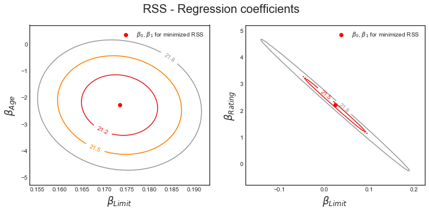

# Linear Regression: Practice

- [Load Datasets](#Load-Datasets)
- [3.1 Simple Linear Regression](#3.1-Simple-Linear-Regression)
- [3.2 Multiple Linear Regression](#3.2-Multiple-Linear-Regression)
- [3.3 Other Considerations in the Regression Model](#3.3-Other-Considerations-in-the-Regression-Model)


```python
import pandas as pd
import numpy as np
import matplotlib.pyplot as plt
from mpl_toolkits.mplot3d import axes3d
import seaborn as sns

from sklearn.preprocessing import scale
import sklearn.linear_model as skl_lm
from sklearn.metrics import mean_squared_error, r2_score
import statsmodels.api as sm
import statsmodels.formula.api as smf

%matplotlib inline
plt.style.use('seaborn-white')
```

### Load Datasets
Datasets available on https://statlearning.com/data.html


```python
!../data_grabber.sh data/ ../data_urls.txt
```

    Error: data/ not found. Will make directory and place files in data/.


```python
advertising = pd.read_csv('data/Advertising.csv', usecols=[1,2,3,4])
advertising.info()
```

    <class 'pandas.core.frame.DataFrame'>
    RangeIndex: 200 entries, 0 to 199
    Data columns (total 4 columns):
     #   Column     Non-Null Count  Dtype  
    ---  ------     --------------  -----  
     0   TV         200 non-null    float64
     1   radio      200 non-null    float64
     2   newspaper  200 non-null    float64
     3   sales      200 non-null    float64
    dtypes: float64(4)
    memory usage: 6.4 KB


```python
credit = pd.read_csv('data/Credit.csv', usecols=list(range(1,12)))
credit['Student2'] = credit.Student.map({'No':0, 'Yes':1})
credit.head(3)
```


<div>
<style scoped>
    .dataframe tbody tr th:only-of-type {
        vertical-align: middle;
    }

    .dataframe tbody tr th {
        vertical-align: top;
    }

    .dataframe thead th {
        text-align: right;
    }
</style>
<table border="1" class="dataframe">
  <thead>
    <tr style="text-align: right;">
      <th></th>
      <th>Income</th>
      <th>Limit</th>
      <th>Rating</th>
      <th>Cards</th>
      <th>Age</th>
      <th>Education</th>
      <th>Gender</th>
      <th>Student</th>
      <th>Married</th>
      <th>Ethnicity</th>
      <th>Balance</th>
      <th>Student2</th>
    </tr>
  </thead>
  <tbody>
    <tr>
      <th>0</th>
      <td>14.891</td>
      <td>3606</td>
      <td>283</td>
      <td>2</td>
      <td>34</td>
      <td>11</td>
      <td>Male</td>
      <td>No</td>
      <td>Yes</td>
      <td>Caucasian</td>
      <td>333</td>
      <td>0</td>
    </tr>
    <tr>
      <th>1</th>
      <td>106.025</td>
      <td>6645</td>
      <td>483</td>
      <td>3</td>
      <td>82</td>
      <td>15</td>
      <td>Female</td>
      <td>Yes</td>
      <td>Yes</td>
      <td>Asian</td>
      <td>903</td>
      <td>1</td>
    </tr>
    <tr>
      <th>2</th>
      <td>104.593</td>
      <td>7075</td>
      <td>514</td>
      <td>4</td>
      <td>71</td>
      <td>11</td>
      <td>Male</td>
      <td>No</td>
      <td>No</td>
      <td>Asian</td>
      <td>580</td>
      <td>0</td>
    </tr>
  </tbody>
</table>
</div>


```python
auto = pd.read_table('data/Auto.data', na_values='?').dropna()
auto.info()
auto.head()
```

    <class 'pandas.core.frame.DataFrame'>
    Int64Index: 0 entries
    Data columns (total 14 columns):
     #   Column             Non-Null Count  Dtype  
    ---  ------             --------------  -----  
     0   mpg                0 non-null      object 
     1   cylinders          0 non-null      object 
     2   displacement       0 non-null      float64
     3   horsepower weight  0 non-null      float64
     4   acceleration       0 non-null      float64
     5   year               0 non-null      float64
     6   origin             0 non-null      float64
     7   name               0 non-null      float64
     8   Unnamed: 8         0 non-null      float64
     9   Unnamed: 9         0 non-null      float64
     10  Unnamed: 10        0 non-null      float64
     11  Unnamed: 11        0 non-null      float64
     12  Unnamed: 12        0 non-null      float64
     13  Unnamed: 13        0 non-null      float64
    dtypes: float64(12), object(2)
    memory usage: 0.0+ bytes


<div>
<style scoped>
    .dataframe tbody tr th:only-of-type {
        vertical-align: middle;
    }

    .dataframe tbody tr th {
        vertical-align: top;
    }

    .dataframe thead th {
        text-align: right;
    }
</style>
<table border="1" class="dataframe">
  <thead>
    <tr style="text-align: right;">
      <th></th>
      <th>mpg</th>
      <th>cylinders</th>
      <th>displacement</th>
      <th>horsepower weight</th>
      <th>acceleration</th>
      <th>year</th>
      <th>origin</th>
      <th>name</th>
      <th>Unnamed: 8</th>
      <th>Unnamed: 9</th>
      <th>Unnamed: 10</th>
      <th>Unnamed: 11</th>
      <th>Unnamed: 12</th>
      <th>Unnamed: 13</th>
    </tr>
  </thead>
  <tbody>
  </tbody>
</table>
</div>


## 3.1 Simple Linear Regression

### Figure 3.1 - Least squares fit


```python
sns.regplot(advertising.TV, advertising.Sales, order=1, ci=None, scatter_kws={'color':'r', 's':9})
plt.xlim(-10,310)
plt.ylim(ymin=0);
```


### Figure 3.2 - Regression coefficients - RSS
Note that the text in the book describes the coefficients based on uncentered data, whereas the plot shows the model based on centered data. The latter is visually more appealing for explaining the concept of a minimum RSS. I think that, in order not to confuse the reader, the values on the axis of the B0 coefficients have been changed to correspond with the text. The axes on the plots below are unaltered.


```python
# Regression coefficients (Ordinary Least Squares)
regr = skl_lm.LinearRegression()

X = scale(advertising.TV, with_mean=True, with_std=False).reshape(-1,1)
y = advertising.Sales

regr.fit(X,y)
print(regr.intercept_)
print(regr.coef_)
```

    14.0225
    [ 0.04753664]


```python
# Create grid coordinates for plotting
B0 = np.linspace(regr.intercept_-2, regr.intercept_+2, 50)
B1 = np.linspace(regr.coef_-0.02, regr.coef_+0.02, 50)
xx, yy = np.meshgrid(B0, B1, indexing='xy')
Z = np.zeros((B0.size,B1.size))

# Calculate Z-values (RSS) based on grid of coefficients
for (i,j),v in np.ndenumerate(Z):
    Z[i,j] =((y - (xx[i,j]+X.ravel()*yy[i,j]))**2).sum()/1000

# Minimized RSS
min_RSS = r'$\beta_0$, $\beta_1$ for minimized RSS'
min_rss = np.sum((regr.intercept_+regr.coef_*X - y.values.reshape(-1,1))**2)/1000
min_rss
```


    2.1025305831313514


```python
fig = plt.figure(figsize=(15,6))
fig.suptitle('RSS - Regression coefficients', fontsize=20)

ax1 = fig.add_subplot(121)
ax2 = fig.add_subplot(122, projection='3d')

# Left plot
CS = ax1.contour(xx, yy, Z, cmap=plt.cm.Set1, levels=[2.15, 2.2, 2.3, 2.5, 3])
ax1.scatter(regr.intercept_, regr.coef_[0], c='r', label=min_RSS)
ax1.clabel(CS, inline=True, fontsize=10, fmt='%1.1f')

# Right plot
ax2.plot_surface(xx, yy, Z, rstride=3, cstride=3, alpha=0.3)
ax2.contour(xx, yy, Z, zdir='z', offset=Z.min(), cmap=plt.cm.Set1,
            alpha=0.4, levels=[2.15, 2.2, 2.3, 2.5, 3])
ax2.scatter3D(regr.intercept_, regr.coef_[0], min_rss, c='r', label=min_RSS)
ax2.set_zlabel('RSS')
ax2.set_zlim(Z.min(),Z.max())
ax2.set_ylim(0.02,0.07)

# settings common to both plots
for ax in fig.axes:
    ax.set_xlabel(r'$\beta_0$', fontsize=17)
    ax.set_ylabel(r'$\beta_1$', fontsize=17)
    ax.set_yticks([0.03,0.04,0.05,0.06])
    ax.legend()
```


### Confidence interval on page 67 & Table 3.1 & 3.2 - Statsmodels 


```python
est = smf.ols('Sales ~ TV', advertising).fit()
est.summary().tables[1]
```


<table class="simpletable">
<tr>
      <td></td>         <th>coef</th>     <th>std err</th>      <th>t</th>      <th>P>|t|</th>  <th>[0.025</th>    <th>0.975]</th>  
</tr>
<tr>
  <th>Intercept</th> <td>    7.0326</td> <td>    0.458</td> <td>   15.360</td> <td> 0.000</td> <td>    6.130</td> <td>    7.935</td>
</tr>
<tr>
  <th>TV</th>        <td>    0.0475</td> <td>    0.003</td> <td>   17.668</td> <td> 0.000</td> <td>    0.042</td> <td>    0.053</td>
</tr>
</table>


```python
# RSS with regression coefficients
((advertising.Sales - (est.params[0] + est.params[1]*advertising.TV))**2).sum()/1000
```


    2.1025305831313514


### Table 3.1 & 3.2 - Scikit-learn


```python
regr = skl_lm.LinearRegression()

X = advertising.TV.values.reshape(-1,1)
y = advertising.Sales

regr.fit(X,y)
print(regr.intercept_)
print(regr.coef_)
```

    7.03259354913
    [ 0.04753664]


```python
Sales_pred = regr.predict(X)
r2_score(y, Sales_pred)
```


    0.61187505085007099


## 3.2 Multiple Linear Regression

### Table 3.3 - Statsmodels


```python
est = smf.ols('Sales ~ Radio', advertising).fit()
est.summary().tables[1]
```


<table class="simpletable">
<tr>
      <td></td>         <th>coef</th>     <th>std err</th>      <th>t</th>      <th>P>|t|</th>  <th>[0.025</th>    <th>0.975]</th>  
</tr>
<tr>
  <th>Intercept</th> <td>    9.3116</td> <td>    0.563</td> <td>   16.542</td> <td> 0.000</td> <td>    8.202</td> <td>   10.422</td>
</tr>
<tr>
  <th>Radio</th>     <td>    0.2025</td> <td>    0.020</td> <td>    9.921</td> <td> 0.000</td> <td>    0.162</td> <td>    0.243</td>
</tr>
</table>


```python
est = smf.ols('Sales ~ Newspaper', advertising).fit()
est.summary().tables[1]
```


<table class="simpletable">
<tr>
      <td></td>         <th>coef</th>     <th>std err</th>      <th>t</th>      <th>P>|t|</th>  <th>[0.025</th>    <th>0.975]</th>  
</tr>
<tr>
  <th>Intercept</th> <td>   12.3514</td> <td>    0.621</td> <td>   19.876</td> <td> 0.000</td> <td>   11.126</td> <td>   13.577</td>
</tr>
<tr>
  <th>Newspaper</th> <td>    0.0547</td> <td>    0.017</td> <td>    3.300</td> <td> 0.001</td> <td>    0.022</td> <td>    0.087</td>
</tr>
</table>


### Table 3.4 & 3.6 - Statsmodels


```python
est = smf.ols('Sales ~ TV + Radio + Newspaper', advertising).fit()
est.summary()
```


<table class="simpletable">
<caption>OLS Regression Results</caption>
<tr>
  <th>Dep. Variable:</th>          <td>Sales</td>      <th>  R-squared:         </th> <td>   0.897</td>
</tr>
<tr>
  <th>Model:</th>                   <td>OLS</td>       <th>  Adj. R-squared:    </th> <td>   0.896</td>
</tr>
<tr>
  <th>Method:</th>             <td>Least Squares</td>  <th>  F-statistic:       </th> <td>   570.3</td>
</tr>
<tr>
  <th>Date:</th>             <td>Tue, 09 Jan 2018</td> <th>  Prob (F-statistic):</th> <td>1.58e-96</td>
</tr>
<tr>
  <th>Time:</th>                 <td>23:14:15</td>     <th>  Log-Likelihood:    </th> <td> -386.18</td>
</tr>
<tr>
  <th>No. Observations:</th>      <td>   200</td>      <th>  AIC:               </th> <td>   780.4</td>
</tr>
<tr>
  <th>Df Residuals:</th>          <td>   196</td>      <th>  BIC:               </th> <td>   793.6</td>
</tr>
<tr>
  <th>Df Model:</th>              <td>     3</td>      <th>                     </th>     <td> </td>   
</tr>
<tr>
  <th>Covariance Type:</th>      <td>nonrobust</td>    <th>                     </th>     <td> </td>   
</tr>
</table>
<table class="simpletable">
<tr>
      <td></td>         <th>coef</th>     <th>std err</th>      <th>t</th>      <th>P>|t|</th>  <th>[0.025</th>    <th>0.975]</th>  
</tr>
<tr>
  <th>Intercept</th> <td>    2.9389</td> <td>    0.312</td> <td>    9.422</td> <td> 0.000</td> <td>    2.324</td> <td>    3.554</td>
</tr>
<tr>
  <th>TV</th>        <td>    0.0458</td> <td>    0.001</td> <td>   32.809</td> <td> 0.000</td> <td>    0.043</td> <td>    0.049</td>
</tr>
<tr>
  <th>Radio</th>     <td>    0.1885</td> <td>    0.009</td> <td>   21.893</td> <td> 0.000</td> <td>    0.172</td> <td>    0.206</td>
</tr>
<tr>
  <th>Newspaper</th> <td>   -0.0010</td> <td>    0.006</td> <td>   -0.177</td> <td> 0.860</td> <td>   -0.013</td> <td>    0.011</td>
</tr>
</table>
<table class="simpletable">
<tr>
  <th>Omnibus:</th>       <td>60.414</td> <th>  Durbin-Watson:     </th> <td>   2.084</td>
</tr>
<tr>
  <th>Prob(Omnibus):</th> <td> 0.000</td> <th>  Jarque-Bera (JB):  </th> <td> 151.241</td>
</tr>
<tr>
  <th>Skew:</th>          <td>-1.327</td> <th>  Prob(JB):          </th> <td>1.44e-33</td>
</tr>
<tr>
  <th>Kurtosis:</th>      <td> 6.332</td> <th>  Cond. No.          </th> <td>    454.</td>
</tr>
</table>


### Table 3.5 - Correlation Matrix


```python
advertising.corr()
```


<div>
<style scoped>
    .dataframe tbody tr th:only-of-type {
        vertical-align: middle;
    }

    .dataframe tbody tr th {
        vertical-align: top;
    }

    .dataframe thead th {
        text-align: right;
    }
</style>
<table border="1" class="dataframe">
  <thead>
    <tr style="text-align: right;">
      <th></th>
      <th>TV</th>
      <th>Radio</th>
      <th>Newspaper</th>
      <th>Sales</th>
    </tr>
  </thead>
  <tbody>
    <tr>
      <th>TV</th>
      <td>1.000000</td>
      <td>0.054809</td>
      <td>0.056648</td>
      <td>0.782224</td>
    </tr>
    <tr>
      <th>Radio</th>
      <td>0.054809</td>
      <td>1.000000</td>
      <td>0.354104</td>
      <td>0.576223</td>
    </tr>
    <tr>
      <th>Newspaper</th>
      <td>0.056648</td>
      <td>0.354104</td>
      <td>1.000000</td>
      <td>0.228299</td>
    </tr>
    <tr>
      <th>Sales</th>
      <td>0.782224</td>
      <td>0.576223</td>
      <td>0.228299</td>
      <td>1.000000</td>
    </tr>
  </tbody>
</table>
</div>


### Figure 3.5 - Multiple Linear Regression


```python
regr = skl_lm.LinearRegression()

X = advertising[['Radio', 'TV']].as_matrix()
y = advertising.Sales

regr.fit(X,y)
print(regr.coef_)
print(regr.intercept_)
```

    [ 0.18799423  0.04575482]
    2.92109991241


```python
# What are the min/max values of Radio & TV?
# Use these values to set up the grid for plotting.
advertising[['Radio', 'TV']].describe()
```


<div>
<style scoped>
    .dataframe tbody tr th:only-of-type {
        vertical-align: middle;
    }

    .dataframe tbody tr th {
        vertical-align: top;
    }

    .dataframe thead th {
        text-align: right;
    }
</style>
<table border="1" class="dataframe">
  <thead>
    <tr style="text-align: right;">
      <th></th>
      <th>Radio</th>
      <th>TV</th>
    </tr>
  </thead>
  <tbody>
    <tr>
      <th>count</th>
      <td>200.000000</td>
      <td>200.000000</td>
    </tr>
    <tr>
      <th>mean</th>
      <td>23.264000</td>
      <td>147.042500</td>
    </tr>
    <tr>
      <th>std</th>
      <td>14.846809</td>
      <td>85.854236</td>
    </tr>
    <tr>
      <th>min</th>
      <td>0.000000</td>
      <td>0.700000</td>
    </tr>
    <tr>
      <th>25%</th>
      <td>9.975000</td>
      <td>74.375000</td>
    </tr>
    <tr>
      <th>50%</th>
      <td>22.900000</td>
      <td>149.750000</td>
    </tr>
    <tr>
      <th>75%</th>
      <td>36.525000</td>
      <td>218.825000</td>
    </tr>
    <tr>
      <th>max</th>
      <td>49.600000</td>
      <td>296.400000</td>
    </tr>
  </tbody>
</table>
</div>


```python
# Create a coordinate grid
Radio = np.arange(0,50)
TV = np.arange(0,300)

B1, B2 = np.meshgrid(Radio, TV, indexing='xy')
Z = np.zeros((TV.size, Radio.size))

for (i,j),v in np.ndenumerate(Z):
        Z[i,j] =(regr.intercept_ + B1[i,j]*regr.coef_[0] + B2[i,j]*regr.coef_[1])
```


```python
# Create plot
fig = plt.figure(figsize=(10,6))
fig.suptitle('Regression: Sales ~ Radio + TV Advertising', fontsize=20)

ax = axes3d.Axes3D(fig)

ax.plot_surface(B1, B2, Z, rstride=10, cstride=5, alpha=0.4)
ax.scatter3D(advertising.Radio, advertising.TV, advertising.Sales, c='r')

ax.set_xlabel('Radio')
ax.set_xlim(0,50)
ax.set_ylabel('TV')
ax.set_ylim(ymin=0)
ax.set_zlabel('Sales');
```


## 3.3 Other Considerations in the Regression Model

### Figure 3.6


```python
sns.pairplot(credit[['Balance','Age','Cards','Education','Income','Limit','Rating']]);
```


###  Table 3.7


```python
est = smf.ols('Balance ~ Gender', credit).fit()
est.summary().tables[1]
```


<table class="simpletable">
<tr>
          <td></td>            <th>coef</th>     <th>std err</th>      <th>t</th>      <th>P>|t|</th>  <th>[0.025</th>    <th>0.975]</th>  
</tr>
<tr>
  <th>Intercept</th>        <td>  509.8031</td> <td>   33.128</td> <td>   15.389</td> <td> 0.000</td> <td>  444.675</td> <td>  574.931</td>
</tr>
<tr>
  <th>Gender[T.Female]</th> <td>   19.7331</td> <td>   46.051</td> <td>    0.429</td> <td> 0.669</td> <td>  -70.801</td> <td>  110.267</td>
</tr>
</table>


### Table 3.8


```python
est = smf.ols('Balance ~ Ethnicity', credit).fit()
est.summary().tables[1]
```


<table class="simpletable">
<tr>
             <td></td>               <th>coef</th>     <th>std err</th>      <th>t</th>      <th>P>|t|</th>  <th>[0.025</th>    <th>0.975]</th>  
</tr>
<tr>
  <th>Intercept</th>              <td>  531.0000</td> <td>   46.319</td> <td>   11.464</td> <td> 0.000</td> <td>  439.939</td> <td>  622.061</td>
</tr>
<tr>
  <th>Ethnicity[T.Asian]</th>     <td>  -18.6863</td> <td>   65.021</td> <td>   -0.287</td> <td> 0.774</td> <td> -146.515</td> <td>  109.142</td>
</tr>
<tr>
  <th>Ethnicity[T.Caucasian]</th> <td>  -12.5025</td> <td>   56.681</td> <td>   -0.221</td> <td> 0.826</td> <td> -123.935</td> <td>   98.930</td>
</tr>
</table>


### Table 3.9 - Interaction Variables


```python
est = smf.ols('Sales ~ TV + Radio + TV*Radio', advertising).fit()
est.summary().tables[1]
```


<table class="simpletable">
<tr>
      <td></td>         <th>coef</th>     <th>std err</th>      <th>t</th>      <th>P>|t|</th>  <th>[0.025</th>    <th>0.975]</th>  
</tr>
<tr>
  <th>Intercept</th> <td>    6.7502</td> <td>    0.248</td> <td>   27.233</td> <td> 0.000</td> <td>    6.261</td> <td>    7.239</td>
</tr>
<tr>
  <th>TV</th>        <td>    0.0191</td> <td>    0.002</td> <td>   12.699</td> <td> 0.000</td> <td>    0.016</td> <td>    0.022</td>
</tr>
<tr>
  <th>Radio</th>     <td>    0.0289</td> <td>    0.009</td> <td>    3.241</td> <td> 0.001</td> <td>    0.011</td> <td>    0.046</td>
</tr>
<tr>
  <th>TV:Radio</th>  <td>    0.0011</td> <td> 5.24e-05</td> <td>   20.727</td> <td> 0.000</td> <td>    0.001</td> <td>    0.001</td>
</tr>
</table>


### Figure 3.7 - Interaction between qualitative and quantative variables


```python
est1 = smf.ols('Balance ~ Income + Student2', credit).fit()
regr1 = est1.params
est2 = smf.ols('Balance ~ Income + Income*Student2', credit).fit()
regr2 = est2.params

print('Regression 1 - without interaction term')
print(regr1)
print('\nRegression 2 - with interaction term')
print(regr2)
```

    Regression 1 - without interaction term
    Intercept    211.142964
    Income         5.984336
    Student2     382.670539
    dtype: float64
    
    Regression 2 - with interaction term
    Intercept          200.623153
    Income               6.218169
    Student2           476.675843
    Income:Student2     -1.999151
    dtype: float64


```python
# Income (x-axis)
income = np.linspace(0,150)

# Balance without interaction term (y-axis)
student1 = np.linspace(regr1['Intercept']+regr1['Student2'],
                       regr1['Intercept']+regr1['Student2']+150*regr1['Income'])
non_student1 =  np.linspace(regr1['Intercept'], regr1['Intercept']+150*regr1['Income'])

# Balance with iteraction term (y-axis)
student2 = np.linspace(regr2['Intercept']+regr2['Student2'],
                       regr2['Intercept']+regr2['Student2']+
                       150*(regr2['Income']+regr2['Income:Student2']))
non_student2 =  np.linspace(regr2['Intercept'], regr2['Intercept']+150*regr2['Income'])

# Create plot
fig, (ax1,ax2) = plt.subplots(1,2, figsize=(12,5))
ax1.plot(income, student1, 'r', income, non_student1, 'k')
ax2.plot(income, student2, 'r', income, non_student2, 'k')

for ax in fig.axes:
    ax.legend(['student', 'non-student'], loc=2)
    ax.set_xlabel('Income')
    ax.set_ylabel('Balance')
    ax.set_ylim(ymax=1550)
```


### Figure 3.8 - Non-linear relationships


```python
# With Seaborn's regplot() you can easily plot higher order polynomials.
plt.scatter(auto.horsepower, auto.mpg, facecolors='None', edgecolors='k', alpha=.5) 
sns.regplot(auto.horsepower, auto.mpg, ci=None, label='Linear', scatter=False, color='orange')
sns.regplot(auto.horsepower, auto.mpg, ci=None, label='Degree 2', order=2, scatter=False, color='lightblue')
sns.regplot(auto.horsepower, auto.mpg, ci=None, label='Degree 5', order=5, scatter=False, color='g')
plt.legend()
plt.ylim(5,55)
plt.xlim(40,240);
```


### Table 3.10


```python
auto['horsepower2'] = auto.horsepower**2
auto.head(3)
```


<div>
<style scoped>
    .dataframe tbody tr th:only-of-type {
        vertical-align: middle;
    }

    .dataframe tbody tr th {
        vertical-align: top;
    }

    .dataframe thead th {
        text-align: right;
    }
</style>
<table border="1" class="dataframe">
  <thead>
    <tr style="text-align: right;">
      <th></th>
      <th>mpg</th>
      <th>cylinders</th>
      <th>displacement</th>
      <th>horsepower</th>
      <th>weight</th>
      <th>acceleration</th>
      <th>year</th>
      <th>origin</th>
      <th>name</th>
      <th>horsepower2</th>
    </tr>
  </thead>
  <tbody>
    <tr>
      <th>0</th>
      <td>18.0</td>
      <td>8</td>
      <td>307.0</td>
      <td>130.0</td>
      <td>3504</td>
      <td>12.0</td>
      <td>70</td>
      <td>1</td>
      <td>chevrolet chevelle malibu</td>
      <td>16900.0</td>
    </tr>
    <tr>
      <th>1</th>
      <td>15.0</td>
      <td>8</td>
      <td>350.0</td>
      <td>165.0</td>
      <td>3693</td>
      <td>11.5</td>
      <td>70</td>
      <td>1</td>
      <td>buick skylark 320</td>
      <td>27225.0</td>
    </tr>
    <tr>
      <th>2</th>
      <td>18.0</td>
      <td>8</td>
      <td>318.0</td>
      <td>150.0</td>
      <td>3436</td>
      <td>11.0</td>
      <td>70</td>
      <td>1</td>
      <td>plymouth satellite</td>
      <td>22500.0</td>
    </tr>
  </tbody>
</table>
</div>


```python
est = smf.ols('mpg ~ horsepower + horsepower2', auto).fit()
est.summary().tables[1]
```


<table class="simpletable">
<tr>
       <td></td>          <th>coef</th>     <th>std err</th>      <th>t</th>      <th>P>|t|</th>  <th>[0.025</th>    <th>0.975]</th>  
</tr>
<tr>
  <th>Intercept</th>   <td>   56.9001</td> <td>    1.800</td> <td>   31.604</td> <td> 0.000</td> <td>   53.360</td> <td>   60.440</td>
</tr>
<tr>
  <th>horsepower</th>  <td>   -0.4662</td> <td>    0.031</td> <td>  -14.978</td> <td> 0.000</td> <td>   -0.527</td> <td>   -0.405</td>
</tr>
<tr>
  <th>horsepower2</th> <td>    0.0012</td> <td>    0.000</td> <td>   10.080</td> <td> 0.000</td> <td>    0.001</td> <td>    0.001</td>
</tr>
</table>


### Figure 3.9


```python
regr = skl_lm.LinearRegression()

# Linear fit
X = auto.horsepower.values.reshape(-1,1)
y = auto.mpg
regr.fit(X, y)

auto['pred1'] = regr.predict(X)
auto['resid1'] = auto.mpg - auto.pred1

# Quadratic fit
X2 = auto[['horsepower', 'horsepower2']].as_matrix()
regr.fit(X2, y)

auto['pred2'] = regr.predict(X2)
auto['resid2'] = auto.mpg - auto.pred2
```


```python
fig, (ax1,ax2) = plt.subplots(1,2, figsize=(12,5))

# Left plot
sns.regplot(auto.pred1, auto.resid1, lowess=True, 
            ax=ax1, line_kws={'color':'r', 'lw':1},
            scatter_kws={'facecolors':'None', 'edgecolors':'k', 'alpha':0.5})
ax1.hlines(0,xmin=ax1.xaxis.get_data_interval()[0],
           xmax=ax1.xaxis.get_data_interval()[1], linestyles='dotted')
ax1.set_title('Residual Plot for Linear Fit')

# Right plot
sns.regplot(auto.pred2, auto.resid2, lowess=True,
            line_kws={'color':'r', 'lw':1}, ax=ax2,
            scatter_kws={'facecolors':'None', 'edgecolors':'k', 'alpha':0.5})
ax2.hlines(0,xmin=ax2.xaxis.get_data_interval()[0],
           xmax=ax2.xaxis.get_data_interval()[1], linestyles='dotted')
ax2.set_title('Residual Plot for Quadratic Fit')

for ax in fig.axes:
    ax.set_xlabel('Fitted values')
    ax.set_ylabel('Residuals')
```


### Figure 3.14


```python
fig, (ax1,ax2) = plt.subplots(1,2, figsize=(12,5))

# Left plot
ax1.scatter(credit.Limit, credit.Age, facecolor='None', edgecolor='r')
ax1.set_ylabel('Age')

# Right plot
ax2.scatter(credit.Limit, credit.Rating, facecolor='None', edgecolor='r')
ax2.set_ylabel('Rating')

for ax in fig.axes:
    ax.set_xlabel('Limit')
    ax.set_xticks([2000,4000,6000,8000,12000])
```


### Figure 3.15


```python
y = credit.Balance

# Regression for left plot
X = credit[['Age', 'Limit']].as_matrix()
regr1 = skl_lm.LinearRegression()
regr1.fit(scale(X.astype('float'), with_std=False), y)
print('Age/Limit\n',regr1.intercept_)
print(regr1.coef_)

# Regression for right plot
X2 = credit[['Rating', 'Limit']].as_matrix()
regr2 = skl_lm.LinearRegression()
regr2.fit(scale(X2.astype('float'), with_std=False), y)
print('\nRating/Limit\n',regr2.intercept_)
print(regr2.coef_)
```

    Age/Limit
     520.015
    [-2.29148553  0.17336497]
    
    Rating/Limit
     520.015
    [ 2.20167217  0.02451438]


```python
# Create grid coordinates for plotting
B_Age = np.linspace(regr1.coef_[0]-3, regr1.coef_[0]+3, 100)
B_Limit = np.linspace(regr1.coef_[1]-0.02, regr1.coef_[1]+0.02, 100)

B_Rating = np.linspace(regr2.coef_[0]-3, regr2.coef_[0]+3, 100)
B_Limit2 = np.linspace(regr2.coef_[1]-0.2, regr2.coef_[1]+0.2, 100)

X1, Y1 = np.meshgrid(B_Limit, B_Age, indexing='xy')
X2, Y2 = np.meshgrid(B_Limit2, B_Rating, indexing='xy')
Z1 = np.zeros((B_Age.size,B_Limit.size))
Z2 = np.zeros((B_Rating.size,B_Limit2.size))

Limit_scaled = scale(credit.Limit.astype('float'), with_std=False)
Age_scaled = scale(credit.Age.astype('float'), with_std=False)
Rating_scaled = scale(credit.Rating.astype('float'), with_std=False)

# Calculate Z-values (RSS) based on grid of coefficients
for (i,j),v in np.ndenumerate(Z1):
    Z1[i,j] =((y - (regr1.intercept_ + X1[i,j]*Limit_scaled +
                    Y1[i,j]*Age_scaled))**2).sum()/1000000
    
for (i,j),v in np.ndenumerate(Z2):
    Z2[i,j] =((y - (regr2.intercept_ + X2[i,j]*Limit_scaled +
                    Y2[i,j]*Rating_scaled))**2).sum()/1000000
```


```python
fig = plt.figure(figsize=(12,5))
fig.suptitle('RSS - Regression coefficients', fontsize=20)

ax1 = fig.add_subplot(121)
ax2 = fig.add_subplot(122)

min_RSS = r'$\beta_0$, $\beta_1$ for minimized RSS'
    
# Left plot
CS = ax1.contour(X1, Y1, Z1, cmap=plt.cm.Set1, levels=[21.25, 21.5, 21.8])
ax1.scatter(regr1.coef_[1], regr1.coef_[0], c='r', label=min_RSS)
ax1.clabel(CS, inline=True, fontsize=10, fmt='%1.1f')
ax1.set_ylabel(r'$\beta_{Age}$', fontsize=17)

# Right plot
CS = ax2.contour(X2, Y2, Z2, cmap=plt.cm.Set1, levels=[21.5, 21.8])
ax2.scatter(regr2.coef_[1], regr2.coef_[0], c='r', label=min_RSS)
ax2.clabel(CS, inline=True, fontsize=10, fmt='%1.1f')
ax2.set_ylabel(r'$\beta_{Rating}$', fontsize=17)
ax2.set_xticks([-0.1, 0, 0.1, 0.2])

for ax in fig.axes:
    ax.set_xlabel(r'$\beta_{Limit}$', fontsize=17)
    ax.legend()
```





### Variance Inflation Factor - page 102


```python
est_Age = smf.ols('Age ~ Rating + Limit', credit).fit()
est_Rating = smf.ols('Rating ~ Age + Limit', credit).fit()
est_Limit = smf.ols('Limit ~ Age + Rating', credit).fit()

print(1/(1-est_Age.rsquared))
print(1/(1-est_Rating.rsquared))
print(1/(1-est_Limit.rsquared))
```

    1.01138468607
    160.668300959
    160.592879786

