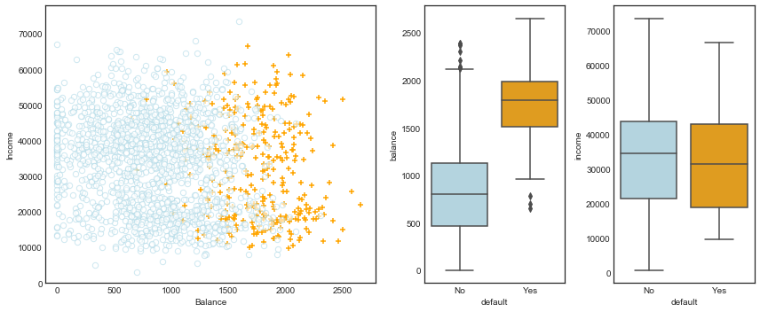

# Chapter 4 - Classification

- [Load dataset](#Load-dataset)
- [The Default data set](#Figure-4.1---Default-data-set)
- [4.3 Logistic Regression](#4.3-Logistic-Regression)
- [4.4 Linear Discriminant Analysis](#4.4-Linear-Discriminant-Analysis)
- [Lab: 4.6.3 Linear Discriminant Analysis](#4.6.3-Linear-Discriminant-Analysis)
- [Lab: 4.6.4 Quadratic Discriminant Analysis](#4.6.4-Quadratic-Discriminant-Analysis)
- [Lab: 4.6.5 K-Nearest Neighbors](#4.6.5-K-Nearest-Neighbors)
- [Lab: 4.6.6 An Application to Caravan Insurance Data](#4.6.6-An-Application-to-Caravan-Insurance-Data)


```python
# %load ../standard_import.txt
import pandas as pd
import numpy as np
import matplotlib as mpl
import matplotlib.pyplot as plt
import seaborn as sns

import sklearn.linear_model as skl_lm
from sklearn.discriminant_analysis import LinearDiscriminantAnalysis
from sklearn.discriminant_analysis import QuadraticDiscriminantAnalysis
from sklearn.metrics import confusion_matrix, classification_report, precision_score
from sklearn import preprocessing
from sklearn import neighbors

import statsmodels.api as sm
import statsmodels.formula.api as smf

%matplotlib inline
plt.style.use('seaborn-white')
```

### Load dataset


```python
# In R, I exported the dataset from package 'ISLR' to an Excel file
df = pd.read_excel('Data/Default.xlsx')

# Note: factorize() returns two objects: a label array and an array with the unique values.
# We are only interested in the first object. 
df['default2'] = df.default.factorize()[0]
df['student2'] = df.student.factorize()[0]
df.head(3)
```


<div>
<style scoped>
    .dataframe tbody tr th:only-of-type {
        vertical-align: middle;
    }

    .dataframe tbody tr th {
        vertical-align: top;
    }

    .dataframe thead th {
        text-align: right;
    }
</style>
<table border="1" class="dataframe">
  <thead>
    <tr style="text-align: right;">
      <th></th>
      <th>default</th>
      <th>student</th>
      <th>balance</th>
      <th>income</th>
      <th>default2</th>
      <th>student2</th>
    </tr>
  </thead>
  <tbody>
    <tr>
      <th>1</th>
      <td>No</td>
      <td>No</td>
      <td>729.526495</td>
      <td>44361.625074</td>
      <td>0</td>
      <td>0</td>
    </tr>
    <tr>
      <th>2</th>
      <td>No</td>
      <td>Yes</td>
      <td>817.180407</td>
      <td>12106.134700</td>
      <td>0</td>
      <td>1</td>
    </tr>
    <tr>
      <th>3</th>
      <td>No</td>
      <td>No</td>
      <td>1073.549164</td>
      <td>31767.138947</td>
      <td>0</td>
      <td>0</td>
    </tr>
  </tbody>
</table>
</div>


###  Figure 4.1 - Default data set


```python
fig = plt.figure(figsize=(12,5))
gs = mpl.gridspec.GridSpec(1, 4)
ax1 = plt.subplot(gs[0,:-2])
ax2 = plt.subplot(gs[0,-2])
ax3 = plt.subplot(gs[0,-1])

# Take a fraction of the samples where target value (default) is 'no'
df_no = df[df.default2 == 0].sample(frac=0.15)
# Take all samples  where target value is 'yes'
df_yes = df[df.default2 == 1]
df_ = df_no.append(df_yes)

ax1.scatter(df_[df_.default == 'Yes'].balance, df_[df_.default == 'Yes'].income, s=40, c='orange', marker='+',
            linewidths=1)
ax1.scatter(df_[df_.default == 'No'].balance, df_[df_.default == 'No'].income, s=40, marker='o', linewidths='1',
            edgecolors='lightblue', facecolors='white', alpha=.6)

ax1.set_ylim(ymin=0)
ax1.set_ylabel('Income')
ax1.set_xlim(xmin=-100)
ax1.set_xlabel('Balance')

c_palette = {'No':'lightblue', 'Yes':'orange'}
sns.boxplot('default', 'balance', data=df, orient='v', ax=ax2, palette=c_palette)
sns.boxplot('default', 'income', data=df, orient='v', ax=ax3, palette=c_palette)
gs.tight_layout(plt.gcf())
```





## 4.3 Logistic Regression
### Figure 4.2


```python
X_train = df.balance.values.reshape(-1,1) 
y = df.default2

# Create array of test data. Calculate the classification probability
# and predicted classification.
X_test = np.arange(df.balance.min(), df.balance.max()).reshape(-1,1)

clf = skl_lm.LogisticRegression(solver='newton-cg')
clf.fit(X_train,y)
prob = clf.predict_proba(X_test)

fig, (ax1, ax2) = plt.subplots(1,2, figsize=(12,5))
# Left plot
sns.regplot(df.balance, df.default2, order=1, ci=None,
            scatter_kws={'color':'orange'},
            line_kws={'color':'lightblue', 'lw':2}, ax=ax1)
# Right plot
ax2.scatter(X_train, y, color='orange')
ax2.plot(X_test, prob[:,1], color='lightblue')

for ax in fig.axes:
    ax.hlines(1, xmin=ax.xaxis.get_data_interval()[0],
              xmax=ax.xaxis.get_data_interval()[1], linestyles='dashed', lw=1)
    ax.hlines(0, xmin=ax.xaxis.get_data_interval()[0],
              xmax=ax.xaxis.get_data_interval()[1], linestyles='dashed', lw=1)
    ax.set_ylabel('Probability of default')
    ax.set_xlabel('Balance')
    ax.set_yticks([0, 0.25, 0.5, 0.75, 1.])
    ax.set_xlim(xmin=-100)
```


### Table 4.1


```python
y = df.default2
```

#####  scikit-learn


```python
# Using newton-cg solver, the coefficients are equal/closest to the ones in the book. 
# I do not know the details on the differences between the solvers.
clf = skl_lm.LogisticRegression(solver='newton-cg')
X_train = df.balance.values.reshape(-1,1)
clf.fit(X_train,y)
print(clf)
print('classes: ',clf.classes_)
print('coefficients: ',clf.coef_)
print('intercept :', clf.intercept_)
```

    LogisticRegression(C=1.0, class_weight=None, dual=False, fit_intercept=True,
              intercept_scaling=1, max_iter=100, multi_class='ovr', n_jobs=1,
              penalty='l2', random_state=None, solver='newton-cg', tol=0.0001,
              verbose=0, warm_start=False)
    classes:  [0 1]
    coefficients:  [[ 0.00549891]]
    intercept : [-10.65131761]


##### statsmodels


```python
X_train = sm.add_constant(df.balance)
est = smf.Logit(y.ravel(), X_train).fit()
est.summary2().tables[1]
```

    Optimization terminated successfully.
             Current function value: 0.079823
             Iterations 10


<div>
<style scoped>
    .dataframe tbody tr th:only-of-type {
        vertical-align: middle;
    }

    .dataframe tbody tr th {
        vertical-align: top;
    }

    .dataframe thead th {
        text-align: right;
    }
</style>
<table border="1" class="dataframe">
  <thead>
    <tr style="text-align: right;">
      <th></th>
      <th>Coef.</th>
      <th>Std.Err.</th>
      <th>z</th>
      <th>P&gt;|z|</th>
      <th>[0.025</th>
      <th>0.975]</th>
    </tr>
  </thead>
  <tbody>
    <tr>
      <th>const</th>
      <td>-10.651331</td>
      <td>0.361169</td>
      <td>-29.491287</td>
      <td>3.723665e-191</td>
      <td>-11.359208</td>
      <td>-9.943453</td>
    </tr>
    <tr>
      <th>balance</th>
      <td>0.005499</td>
      <td>0.000220</td>
      <td>24.952404</td>
      <td>2.010855e-137</td>
      <td>0.005067</td>
      <td>0.005931</td>
    </tr>
  </tbody>
</table>
</div>


###  Table 4.2


```python
X_train = sm.add_constant(df.student2)
y = df.default2

est = smf.Logit(y, X_train).fit()
est.summary2().tables[1]
```

    Optimization terminated successfully.
             Current function value: 0.145434
             Iterations 7


<div>
<style scoped>
    .dataframe tbody tr th:only-of-type {
        vertical-align: middle;
    }

    .dataframe tbody tr th {
        vertical-align: top;
    }

    .dataframe thead th {
        text-align: right;
    }
</style>
<table border="1" class="dataframe">
  <thead>
    <tr style="text-align: right;">
      <th></th>
      <th>Coef.</th>
      <th>Std.Err.</th>
      <th>z</th>
      <th>P&gt;|z|</th>
      <th>[0.025</th>
      <th>0.975]</th>
    </tr>
  </thead>
  <tbody>
    <tr>
      <th>const</th>
      <td>-3.504128</td>
      <td>0.070713</td>
      <td>-49.554094</td>
      <td>0.000000</td>
      <td>-3.642723</td>
      <td>-3.365532</td>
    </tr>
    <tr>
      <th>student2</th>
      <td>0.404887</td>
      <td>0.115019</td>
      <td>3.520177</td>
      <td>0.000431</td>
      <td>0.179454</td>
      <td>0.630320</td>
    </tr>
  </tbody>
</table>
</div>


###  Table 4.3 - Multiple Logistic Regression


```python
X_train = sm.add_constant(df[['balance', 'income', 'student2']])
est = smf.Logit(y, X_train).fit()
est.summary2().tables[1]
```

    Optimization terminated successfully.
             Current function value: 0.078577
             Iterations 10


<div>
<style scoped>
    .dataframe tbody tr th:only-of-type {
        vertical-align: middle;
    }

    .dataframe tbody tr th {
        vertical-align: top;
    }

    .dataframe thead th {
        text-align: right;
    }
</style>
<table border="1" class="dataframe">
  <thead>
    <tr style="text-align: right;">
      <th></th>
      <th>Coef.</th>
      <th>Std.Err.</th>
      <th>z</th>
      <th>P&gt;|z|</th>
      <th>[0.025</th>
      <th>0.975]</th>
    </tr>
  </thead>
  <tbody>
    <tr>
      <th>const</th>
      <td>-10.869045</td>
      <td>0.492273</td>
      <td>-22.079320</td>
      <td>4.995499e-108</td>
      <td>-11.833882</td>
      <td>-9.904209</td>
    </tr>
    <tr>
      <th>balance</th>
      <td>0.005737</td>
      <td>0.000232</td>
      <td>24.736506</td>
      <td>4.331521e-135</td>
      <td>0.005282</td>
      <td>0.006191</td>
    </tr>
    <tr>
      <th>income</th>
      <td>0.000003</td>
      <td>0.000008</td>
      <td>0.369808</td>
      <td>7.115254e-01</td>
      <td>-0.000013</td>
      <td>0.000019</td>
    </tr>
    <tr>
      <th>student2</th>
      <td>-0.646776</td>
      <td>0.236257</td>
      <td>-2.737595</td>
      <td>6.189022e-03</td>
      <td>-1.109831</td>
      <td>-0.183721</td>
    </tr>
  </tbody>
</table>
</div>


### Figure 4.3 - Confounding


```python
# balance and default vectors for students
X_train = df[df.student == 'Yes'].balance.values.reshape(df[df.student == 'Yes'].balance.size,1) 
y = df[df.student == 'Yes'].default2

# balance and default vectors for non-students
X_train2 = df[df.student == 'No'].balance.values.reshape(df[df.student == 'No'].balance.size,1) 
y2 = df[df.student == 'No'].default2

# Vector with balance values for plotting
X_test = np.arange(df.balance.min(), df.balance.max()).reshape(-1,1)

clf = skl_lm.LogisticRegression(solver='newton-cg')
clf2 = skl_lm.LogisticRegression(solver='newton-cg')

clf.fit(X_train,y)
clf2.fit(X_train2,y2)

prob = clf.predict_proba(X_test)
prob2 = clf2.predict_proba(X_test)
```


```python
df.groupby(['student','default']).size().unstack('default')
```


<div>
<style scoped>
    .dataframe tbody tr th:only-of-type {
        vertical-align: middle;
    }

    .dataframe tbody tr th {
        vertical-align: top;
    }

    .dataframe thead th {
        text-align: right;
    }
</style>
<table border="1" class="dataframe">
  <thead>
    <tr style="text-align: right;">
      <th>default</th>
      <th>No</th>
      <th>Yes</th>
    </tr>
    <tr>
      <th>student</th>
      <th></th>
      <th></th>
    </tr>
  </thead>
  <tbody>
    <tr>
      <th>No</th>
      <td>6850</td>
      <td>206</td>
    </tr>
    <tr>
      <th>Yes</th>
      <td>2817</td>
      <td>127</td>
    </tr>
  </tbody>
</table>
</div>


```python
# creating plot
fig, (ax1, ax2) = plt.subplots(1,2, figsize=(12,5))

# Left plot
ax1.plot(X_test, pd.DataFrame(prob)[1], color='orange', label='Student')
ax1.plot(X_test, pd.DataFrame(prob2)[1], color='lightblue', label='Non-student')
ax1.hlines(127/2817, colors='orange', label='Overall Student',
           xmin=ax1.xaxis.get_data_interval()[0],
           xmax=ax1.xaxis.get_data_interval()[1], linestyles='dashed')
ax1.hlines(206/6850, colors='lightblue', label='Overall Non-Student',
           xmin=ax1.xaxis.get_data_interval()[0],
           xmax=ax1.xaxis.get_data_interval()[1], linestyles='dashed')
ax1.set_ylabel('Default Rate')
ax1.set_xlabel('Credit Card Balance')
ax1.set_yticks([0, 0.2, 0.4, 0.6, 0.8, 1.])
ax1.set_xlim(450,2500)
ax1.legend(loc=2)

# Right plot
sns.boxplot('student', 'balance', data=df, orient='v', ax=ax2,  palette=c_palette);
```


## 4.4 Linear Discriminant Analysis
### Table 4.4 


```python
X = df[['balance', 'income', 'student2']].as_matrix()
y = df.default2.as_matrix()

lda = LinearDiscriminantAnalysis(solver='svd')
y_pred = lda.fit(X, y).predict(X)

df_ = pd.DataFrame({'True default status': y,
                    'Predicted default status': y_pred})
df_.replace(to_replace={0:'No', 1:'Yes'}, inplace=True)

df_.groupby(['Predicted default status','True default status']).size().unstack('True default status')
```


<div>
<style scoped>
    .dataframe tbody tr th:only-of-type {
        vertical-align: middle;
    }

    .dataframe tbody tr th {
        vertical-align: top;
    }

    .dataframe thead th {
        text-align: right;
    }
</style>
<table border="1" class="dataframe">
  <thead>
    <tr style="text-align: right;">
      <th>True default status</th>
      <th>No</th>
      <th>Yes</th>
    </tr>
    <tr>
      <th>Predicted default status</th>
      <th></th>
      <th></th>
    </tr>
  </thead>
  <tbody>
    <tr>
      <th>No</th>
      <td>9645</td>
      <td>254</td>
    </tr>
    <tr>
      <th>Yes</th>
      <td>22</td>
      <td>79</td>
    </tr>
  </tbody>
</table>
</div>


```python
print(classification_report(y, y_pred, target_names=['No', 'Yes']))
```

                 precision    recall  f1-score   support
    
             No       0.97      1.00      0.99      9667
            Yes       0.78      0.24      0.36       333
    
    avg / total       0.97      0.97      0.97     10000
    


### Table 4.5
Instead of using the probability of 50% as decision boundary, we say that a probability of default of 20% is to be classified as 'Yes'.


```python
decision_prob = 0.2
y_prob = lda.fit(X, y).predict_proba(X)

df_ = pd.DataFrame({'True default status': y,
                    'Predicted default status': y_prob[:,1] > decision_prob})
df_.replace(to_replace={0:'No', 1:'Yes', 'True':'Yes', 'False':'No'}, inplace=True)

df_.groupby(['Predicted default status','True default status']).size().unstack('True default status')
```


<div>
<style scoped>
    .dataframe tbody tr th:only-of-type {
        vertical-align: middle;
    }

    .dataframe tbody tr th {
        vertical-align: top;
    }

    .dataframe thead th {
        text-align: right;
    }
</style>
<table border="1" class="dataframe">
  <thead>
    <tr style="text-align: right;">
      <th>True default status</th>
      <th>No</th>
      <th>Yes</th>
    </tr>
    <tr>
      <th>Predicted default status</th>
      <th></th>
      <th></th>
    </tr>
  </thead>
  <tbody>
    <tr>
      <th>No</th>
      <td>9435</td>
      <td>140</td>
    </tr>
    <tr>
      <th>Yes</th>
      <td>232</td>
      <td>193</td>
    </tr>
  </tbody>
</table>
</div>


#  Lab

### 4.6.3 Linear Discriminant Analysis


```python
df = pd.read_csv('Data/Smarket.csv', usecols=range(1,10), index_col=0, parse_dates=True)
```


```python
X_train = df[:'2004'][['Lag1','Lag2']]
y_train = df[:'2004']['Direction']

X_test = df['2005':][['Lag1','Lag2']]
y_test = df['2005':]['Direction']

lda = LinearDiscriminantAnalysis()
pred = lda.fit(X_train, y_train).predict(X_test)
```


```python
lda.priors_
```


    array([ 0.49198397,  0.50801603])


```python
lda.means_
```


    array([[ 0.04279022,  0.03389409],
           [-0.03954635, -0.03132544]])


```python
# These do not seem to correspond to the values from the R output in the book?
lda.coef_
```


    array([[-0.05544078, -0.0443452 ]])


```python
confusion_matrix(y_test, pred).T
```


    array([[ 35,  35],
           [ 76, 106]])


```python
print(classification_report(y_test, pred, digits=3))
```

                 precision    recall  f1-score   support
    
           Down      0.500     0.315     0.387       111
             Up      0.582     0.752     0.656       141
    
    avg / total      0.546     0.560     0.538       252
    


```python
pred_p = lda.predict_proba(X_test)
```


```python
np.unique(pred_p[:,1]>0.5, return_counts=True)
```


    (array([False,  True], dtype=bool), array([ 70, 182]))


```python
np.unique(pred_p[:,1]>0.9, return_counts=True)
```


    (array([False], dtype=bool), array([252]))


### 4.6.4 Quadratic Discriminant Analysis


```python
qda = QuadraticDiscriminantAnalysis()
pred = qda.fit(X_train, y_train).predict(X_test)
```


```python
qda.priors_
```


    array([ 0.49198397,  0.50801603])


```python
qda.means_
```


    array([[ 0.04279022,  0.03389409],
           [-0.03954635, -0.03132544]])


```python
confusion_matrix(y_test, pred).T
```


    array([[ 30,  20],
           [ 81, 121]])


```python
print(classification_report(y_test, pred, digits=3))
```

                 precision    recall  f1-score   support
    
           Down      0.600     0.270     0.373       111
             Up      0.599     0.858     0.706       141
    
    avg / total      0.599     0.599     0.559       252
    


### 4.6.5 K-Nearest Neighbors


```python
knn = neighbors.KNeighborsClassifier(n_neighbors=1)
pred = knn.fit(X_train, y_train).predict(X_test)
print(confusion_matrix(y_test, pred).T)
print(classification_report(y_test, pred, digits=3))
```

    [[43 58]
     [68 83]]
                 precision    recall  f1-score   support
    
           Down      0.426     0.387     0.406       111
             Up      0.550     0.589     0.568       141
    
    avg / total      0.495     0.500     0.497       252
    


```python
knn = neighbors.KNeighborsClassifier(n_neighbors=3)
pred = knn.fit(X_train, y_train).predict(X_test)
print(confusion_matrix(y_test, pred).T)
print(classification_report(y_test, pred, digits=3))
```

    [[48 55]
     [63 86]]
                 precision    recall  f1-score   support
    
           Down      0.466     0.432     0.449       111
             Up      0.577     0.610     0.593       141
    
    avg / total      0.528     0.532     0.529       252
    


### 4.6.6 An Application to Caravan Insurance Data

#### K-Nearest Neighbors


```python
# In R, I exported the dataset from package 'ISLR' to a csv file
df = pd.read_csv('Data/Caravan.csv')
y = df.Purchase
X = df.drop('Purchase', axis=1).astype('float64')
X_scaled = preprocessing.scale(X)

X_train = X_scaled[1000:,:]
y_train = y[1000:]
X_test = X_scaled[:1000,:]
y_test = y[:1000]

def KNN(n_neighbors=1, weights='uniform'):
    clf = neighbors.KNeighborsClassifier(n_neighbors, weights)
    clf.fit(X_train, y_train)
    pred = clf.predict(X_test)
    score = clf.score(X_test, y_test)
    return(pred, score, clf.classes_)

def plot_confusion_matrix(cm, classes, n_neighbors, title='Confusion matrix (Normalized)',
                          cmap=plt.cm.Blues):
    plt.imshow(cm, interpolation='nearest', cmap=plt.cm.Blues)
    plt.title('Normalized confusion matrix: KNN-{}'.format(n_neighbors))
    plt.colorbar()
    plt.xticks(np.arange(2), classes)
    plt.yticks(np.arange(2), classes)
    plt.tight_layout()
    plt.xlabel('True label',rotation='horizontal', ha='right')
    plt.ylabel('Predicted label')
    plt.show()
```


```python
for i in [1,3,5]:
    pred, score, classes = KNN(i)
    cm = confusion_matrix(y_test, pred)
    cm_normalized = cm.astype('float') / cm.sum(axis=1)[:, np.newaxis]
    plot_confusion_matrix(cm_normalized.T, classes, n_neighbors=i)
    cm_df = pd.DataFrame(cm.T, index=classes, columns=classes)
    cm_df.index.name = 'Predicted'
    cm_df.columns.name = 'True'
    print(cm_df)    
    print(pd.DataFrame(precision_score(y_test, pred, average=None),
                       index=classes, columns=['Precision']))        
```


    True        No  Yes
    Predicted          
    No         882   48
    Yes         59   11
         Precision
    No    0.948387
    Yes   0.157143


    True        No  Yes
    Predicted          
    No         921   53
    Yes         20    6
         Precision
    No    0.945585
    Yes   0.230769


    True        No  Yes
    Predicted          
    No         934   55
    Yes          7    4
         Precision
    No    0.944388
    Yes   0.363636


####  Logistic Regression


```python
regr = skl_lm.LogisticRegression()
regr.fit(X_train, y_train)
```


    LogisticRegression(C=1.0, class_weight=None, dual=False, fit_intercept=True,
              intercept_scaling=1, max_iter=100, multi_class='ovr', n_jobs=1,
              penalty='l2', random_state=None, solver='liblinear', tol=0.0001,
              verbose=0, warm_start=False)


```python
pred = regr.predict(X_test)
cm_df = pd.DataFrame(confusion_matrix(y_test, pred).T, index=regr.classes_,
                     columns=regr.classes_)
cm_df.index.name = 'Predicted'
cm_df.columns.name = 'True'
print(cm_df)
print(classification_report(y_test, pred))
```

    True        No  Yes
    Predicted          
    No         935   59
    Yes          6    0
                 precision    recall  f1-score   support
    
             No       0.94      0.99      0.97       941
            Yes       0.00      0.00      0.00        59
    
    avg / total       0.89      0.94      0.91      1000
    


```python
pred_p = regr.predict_proba(X_test)
cm_df = pd.DataFrame({'True': y_test, 'Pred': pred_p[:,1] > .25})
cm_df.Pred.replace(to_replace={True:'Yes', False:'No'}, inplace=True)
print(cm_df.groupby(['True', 'Pred']).size().unstack('True').T)
print(classification_report(y_test, cm_df.Pred))
```

    Pred   No  Yes
    True          
    No    919   22
    Yes    48   11
                 precision    recall  f1-score   support
    
             No       0.95      0.98      0.96       941
            Yes       0.33      0.19      0.24        59
    
    avg / total       0.91      0.93      0.92      1000
    

