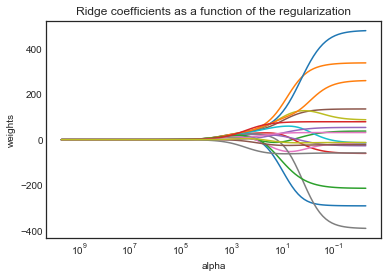
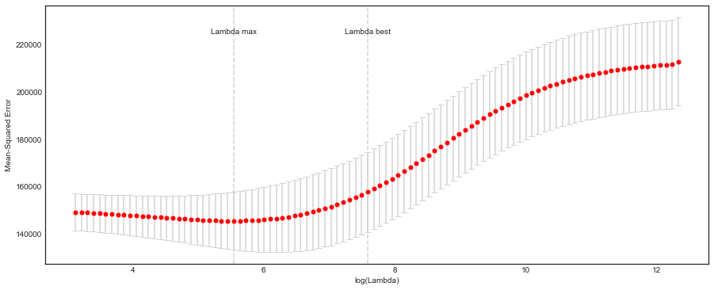
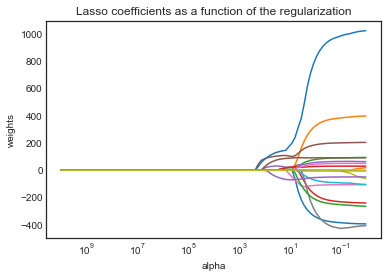
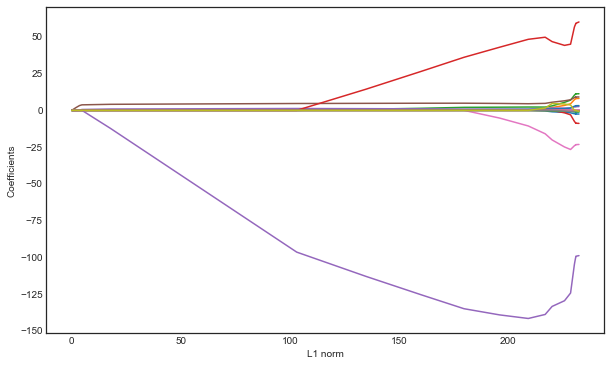
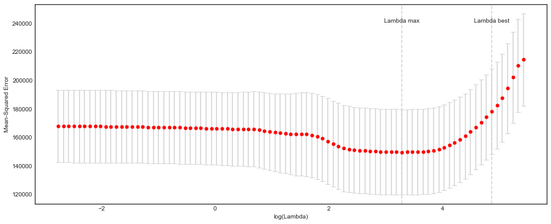
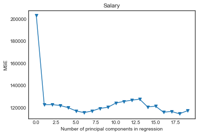
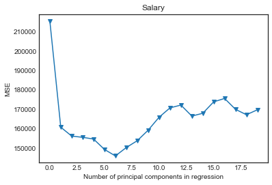
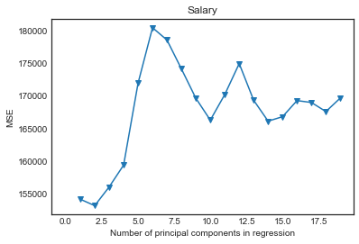

# Linear Model Selection and Regularization: Practice

- [Lab 2: Ridge Regression](#6.6.1-Ridge-Regression)
- [Lab 2: The Lasso](#6.6.2-The-Lasso)
- [Lab 3: Principal Components Regression](#6.7.1-Principal-Components-Regression)
- [Lab 3: Partial Least Squares](#6.7.2-Partial-Least-Squares)


```python
import pandas as pd
import numpy as np
import matplotlib.pyplot as plt
import seaborn as sns

import glmnet as gln

from sklearn.preprocessing import scale 
from sklearn import model_selection
from sklearn.linear_model import LinearRegression, Ridge, RidgeCV, Lasso, LassoCV
from sklearn.decomposition import PCA
from sklearn.cross_decomposition import PLSRegression
from sklearn.model_selection import KFold, cross_val_score
from sklearn.metrics import mean_squared_error

%matplotlib inline
plt.style.use('seaborn-white')
```

# Lab 2


```python
# In R, I exported the dataset from package 'ISLR' to a csv file.
df = pd.read_csv('Data/Hitters.csv', index_col=0).dropna()
df.index.name = 'Player'
df.info()
```

    <class 'pandas.core.frame.DataFrame'>
    Index: 263 entries, -Alan Ashby to -Willie Wilson
    Data columns (total 20 columns):
    AtBat        263 non-null int64
    Hits         263 non-null int64
    HmRun        263 non-null int64
    Runs         263 non-null int64
    RBI          263 non-null int64
    Walks        263 non-null int64
    Years        263 non-null int64
    CAtBat       263 non-null int64
    CHits        263 non-null int64
    CHmRun       263 non-null int64
    CRuns        263 non-null int64
    CRBI         263 non-null int64
    CWalks       263 non-null int64
    League       263 non-null object
    Division     263 non-null object
    PutOuts      263 non-null int64
    Assists      263 non-null int64
    Errors       263 non-null int64
    Salary       263 non-null float64
    NewLeague    263 non-null object
    dtypes: float64(1), int64(16), object(3)
    memory usage: 43.1+ KB


```python
df.head()
```


<div>
<style scoped>
    .dataframe tbody tr th:only-of-type {
        vertical-align: middle;
    }

    .dataframe tbody tr th {
        vertical-align: top;
    }

    .dataframe thead th {
        text-align: right;
    }
</style>
<table border="1" class="dataframe">
  <thead>
    <tr style="text-align: right;">
      <th></th>
      <th>AtBat</th>
      <th>Hits</th>
      <th>HmRun</th>
      <th>Runs</th>
      <th>RBI</th>
      <th>Walks</th>
      <th>Years</th>
      <th>CAtBat</th>
      <th>CHits</th>
      <th>CHmRun</th>
      <th>CRuns</th>
      <th>CRBI</th>
      <th>CWalks</th>
      <th>League</th>
      <th>Division</th>
      <th>PutOuts</th>
      <th>Assists</th>
      <th>Errors</th>
      <th>Salary</th>
      <th>NewLeague</th>
    </tr>
    <tr>
      <th>Player</th>
      <th></th>
      <th></th>
      <th></th>
      <th></th>
      <th></th>
      <th></th>
      <th></th>
      <th></th>
      <th></th>
      <th></th>
      <th></th>
      <th></th>
      <th></th>
      <th></th>
      <th></th>
      <th></th>
      <th></th>
      <th></th>
      <th></th>
      <th></th>
    </tr>
  </thead>
  <tbody>
    <tr>
      <th>-Alan Ashby</th>
      <td>315</td>
      <td>81</td>
      <td>7</td>
      <td>24</td>
      <td>38</td>
      <td>39</td>
      <td>14</td>
      <td>3449</td>
      <td>835</td>
      <td>69</td>
      <td>321</td>
      <td>414</td>
      <td>375</td>
      <td>N</td>
      <td>W</td>
      <td>632</td>
      <td>43</td>
      <td>10</td>
      <td>475.0</td>
      <td>N</td>
    </tr>
    <tr>
      <th>-Alvin Davis</th>
      <td>479</td>
      <td>130</td>
      <td>18</td>
      <td>66</td>
      <td>72</td>
      <td>76</td>
      <td>3</td>
      <td>1624</td>
      <td>457</td>
      <td>63</td>
      <td>224</td>
      <td>266</td>
      <td>263</td>
      <td>A</td>
      <td>W</td>
      <td>880</td>
      <td>82</td>
      <td>14</td>
      <td>480.0</td>
      <td>A</td>
    </tr>
    <tr>
      <th>-Andre Dawson</th>
      <td>496</td>
      <td>141</td>
      <td>20</td>
      <td>65</td>
      <td>78</td>
      <td>37</td>
      <td>11</td>
      <td>5628</td>
      <td>1575</td>
      <td>225</td>
      <td>828</td>
      <td>838</td>
      <td>354</td>
      <td>N</td>
      <td>E</td>
      <td>200</td>
      <td>11</td>
      <td>3</td>
      <td>500.0</td>
      <td>N</td>
    </tr>
    <tr>
      <th>-Andres Galarraga</th>
      <td>321</td>
      <td>87</td>
      <td>10</td>
      <td>39</td>
      <td>42</td>
      <td>30</td>
      <td>2</td>
      <td>396</td>
      <td>101</td>
      <td>12</td>
      <td>48</td>
      <td>46</td>
      <td>33</td>
      <td>N</td>
      <td>E</td>
      <td>805</td>
      <td>40</td>
      <td>4</td>
      <td>91.5</td>
      <td>N</td>
    </tr>
    <tr>
      <th>-Alfredo Griffin</th>
      <td>594</td>
      <td>169</td>
      <td>4</td>
      <td>74</td>
      <td>51</td>
      <td>35</td>
      <td>11</td>
      <td>4408</td>
      <td>1133</td>
      <td>19</td>
      <td>501</td>
      <td>336</td>
      <td>194</td>
      <td>A</td>
      <td>W</td>
      <td>282</td>
      <td>421</td>
      <td>25</td>
      <td>750.0</td>
      <td>A</td>
    </tr>
  </tbody>
</table>
</div>


```python
dummies = pd.get_dummies(df[['League', 'Division', 'NewLeague']])
dummies.info()
print(dummies.head())
```

    <class 'pandas.core.frame.DataFrame'>
    Index: 263 entries, -Alan Ashby to -Willie Wilson
    Data columns (total 6 columns):
    League_A       263 non-null uint8
    League_N       263 non-null uint8
    Division_E     263 non-null uint8
    Division_W     263 non-null uint8
    NewLeague_A    263 non-null uint8
    NewLeague_N    263 non-null uint8
    dtypes: uint8(6)
    memory usage: 3.6+ KB
                       League_A  League_N  Division_E  Division_W  NewLeague_A  \
    Player                                                                       
    -Alan Ashby               0         1           0           1            0   
    -Alvin Davis              1         0           0           1            1   
    -Andre Dawson             0         1           1           0            0   
    -Andres Galarraga         0         1           1           0            0   
    -Alfredo Griffin          1         0           0           1            1   
    
                       NewLeague_N  
    Player                          
    -Alan Ashby                  1  
    -Alvin Davis                 0  
    -Andre Dawson                1  
    -Andres Galarraga            1  
    -Alfredo Griffin             0  


```python
y = df.Salary

# Drop the column with the independent variable (Salary), and columns for which we created dummy variables
X_ = df.drop(['Salary', 'League', 'Division', 'NewLeague'], axis=1).astype('float64')
# Define the feature set X.
X = pd.concat([X_, dummies[['League_N', 'Division_W', 'NewLeague_N']]], axis=1)
X.info()
```

    <class 'pandas.core.frame.DataFrame'>
    Index: 263 entries, -Alan Ashby to -Willie Wilson
    Data columns (total 19 columns):
    AtBat          263 non-null float64
    Hits           263 non-null float64
    HmRun          263 non-null float64
    Runs           263 non-null float64
    RBI            263 non-null float64
    Walks          263 non-null float64
    Years          263 non-null float64
    CAtBat         263 non-null float64
    CHits          263 non-null float64
    CHmRun         263 non-null float64
    CRuns          263 non-null float64
    CRBI           263 non-null float64
    CWalks         263 non-null float64
    PutOuts        263 non-null float64
    Assists        263 non-null float64
    Errors         263 non-null float64
    League_N       263 non-null uint8
    Division_W     263 non-null uint8
    NewLeague_N    263 non-null uint8
    dtypes: float64(16), uint8(3)
    memory usage: 35.7+ KB


```python
X.head(5)
```


<div>
<style scoped>
    .dataframe tbody tr th:only-of-type {
        vertical-align: middle;
    }

    .dataframe tbody tr th {
        vertical-align: top;
    }

    .dataframe thead th {
        text-align: right;
    }
</style>
<table border="1" class="dataframe">
  <thead>
    <tr style="text-align: right;">
      <th></th>
      <th>AtBat</th>
      <th>Hits</th>
      <th>HmRun</th>
      <th>Runs</th>
      <th>RBI</th>
      <th>Walks</th>
      <th>Years</th>
      <th>CAtBat</th>
      <th>CHits</th>
      <th>CHmRun</th>
      <th>CRuns</th>
      <th>CRBI</th>
      <th>CWalks</th>
      <th>PutOuts</th>
      <th>Assists</th>
      <th>Errors</th>
      <th>League_N</th>
      <th>Division_W</th>
      <th>NewLeague_N</th>
    </tr>
    <tr>
      <th>Player</th>
      <th></th>
      <th></th>
      <th></th>
      <th></th>
      <th></th>
      <th></th>
      <th></th>
      <th></th>
      <th></th>
      <th></th>
      <th></th>
      <th></th>
      <th></th>
      <th></th>
      <th></th>
      <th></th>
      <th></th>
      <th></th>
      <th></th>
    </tr>
  </thead>
  <tbody>
    <tr>
      <th>-Alan Ashby</th>
      <td>315.0</td>
      <td>81.0</td>
      <td>7.0</td>
      <td>24.0</td>
      <td>38.0</td>
      <td>39.0</td>
      <td>14.0</td>
      <td>3449.0</td>
      <td>835.0</td>
      <td>69.0</td>
      <td>321.0</td>
      <td>414.0</td>
      <td>375.0</td>
      <td>632.0</td>
      <td>43.0</td>
      <td>10.0</td>
      <td>1</td>
      <td>1</td>
      <td>1</td>
    </tr>
    <tr>
      <th>-Alvin Davis</th>
      <td>479.0</td>
      <td>130.0</td>
      <td>18.0</td>
      <td>66.0</td>
      <td>72.0</td>
      <td>76.0</td>
      <td>3.0</td>
      <td>1624.0</td>
      <td>457.0</td>
      <td>63.0</td>
      <td>224.0</td>
      <td>266.0</td>
      <td>263.0</td>
      <td>880.0</td>
      <td>82.0</td>
      <td>14.0</td>
      <td>0</td>
      <td>1</td>
      <td>0</td>
    </tr>
    <tr>
      <th>-Andre Dawson</th>
      <td>496.0</td>
      <td>141.0</td>
      <td>20.0</td>
      <td>65.0</td>
      <td>78.0</td>
      <td>37.0</td>
      <td>11.0</td>
      <td>5628.0</td>
      <td>1575.0</td>
      <td>225.0</td>
      <td>828.0</td>
      <td>838.0</td>
      <td>354.0</td>
      <td>200.0</td>
      <td>11.0</td>
      <td>3.0</td>
      <td>1</td>
      <td>0</td>
      <td>1</td>
    </tr>
    <tr>
      <th>-Andres Galarraga</th>
      <td>321.0</td>
      <td>87.0</td>
      <td>10.0</td>
      <td>39.0</td>
      <td>42.0</td>
      <td>30.0</td>
      <td>2.0</td>
      <td>396.0</td>
      <td>101.0</td>
      <td>12.0</td>
      <td>48.0</td>
      <td>46.0</td>
      <td>33.0</td>
      <td>805.0</td>
      <td>40.0</td>
      <td>4.0</td>
      <td>1</td>
      <td>0</td>
      <td>1</td>
    </tr>
    <tr>
      <th>-Alfredo Griffin</th>
      <td>594.0</td>
      <td>169.0</td>
      <td>4.0</td>
      <td>74.0</td>
      <td>51.0</td>
      <td>35.0</td>
      <td>11.0</td>
      <td>4408.0</td>
      <td>1133.0</td>
      <td>19.0</td>
      <td>501.0</td>
      <td>336.0</td>
      <td>194.0</td>
      <td>282.0</td>
      <td>421.0</td>
      <td>25.0</td>
      <td>0</td>
      <td>1</td>
      <td>0</td>
    </tr>
  </tbody>
</table>
</div>


#### I executed the R code and downloaded the exact same training/test sets used in the book.


```python
X_train = pd.read_csv('Data/Hitters_X_train.csv', index_col=0)
y_train = pd.read_csv('Data/Hitters_y_train.csv', index_col=0)
X_test = pd.read_csv('Data/Hitters_X_test.csv', index_col=0)
y_test = pd.read_csv('Data/Hitters_y_test.csv', index_col=0)
```

### 6.6.1 Ridge Regression

### Scikit-learn

The __glmnet__ algorithms in R optimize the objective function using cyclical coordinate descent, while scikit-learn Ridge regression uses linear least squares with L2 regularization. They are rather different implementations, but the general principles are the same.

The __glmnet() function in R__ optimizes:
### $$ \frac{1}{N}|| X\beta-y||^2_2+\lambda\bigg(\frac{1}{2}(1−\alpha)||\beta||^2_2 \ +\ \alpha||\beta||_1\bigg) $$
(See R documentation and https://cran.r-project.org/web/packages/glmnet/vignettes/glmnet_beta.pdf)<BR>
The function supports L1 and L2 regularization. For just Ridge regression we need to use $\alpha = 0 $. This reduces the above cost function to
### $$ \frac{1}{N}|| X\beta-y||^2_2+\frac{1}{2}\lambda ||\beta||^2_2 $$
The __sklearn Ridge()__ function optimizes:
### $$ ||X\beta - y||^2_2 + \alpha ||\beta||^2_2 $$
which is equivalent to optimizing
### $$ \frac{1}{N}||X\beta - y||^2_2 + \frac{\alpha}{N} ||\beta||^2_2 $$


```python
alphas = 10**np.linspace(10,-2,100)*0.5

ridge = Ridge()
coefs = []

for a in alphas:
    ridge.set_params(alpha=a)
    ridge.fit(scale(X), y)
    coefs.append(ridge.coef_)

ax = plt.gca()
ax.plot(alphas, coefs)
ax.set_xscale('log')
ax.set_xlim(ax.get_xlim()[::-1])  # reverse axis
plt.axis('tight')
plt.xlabel('alpha')
plt.ylabel('weights')
plt.title('Ridge coefficients as a function of the regularization');
```





The above plot shows that the Ridge coefficients get larger when we decrease alpha.

#### Alpha = 4


```python
from sklearn.preprocessing import StandardScaler

scaler = StandardScaler().fit(X_train)
```


```python
ridge2 = Ridge(alpha=len(X_)*11498/2)
ridge2.fit(scaler.transform(X_train), y_train)
pred = ridge2.predict(scaler.transform(X_test))
mean_squared_error(y_test, pred)
```


    193147.46143016344


```python
pd.Series(ridge2.coef_.flatten(), index=X.columns)
```


    AtBat          0.015146
    Hits           0.016050
    HmRun          0.013561
    Runs           0.015681
    RBI            0.016782
    Walks          0.019662
    Years          0.010390
    CAtBat         0.016570
    CHits          0.017627
    CHmRun         0.015072
    CRuns          0.018771
    CRBI           0.016697
    CWalks         0.016821
    PutOuts        0.003228
    Assists       -0.007600
    Errors         0.013672
    League_N       0.003519
    Division_W     0.003339
    NewLeague_N    0.003499
    dtype: float64


#### Alpha = $10^{10}$ 
This big penalty shrinks the coefficients to a very large degree and makes the model more biased, resulting in a higher MSE.


```python
ridge2.set_params(alpha=10**10)
ridge2.fit(scale(X_train), y_train)
pred = ridge2.predict(scale(X_test))
mean_squared_error(y_test, pred)
```


    193253.09741651407


#### Compute the regularization path using RidgeCV


```python
ridgecv = RidgeCV(alphas=alphas, scoring='neg_mean_squared_error')
ridgecv.fit(scale(X_train), y_train)
```


    RidgeCV(alphas=array([5.00000e+09, 3.78232e+09, ..., 6.60971e-03, 5.00000e-03]),
        cv=None, fit_intercept=True, gcv_mode=None, normalize=False,
        scoring='neg_mean_squared_error', store_cv_values=False)


```python
ridgecv.alpha_
```


    115.5064850041579


```python
ridge2.set_params(alpha=ridgecv.alpha_)
ridge2.fit(scale(X_train), y_train)
mean_squared_error(y_test, ridge2.predict(scale(X_test)))
```


    97384.92959172592


```python
pd.Series(ridge2.coef_.flatten(), index=X.columns)
```


    AtBat           7.576771
    Hits           22.596030
    HmRun          18.971990
    Runs           20.193945
    RBI            21.063875
    Walks          55.713281
    Years          -4.687149
    CAtBat         20.496892
    CHits          29.230247
    CHmRun         14.293124
    CRuns          35.881788
    CRBI           20.212172
    CWalks         24.419768
    PutOuts        16.128910
    Assists       -44.102264
    Errors         54.624503
    League_N        5.771464
    Division_W     -0.293713
    NewLeague_N    11.137518
    dtype: float64


### python-glmnet (update 2016-08-29)
This relatively new module is a wrapper for the fortran library used in the R package `glmnet`. It gives mostly the exact same results as described in the book. However, the `predict()` method does not give you the regression *coefficients* for lambda values not in the lambda_path. It only returns the predicted values.
https://github.com/civisanalytics/python-glmnet


```python
grid = 10**np.linspace(10,-2,100)

ridge3 = gln.ElasticNet(alpha=0, lambda_path=grid)
ridge3.fit(X, y)
```


    ElasticNet(alpha=0, cut_point=1.0, fit_intercept=True,
          lambda_path=array([1.00000e+10, 7.56463e+09, ..., 1.32194e-02, 1.00000e-02]),
          max_iter=100000, min_lambda_ratio=0.0001, n_jobs=1, n_lambda=100,
          n_splits=3, random_state=None, scoring=None, standardize=True,
          tol=1e-07, verbose=False)


#### Lambda 11498


```python
ridge3.lambda_path_[49]
```


    11497.569953977356


```python
print('Intercept: {:.3f}'.format(ridge3.intercept_path_[49]))
```

    Intercept: 407.356


```python
pd.Series(np.round(ridge3.coef_path_[:,49], decimals=3), index=X.columns)
```


    AtBat          0.037
    Hits           0.138
    HmRun          0.525
    Runs           0.231
    RBI            0.240
    Walks          0.290
    Years          1.108
    CAtBat         0.003
    CHits          0.012
    CHmRun         0.088
    CRuns          0.023
    CRBI           0.024
    CWalks         0.025
    PutOuts        0.016
    Assists        0.003
    Errors        -0.021
    League_N       0.085
    Division_W    -6.215
    NewLeague_N    0.301
    dtype: float64


```python
np.sqrt(np.sum(ridge3.coef_path_[:,49]**2))
```


    6.3606122865384505


#### Lambda 705


```python
ridge3.lambda_path_[59]
```


    705.4802310718645


```python
print('Intercept: {:.3f}'.format(ridge3.intercept_path_[59]))
```

    Intercept: 54.325


```python
pd.Series(np.round(ridge3.coef_path_[:,59], decimals=3), index=X.columns)
```


    AtBat           0.112
    Hits            0.656
    HmRun           1.180
    Runs            0.938
    RBI             0.847
    Walks           1.320
    Years           2.596
    CAtBat          0.011
    CHits           0.047
    CHmRun          0.338
    CRuns           0.094
    CRBI            0.098
    CWalks          0.072
    PutOuts         0.119
    Assists         0.016
    Errors         -0.704
    League_N       13.684
    Division_W    -54.659
    NewLeague_N     8.612
    dtype: float64


```python
np.sqrt(np.sum(ridge3.coef_path_[:,59]**2))
```


    57.11003436702412


#### Fit model using just the training set.


```python
ridge4 = gln.ElasticNet(alpha=0, lambda_path=grid, scoring='mean_squared_error', tol=1e-12)
ridge4.fit(X_train, y_train.values.ravel())
```


    ElasticNet(alpha=0, cut_point=1.0, fit_intercept=True,
          lambda_path=array([1.00000e+10, 7.56463e+09, ..., 1.32194e-02, 1.00000e-02]),
          max_iter=100000, min_lambda_ratio=0.0001, n_jobs=1, n_lambda=100,
          n_splits=3, random_state=None, scoring='mean_squared_error',
          standardize=True, tol=1e-12, verbose=False)


```python
# prediction using lambda = 4
pred = ridge4.predict(X_test, lamb=4)
mean_squared_error(y_test.values.ravel(), pred)
```


    101036.83230892917


#### Lambda chosen by cross validation


```python
ridge5 = gln.ElasticNet(alpha=0, scoring='mean_squared_error')
ridge5.fit(X_train, y_train.values.ravel())
```


    ElasticNet(alpha=0, cut_point=1.0, fit_intercept=True, lambda_path=None,
          max_iter=100000, min_lambda_ratio=0.0001, n_jobs=1, n_lambda=100,
          n_splits=3, random_state=None, scoring='mean_squared_error',
          standardize=True, tol=1e-07, verbose=False)


```python
# Lambda with best CV performance
ridge5.lambda_max_
```


    255.04348848905948


```python
# Lambda larger than lambda_max_, but with a CV score that is within 1 standard deviation away from lambda_max_ 
ridge5.lambda_best_
```


    array([1974.70910641])


```python
plt.figure(figsize=(15,6))
plt.errorbar(np.log(ridge5.lambda_path_), -ridge5.cv_mean_score_, color='r', linestyle='None', marker='o',
             markersize=5, yerr=ridge5.cv_standard_error_, ecolor='lightgrey', capsize=4)

for ref, txt in zip([ridge5.lambda_best_, ridge5.lambda_max_], ['Lambda best', 'Lambda max']):
    plt.axvline(x=np.log(ref), linestyle='dashed', color='lightgrey')
    plt.text(np.log(ref), .95*plt.gca().get_ylim()[1], txt, ha='center')

plt.xlabel('log(Lambda)')
plt.ylabel('Mean-Squared Error');
```





```python
# MSE for lambda with best CV performance
pred = ridge5.predict(X_test, lamb=ridge5.lambda_max_)
mean_squared_error(y_test, pred)
```


    96006.84514850576


#### Fit model to full data set


```python
ridge6= gln.ElasticNet(alpha=0, scoring='mean_squared_error', n_splits=10)
ridge6.fit(X, y)
```


    ElasticNet(alpha=0, cut_point=1.0, fit_intercept=True, lambda_path=None,
          max_iter=100000, min_lambda_ratio=0.0001, n_jobs=1, n_lambda=100,
          n_splits=10, random_state=None, scoring='mean_squared_error',
          standardize=True, tol=1e-07, verbose=False)


```python
# These are not really close to the ones in the book.
pd.Series(ridge6.coef_path_[:,ridge6.lambda_max_inx_], index=X.columns)
```


    AtBat           -0.681594
    Hits             2.772311
    HmRun           -1.365704
    Runs             1.014812
    RBI              0.713030
    Walks            3.378558
    Years           -9.066826
    CAtBat          -0.001200
    CHits            0.136102
    CHmRun           0.697992
    CRuns            0.295890
    CRBI             0.257072
    CWalks          -0.278966
    PutOuts          0.263887
    Assists          0.169878
    Errors          -3.685656
    League_N        53.209503
    Division_W    -122.834334
    NewLeague_N    -18.102528
    dtype: float64


### 6.6.2 The Lasso

### Scikit-learn


For both __glmnet__ in R and sklearn __Lasso()__ function the standard L1 penalty is:
### $$ \lambda |\beta|_1 $$


```python
lasso = Lasso(max_iter=10000)
coefs = []

for a in alphas*2:
    lasso.set_params(alpha=a)
    lasso.fit(scale(X_train), y_train)
    coefs.append(lasso.coef_)

ax = plt.gca()
ax.plot(alphas*2, coefs)
ax.set_xscale('log')
ax.set_xlim(ax.get_xlim()[::-1])  # reverse axis
plt.axis('tight')
plt.xlabel('alpha')
plt.ylabel('weights')
plt.title('Lasso coefficients as a function of the regularization');
```





```python
lassocv = LassoCV(alphas=None, cv=10, max_iter=10000)
lassocv.fit(scale(X_train), y_train.values.ravel())
```


    LassoCV(alphas=None, copy_X=True, cv=10, eps=0.001, fit_intercept=True,
        max_iter=10000, n_alphas=100, n_jobs=1, normalize=False,
        positive=False, precompute='auto', random_state=None,
        selection='cyclic', tol=0.0001, verbose=False)


```python
lassocv.alpha_
```


    30.013822564464284


```python
lasso.set_params(alpha=lassocv.alpha_)
lasso.fit(scale(X_train), y_train)
mean_squared_error(y_test, lasso.predict(scale(X_test)))
```


    102924.90954696963


```python
# Some of the coefficients are now reduced to exactly zero.
pd.Series(lasso.coef_, index=X.columns)
```


    AtBat            0.000000
    Hits             0.000000
    HmRun            2.154219
    Runs             0.000000
    RBI             30.835560
    Walks          104.071528
    Years           -0.000000
    CAtBat           0.000000
    CHits            0.000000
    CHmRun           0.000000
    CRuns          132.858095
    CRBI             0.000000
    CWalks           0.000000
    PutOuts          1.896185
    Assists        -51.058752
    Errors          76.779641
    League_N         0.000000
    Division_W       0.000000
    NewLeague_N      0.000000
    dtype: float64


### python-glmnet


```python
lasso2 = gln.ElasticNet(alpha=1, lambda_path=grid, scoring='mean_squared_error', n_splits=10)
lasso2.fit(X_train, y_train.values.ravel())
```


    ElasticNet(alpha=1, cut_point=1.0, fit_intercept=True,
          lambda_path=array([1.00000e+10, 7.56463e+09, ..., 1.32194e-02, 1.00000e-02]),
          max_iter=100000, min_lambda_ratio=0.0001, n_jobs=1, n_lambda=100,
          n_splits=10, random_state=None, scoring='mean_squared_error',
          standardize=True, tol=1e-07, verbose=False)


```python
l1_norm = np.sum(np.abs(lasso2.coef_path_), axis=0)

plt.figure(figsize=(10,6))
plt.plot(l1_norm, lasso2.coef_path_.T)
plt.xlabel('L1 norm')
plt.ylabel('Coefficients');
```





#### Let glmnet() create a grid to use in CV


```python
lasso3 = gln.ElasticNet(alpha=1, scoring='mean_squared_error', n_splits=10)
lasso3.fit(X_train, y_train.values.ravel())
```


    ElasticNet(alpha=1, cut_point=1.0, fit_intercept=True, lambda_path=None,
          max_iter=100000, min_lambda_ratio=0.0001, n_jobs=1, n_lambda=100,
          n_splits=10, random_state=None, scoring='mean_squared_error',
          standardize=True, tol=1e-07, verbose=False)


```python
plt.figure(figsize=(15,6))
plt.errorbar(np.log(lasso3.lambda_path_), -lasso3.cv_mean_score_, color='r', linestyle='None', marker='o',
             markersize=5, yerr=lasso3.cv_standard_error_, ecolor='lightgrey', capsize=4)

for ref, txt in zip([lasso3.lambda_best_, lasso3.lambda_max_], ['Lambda best', 'Lambda max']):
    plt.axvline(x=np.log(ref), linestyle='dashed', color='lightgrey')
    plt.text(np.log(ref), .95*plt.gca().get_ylim()[1], txt, ha='center')

plt.xlabel('log(Lambda)')
plt.ylabel('Mean-Squared Error');
```





```python
pred = lasso3.predict(X_test, lamb=lasso3.lambda_max_)
mean_squared_error(y_test, pred)
```


    101294.32852317697


#### Fit model on full dataset


```python
lasso4 = gln.ElasticNet(alpha=1, lambda_path=grid, scoring='mean_squared_error', n_splits=10)
lasso4.fit(X, y)
```


    ElasticNet(alpha=1, cut_point=1.0, fit_intercept=True,
          lambda_path=array([1.00000e+10, 7.56463e+09, ..., 1.32194e-02, 1.00000e-02]),
          max_iter=100000, min_lambda_ratio=0.0001, n_jobs=1, n_lambda=100,
          n_splits=10, random_state=None, scoring='mean_squared_error',
          standardize=True, tol=1e-07, verbose=False)


```python
# These are not really close to the ones in the book.
pd.Series(lasso4.coef_path_[:,lasso4.lambda_max_inx_], index=X.columns)
```


    AtBat           -1.560098
    Hits             5.693168
    HmRun            0.000000
    Runs             0.000000
    RBI              0.000000
    Walks            4.750540
    Years           -9.518024
    CAtBat           0.000000
    CHits            0.000000
    CHmRun           0.519161
    CRuns            0.660407
    CRBI             0.391541
    CWalks          -0.532687
    PutOuts          0.272620
    Assists          0.174816
    Errors          -2.056721
    League_N        32.109569
    Division_W    -119.258342
    NewLeague_N      0.000000
    dtype: float64


# Lab 3

### 6.7.1 Principal Components Regression

Scikit-klearn does not have an implementation of PCA and regression combined like the 'pls' package in R.
https://cran.r-project.org/web/packages/pls/vignettes/pls-manual.pdf


```python
pca = PCA()
X_reduced = pca.fit_transform(scale(X))

print(pca.components_.shape)
pd.DataFrame(pca.components_.T).loc[:4,:5]
```

    (19, 19)


<div>
<style scoped>
    .dataframe tbody tr th:only-of-type {
        vertical-align: middle;
    }

    .dataframe tbody tr th {
        vertical-align: top;
    }

    .dataframe thead th {
        text-align: right;
    }
</style>
<table border="1" class="dataframe">
  <thead>
    <tr style="text-align: right;">
      <th></th>
      <th>0</th>
      <th>1</th>
      <th>2</th>
      <th>3</th>
      <th>4</th>
      <th>5</th>
    </tr>
  </thead>
  <tbody>
    <tr>
      <th>0</th>
      <td>0.198290</td>
      <td>-0.383784</td>
      <td>0.088626</td>
      <td>0.031967</td>
      <td>0.028117</td>
      <td>-0.070646</td>
    </tr>
    <tr>
      <th>1</th>
      <td>0.195861</td>
      <td>-0.377271</td>
      <td>0.074032</td>
      <td>0.017982</td>
      <td>-0.004652</td>
      <td>-0.082240</td>
    </tr>
    <tr>
      <th>2</th>
      <td>0.204369</td>
      <td>-0.237136</td>
      <td>-0.216186</td>
      <td>-0.235831</td>
      <td>0.077660</td>
      <td>-0.149646</td>
    </tr>
    <tr>
      <th>3</th>
      <td>0.198337</td>
      <td>-0.377721</td>
      <td>-0.017166</td>
      <td>-0.049942</td>
      <td>-0.038536</td>
      <td>-0.136660</td>
    </tr>
    <tr>
      <th>4</th>
      <td>0.235174</td>
      <td>-0.314531</td>
      <td>-0.073085</td>
      <td>-0.138985</td>
      <td>0.024299</td>
      <td>-0.111675</td>
    </tr>
  </tbody>
</table>
</div>


The above loadings are the same as in R.


```python
print(X_reduced.shape)
pd.DataFrame(X_reduced).loc[:4,:5]
```

    (263, 19)


<div>
<style scoped>
    .dataframe tbody tr th:only-of-type {
        vertical-align: middle;
    }

    .dataframe tbody tr th {
        vertical-align: top;
    }

    .dataframe thead th {
        text-align: right;
    }
</style>
<table border="1" class="dataframe">
  <thead>
    <tr style="text-align: right;">
      <th></th>
      <th>0</th>
      <th>1</th>
      <th>2</th>
      <th>3</th>
      <th>4</th>
      <th>5</th>
    </tr>
  </thead>
  <tbody>
    <tr>
      <th>0</th>
      <td>-0.009649</td>
      <td>1.870522</td>
      <td>1.265145</td>
      <td>-0.935481</td>
      <td>1.109636</td>
      <td>1.211972</td>
    </tr>
    <tr>
      <th>1</th>
      <td>0.411434</td>
      <td>-2.429422</td>
      <td>-0.909193</td>
      <td>-0.264212</td>
      <td>1.232031</td>
      <td>1.826617</td>
    </tr>
    <tr>
      <th>2</th>
      <td>3.466822</td>
      <td>0.825947</td>
      <td>0.555469</td>
      <td>-1.616726</td>
      <td>-0.857488</td>
      <td>-1.028712</td>
    </tr>
    <tr>
      <th>3</th>
      <td>-2.558317</td>
      <td>-0.230984</td>
      <td>0.519642</td>
      <td>-2.176251</td>
      <td>-0.820301</td>
      <td>1.491696</td>
    </tr>
    <tr>
      <th>4</th>
      <td>1.027702</td>
      <td>-1.573537</td>
      <td>1.331382</td>
      <td>3.494004</td>
      <td>0.983427</td>
      <td>0.513675</td>
    </tr>
  </tbody>
</table>
</div>


The above principal components are the same as in R.


```python
# Variance explained by the principal components
np.cumsum(np.round(pca.explained_variance_ratio_, decimals=4)*100)
```


    array([38.31, 60.15, 70.84, 79.03, 84.29, 88.63, 92.26, 94.96, 96.28,
           97.25, 97.97, 98.64, 99.14, 99.46, 99.73, 99.88, 99.95, 99.98,
           99.99])


```python
# 10-fold CV, with shuffle
n = len(X_reduced)
kf_10 = KFold(n_splits=10, shuffle=True, random_state=1)

regr = LinearRegression()
mse = []

# Calculate MSE with only the intercept (no principal components in regression)
score = -1*cross_val_score(regr, np.ones((n,1)), y.ravel(), cv=kf_10, scoring='neg_mean_squared_error').mean()    
mse.append(score)

# Calculate MSE using CV for the 19 principle components, adding one component at the time.
for i in np.arange(1, 20):
    score = -1*cross_val_score(regr, X_reduced[:,:i], y.ravel(), cv=kf_10, scoring='neg_mean_squared_error').mean()
    mse.append(score)
    
plt.plot(mse, '-v')
plt.xlabel('Number of principal components in regression')
plt.ylabel('MSE')
plt.title('Salary')
plt.xlim(xmin=-1);
```





The above plot indicates that the lowest training MSE is reached when doing regression on 18 components.


```python
regr_test = LinearRegression()
regr_test.fit(X_reduced, y)
regr_test.coef_
```


    array([ 106.36859204,  -21.60350456,   24.2942534 ,  -36.9858579 ,
            -58.41402748,   62.20632652,   24.63862038,   15.82817701,
             29.57680773,   99.64801199,  -30.11209105,   20.99269291,
             72.40210574, -276.68551696,  -74.17098665,  422.72580227,
           -347.05662353, -561.59691587,  -83.25441536])


#### Fitting PCA with training data


```python
pca2 = PCA()
X_reduced_train = pca2.fit_transform(scale(X_train))
n = len(X_reduced_train)

# 10-fold CV, with shuffle
kf_10 = KFold(n_splits=10, shuffle=False, random_state=1)

mse = []

# Calculate MSE with only the intercept (no principal components in regression)
score = -1*cross_val_score(regr, np.ones((n,1)), y_train, cv=kf_10, scoring='neg_mean_squared_error').mean()    
mse.append(score)

# Calculate MSE using CV for the 19 principle components, adding one component at the time.
for i in np.arange(1, 20):
    score = -1*cross_val_score(regr, X_reduced_train[:,:i], y_train, cv=kf_10, scoring='neg_mean_squared_error').mean()
    mse.append(score)

plt.plot(np.array(mse), '-v')
plt.xlabel('Number of principal components in regression')
plt.ylabel('MSE')
plt.title('Salary')
plt.xlim(xmin=-1);
```





The above plot indicates that the lowest training MSE is reached when doing regression on 6 components.

#### Transform test data with PCA loadings and fit regression on 6 principal components


```python
X_reduced_test = pca2.transform(scale(X_test))[:,:7]

# Train regression model on training data 
regr = LinearRegression()
regr.fit(X_reduced_train[:,:7], y_train)

# Prediction with test data
pred = regr.predict(X_reduced_test)
mean_squared_error(y_test, pred)
```


    96320.02078250324


### 6.7.2 Partial Least Squares

Scikit-learn PLSRegression gives same results as the pls package in R when using 'method='oscorespls'. In the LAB excercise, the standard method is used which is 'kernelpls'. 

When doing a slightly different fitting in R, the result is close to the one obtained using scikit-learn.

    pls.fit=plsr(Salary~., data=Hitters, subset=train, scale=TRUE, validation="CV", method='oscorespls')
    validationplot(pls.fit,val.type="MSEP", intercept = FALSE)
   
See documentation:
http://scikit-learn.org/dev/modules/generated/sklearn.cross_decomposition.PLSRegression.html#sklearn.cross_decomposition.PLSRegression


```python
n = len(X_train)

# 10-fold CV, with shuffle
kf_10 = KFold(n_splits=10, shuffle=False, random_state=1)

mse = []

for i in np.arange(1, 20):
    pls = PLSRegression(n_components=i)
    score = cross_val_score(pls, scale(X_train), y_train, cv=kf_10, scoring='neg_mean_squared_error').mean()
    mse.append(-score)

plt.plot(np.arange(1, 20), np.array(mse), '-v')
plt.xlabel('Number of principal components in regression')
plt.ylabel('MSE')
plt.title('Salary')
plt.xlim(xmin=-1);
```





```python
pls = PLSRegression(n_components=2)
pls.fit(scale(X_train), y_train)

mean_squared_error(y_test, pls.predict(scale(X_test)))
```


    102234.27995999217


