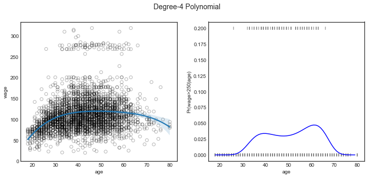
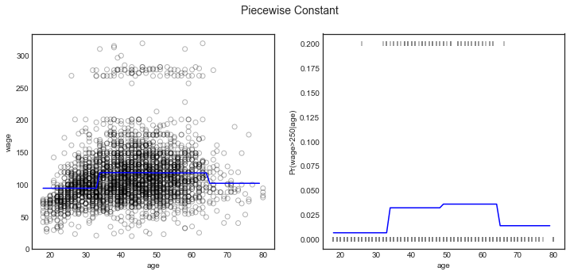
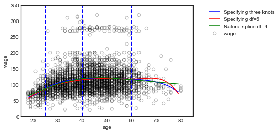

# Chapter 7 - Moving Beyond Linearity

- [Lab: 7.8.1 Polynomial Regression and Step Functions](#7.8.1-Polynomial-Regression-and-Step-Functions)
- [Lab: 7.8.2 Splines](#7.8.2-Splines)


```python
# %load ../standard_import.txt
import pandas as pd
import numpy as np
import matplotlib.pyplot as plt
import seaborn as sns

from sklearn.preprocessing import PolynomialFeatures
import statsmodels.api as sm
import statsmodels.formula.api as smf
from patsy import dmatrix

%matplotlib inline
plt.style.use('seaborn-white')
```

### Load dataset
Using write.csv in R, I exported the dataset from package 'ISLR' to a csv file.


```python
df = pd.read_csv('Data/Wage.csv')
df.head(3)
```


<div>
<style scoped>
    .dataframe tbody tr th:only-of-type {
        vertical-align: middle;
    }

    .dataframe tbody tr th {
        vertical-align: top;
    }

    .dataframe thead th {
        text-align: right;
    }
</style>
<table border="1" class="dataframe">
  <thead>
    <tr style="text-align: right;">
      <th></th>
      <th>Unnamed: 0</th>
      <th>year</th>
      <th>age</th>
      <th>sex</th>
      <th>maritl</th>
      <th>race</th>
      <th>education</th>
      <th>region</th>
      <th>jobclass</th>
      <th>health</th>
      <th>health_ins</th>
      <th>logwage</th>
      <th>wage</th>
    </tr>
  </thead>
  <tbody>
    <tr>
      <th>0</th>
      <td>231655</td>
      <td>2006</td>
      <td>18</td>
      <td>1. Male</td>
      <td>1. Never Married</td>
      <td>1. White</td>
      <td>1. &lt; HS Grad</td>
      <td>2. Middle Atlantic</td>
      <td>1. Industrial</td>
      <td>1. &lt;=Good</td>
      <td>2. No</td>
      <td>4.318063</td>
      <td>75.043154</td>
    </tr>
    <tr>
      <th>1</th>
      <td>86582</td>
      <td>2004</td>
      <td>24</td>
      <td>1. Male</td>
      <td>1. Never Married</td>
      <td>1. White</td>
      <td>4. College Grad</td>
      <td>2. Middle Atlantic</td>
      <td>2. Information</td>
      <td>2. &gt;=Very Good</td>
      <td>2. No</td>
      <td>4.255273</td>
      <td>70.476020</td>
    </tr>
    <tr>
      <th>2</th>
      <td>161300</td>
      <td>2003</td>
      <td>45</td>
      <td>1. Male</td>
      <td>2. Married</td>
      <td>1. White</td>
      <td>3. Some College</td>
      <td>2. Middle Atlantic</td>
      <td>1. Industrial</td>
      <td>1. &lt;=Good</td>
      <td>1. Yes</td>
      <td>4.875061</td>
      <td>130.982177</td>
    </tr>
  </tbody>
</table>
</div>


```python
df.info()
```

    <class 'pandas.core.frame.DataFrame'>
    RangeIndex: 3000 entries, 0 to 2999
    Data columns (total 13 columns):
    Unnamed: 0    3000 non-null int64
    year          3000 non-null int64
    age           3000 non-null int64
    sex           3000 non-null object
    maritl        3000 non-null object
    race          3000 non-null object
    education     3000 non-null object
    region        3000 non-null object
    jobclass      3000 non-null object
    health        3000 non-null object
    health_ins    3000 non-null object
    logwage       3000 non-null float64
    wage          3000 non-null float64
    dtypes: float64(2), int64(3), object(8)
    memory usage: 304.8+ KB


## Lab

### 7.8.1 Polynomial Regression and Step Functions

Create polynomials for 'age'. These correspond to those in R, when using raw=TRUE in poly() function.


```python
X1 = PolynomialFeatures(1).fit_transform(df.age.values.reshape(-1,1))
X2 = PolynomialFeatures(2).fit_transform(df.age.values.reshape(-1,1))
X3 = PolynomialFeatures(3).fit_transform(df.age.values.reshape(-1,1))
X4 = PolynomialFeatures(4).fit_transform(df.age.values.reshape(-1,1))
X5 = PolynomialFeatures(5).fit_transform(df.age.values.reshape(-1,1))

y = (df.wage > 250).map({False:0, True:1}).values
print('X4:\n', X4[:5])
print('y:\n', y[:5])
```

    X4:
     [[1.000000e+00 1.800000e+01 3.240000e+02 5.832000e+03 1.049760e+05]
     [1.000000e+00 2.400000e+01 5.760000e+02 1.382400e+04 3.317760e+05]
     [1.000000e+00 4.500000e+01 2.025000e+03 9.112500e+04 4.100625e+06]
     [1.000000e+00 4.300000e+01 1.849000e+03 7.950700e+04 3.418801e+06]
     [1.000000e+00 5.000000e+01 2.500000e+03 1.250000e+05 6.250000e+06]]
    y:
     [0 0 0 0 0]


#### Linear regression model. (Degree 4)


```python
fit2 = sm.GLS(df.wage, X4).fit()
fit2.summary().tables[1]
```


<table class="simpletable">
<tr>
    <td></td>       <th>coef</th>     <th>std err</th>      <th>t</th>      <th>P>|t|</th>  <th>[0.025</th>    <th>0.975]</th>  
</tr>
<tr>
  <th>const</th> <td> -184.1542</td> <td>   60.040</td> <td>   -3.067</td> <td> 0.002</td> <td> -301.879</td> <td>  -66.430</td>
</tr>
<tr>
  <th>x1</th>    <td>   21.2455</td> <td>    5.887</td> <td>    3.609</td> <td> 0.000</td> <td>    9.703</td> <td>   32.788</td>
</tr>
<tr>
  <th>x2</th>    <td>   -0.5639</td> <td>    0.206</td> <td>   -2.736</td> <td> 0.006</td> <td>   -0.968</td> <td>   -0.160</td>
</tr>
<tr>
  <th>x3</th>    <td>    0.0068</td> <td>    0.003</td> <td>    2.221</td> <td> 0.026</td> <td>    0.001</td> <td>    0.013</td>
</tr>
<tr>
  <th>x4</th>    <td>-3.204e-05</td> <td> 1.64e-05</td> <td>   -1.952</td> <td> 0.051</td> <td>-6.42e-05</td> <td> 1.45e-07</td>
</tr>
</table>


Selecting a suitable degree for the polynomial of age.


```python
fit_1 =  sm.GLS(df.wage, X1).fit()
fit_2 =  sm.GLS(df.wage, X2).fit()
fit_3 =  sm.GLS(df.wage, X3).fit()
fit_4 =  sm.GLS(df.wage, X4).fit()
fit_5 =  sm.GLS(df.wage, X5).fit()

sm.stats.anova_lm(fit_1, fit_2, fit_3, fit_4, fit_5, typ=1)
```

    /Users/jordi/anaconda3/envs/jwv/lib/python3.6/site-packages/scipy/stats/_distn_infrastructure.py:879: RuntimeWarning: invalid value encountered in greater
      return (self.a < x) & (x < self.b)
    /Users/jordi/anaconda3/envs/jwv/lib/python3.6/site-packages/scipy/stats/_distn_infrastructure.py:879: RuntimeWarning: invalid value encountered in less
      return (self.a < x) & (x < self.b)
    /Users/jordi/anaconda3/envs/jwv/lib/python3.6/site-packages/scipy/stats/_distn_infrastructure.py:1821: RuntimeWarning: invalid value encountered in less_equal
      cond2 = cond0 & (x <= self.a)


<div>
<style scoped>
    .dataframe tbody tr th:only-of-type {
        vertical-align: middle;
    }

    .dataframe tbody tr th {
        vertical-align: top;
    }

    .dataframe thead th {
        text-align: right;
    }
</style>
<table border="1" class="dataframe">
  <thead>
    <tr style="text-align: right;">
      <th></th>
      <th>df_resid</th>
      <th>ssr</th>
      <th>df_diff</th>
      <th>ss_diff</th>
      <th>F</th>
      <th>Pr(&gt;F)</th>
    </tr>
  </thead>
  <tbody>
    <tr>
      <th>0</th>
      <td>2998.0</td>
      <td>5.022216e+06</td>
      <td>0.0</td>
      <td>NaN</td>
      <td>NaN</td>
      <td>NaN</td>
    </tr>
    <tr>
      <th>1</th>
      <td>2997.0</td>
      <td>4.793430e+06</td>
      <td>1.0</td>
      <td>228786.010128</td>
      <td>143.593107</td>
      <td>2.363850e-32</td>
    </tr>
    <tr>
      <th>2</th>
      <td>2996.0</td>
      <td>4.777674e+06</td>
      <td>1.0</td>
      <td>15755.693664</td>
      <td>9.888756</td>
      <td>1.679202e-03</td>
    </tr>
    <tr>
      <th>3</th>
      <td>2995.0</td>
      <td>4.771604e+06</td>
      <td>1.0</td>
      <td>6070.152124</td>
      <td>3.809813</td>
      <td>5.104620e-02</td>
    </tr>
    <tr>
      <th>4</th>
      <td>2994.0</td>
      <td>4.770322e+06</td>
      <td>1.0</td>
      <td>1282.563017</td>
      <td>0.804976</td>
      <td>3.696820e-01</td>
    </tr>
  </tbody>
</table>
</div>


The polynomial degree 4 seems best.


```python
X = X4
```

Scikit-learn implements a regularized logistic regression model particularly suitable for high dimensional data. Since we just have one feature (age) we use the GLM model from statsmodels.


```python
clf = sm.GLM(y, X, family=sm.families.Binomial(sm.families.links.logit))
res = clf.fit()
```

Create array of test data. Transform to polynomial degree 4 and run prediction.


```python
age_grid = np.arange(df.age.min(), df.age.max()).reshape(-1,1)
```


```python
X_test = PolynomialFeatures(4).fit_transform(age_grid)
pred = res.predict(X_test)
```

### Figure 7.1


```python
# creating plots
fig, (ax1, ax2) = plt.subplots(1,2, figsize=(12,5))
fig.suptitle('Degree-4 Polynomial', fontsize=14)

# Scatter plot with polynomial regression line
ax1.scatter(df.age, df.wage, facecolor='None', edgecolor='k', alpha=0.3)
sns.regplot(df.age, df.wage, order = 4, truncate=True, scatter=False, ax=ax1)
ax1.set_ylim(ymin=0)

# Logistic regression showing Pr(wage>250) for the age range.
ax2.plot(age_grid, pred, color='b')

# Rug plot showing the distribution of wage>250 in the training data.
# 'True' on the top, 'False' on the bottom.
ax2.scatter(df.age, y/5, s=30, c='grey', marker='|', alpha=0.7)

ax2.set_ylim(-0.01,0.21)
ax2.set_xlabel('age')
ax2.set_ylabel('Pr(wage>250|age)');
```





#### Step function


```python
df_cut, bins = pd.cut(df.age, 4, retbins=True, right=True)
df_cut.value_counts(sort=False)
```


    (17.938, 33.5]     750
    (33.5, 49.0]      1399
    (49.0, 64.5]       779
    (64.5, 80.0]        72
    Name: age, dtype: int64


```python
df_steps = pd.concat([df.age, df_cut, df.wage], keys=['age','age_cuts','wage'], axis=1)
df_steps.head(5)
```


<div>
<style scoped>
    .dataframe tbody tr th:only-of-type {
        vertical-align: middle;
    }

    .dataframe tbody tr th {
        vertical-align: top;
    }

    .dataframe thead th {
        text-align: right;
    }
</style>
<table border="1" class="dataframe">
  <thead>
    <tr style="text-align: right;">
      <th></th>
      <th>age</th>
      <th>age_cuts</th>
      <th>wage</th>
    </tr>
  </thead>
  <tbody>
    <tr>
      <th>0</th>
      <td>18</td>
      <td>(17.938, 33.5]</td>
      <td>75.043154</td>
    </tr>
    <tr>
      <th>1</th>
      <td>24</td>
      <td>(17.938, 33.5]</td>
      <td>70.476020</td>
    </tr>
    <tr>
      <th>2</th>
      <td>45</td>
      <td>(33.5, 49.0]</td>
      <td>130.982177</td>
    </tr>
    <tr>
      <th>3</th>
      <td>43</td>
      <td>(33.5, 49.0]</td>
      <td>154.685293</td>
    </tr>
    <tr>
      <th>4</th>
      <td>50</td>
      <td>(49.0, 64.5]</td>
      <td>75.043154</td>
    </tr>
  </tbody>
</table>
</div>


```python
# Create dummy variables for the age groups
df_steps_dummies = pd.get_dummies(df_steps['age_cuts'])

# Statsmodels requires explicit adding of a constant (intercept)
df_steps_dummies = sm.add_constant(df_steps_dummies)

df_steps_dummies.head(5)
```


<div>
<style scoped>
    .dataframe tbody tr th:only-of-type {
        vertical-align: middle;
    }

    .dataframe tbody tr th {
        vertical-align: top;
    }

    .dataframe thead th {
        text-align: right;
    }
</style>
<table border="1" class="dataframe">
  <thead>
    <tr style="text-align: right;">
      <th></th>
      <th>const</th>
      <th>(17.938, 33.5]</th>
      <th>(33.5, 49.0]</th>
      <th>(49.0, 64.5]</th>
      <th>(64.5, 80.0]</th>
    </tr>
  </thead>
  <tbody>
    <tr>
      <th>0</th>
      <td>1.0</td>
      <td>1</td>
      <td>0</td>
      <td>0</td>
      <td>0</td>
    </tr>
    <tr>
      <th>1</th>
      <td>1.0</td>
      <td>1</td>
      <td>0</td>
      <td>0</td>
      <td>0</td>
    </tr>
    <tr>
      <th>2</th>
      <td>1.0</td>
      <td>0</td>
      <td>1</td>
      <td>0</td>
      <td>0</td>
    </tr>
    <tr>
      <th>3</th>
      <td>1.0</td>
      <td>0</td>
      <td>1</td>
      <td>0</td>
      <td>0</td>
    </tr>
    <tr>
      <th>4</th>
      <td>1.0</td>
      <td>0</td>
      <td>0</td>
      <td>1</td>
      <td>0</td>
    </tr>
  </tbody>
</table>
</div>


```python
# Using statsmodels because it has a more complete output for coefficients
fit3 = sm.GLM(df_steps.wage, df_steps_dummies.drop(df_steps_dummies.columns[1], axis=1)).fit()
fit3.summary().tables[1]
```


<table class="simpletable">
<tr>
        <td></td>          <th>coef</th>     <th>std err</th>      <th>z</th>      <th>P>|z|</th>  <th>[0.025</th>    <th>0.975]</th>  
</tr>
<tr>
  <th>const</th>        <td>   94.1584</td> <td>    1.476</td> <td>   63.790</td> <td> 0.000</td> <td>   91.265</td> <td>   97.051</td>
</tr>
<tr>
  <th>(33.5, 49.0]</th> <td>   24.0535</td> <td>    1.829</td> <td>   13.148</td> <td> 0.000</td> <td>   20.468</td> <td>   27.639</td>
</tr>
<tr>
  <th>(49.0, 64.5]</th> <td>   23.6646</td> <td>    2.068</td> <td>   11.443</td> <td> 0.000</td> <td>   19.611</td> <td>   27.718</td>
</tr>
<tr>
  <th>(64.5, 80.0]</th> <td>    7.6406</td> <td>    4.987</td> <td>    1.532</td> <td> 0.126</td> <td>   -2.135</td> <td>   17.416</td>
</tr>
</table>


```python
# Put the test data in the same bins as the training data.
bin_mapping = np.digitize(age_grid.ravel(), bins)
bin_mapping
```


    array([1, 1, 1, 1, 1, 1, 1, 1, 1, 1, 1, 1, 1, 1, 1, 1, 2, 2, 2, 2, 2, 2,
           2, 2, 2, 2, 2, 2, 2, 2, 2, 3, 3, 3, 3, 3, 3, 3, 3, 3, 3, 3, 3, 3,
           3, 3, 3, 4, 4, 4, 4, 4, 4, 4, 4, 4, 4, 4, 4, 4, 4, 4])


```python
# Get dummies, drop first dummy category, add constant
X_test2 = sm.add_constant(pd.get_dummies(bin_mapping).drop(1, axis=1))
X_test2.head()
```


<div>
<style scoped>
    .dataframe tbody tr th:only-of-type {
        vertical-align: middle;
    }

    .dataframe tbody tr th {
        vertical-align: top;
    }

    .dataframe thead th {
        text-align: right;
    }
</style>
<table border="1" class="dataframe">
  <thead>
    <tr style="text-align: right;">
      <th></th>
      <th>const</th>
      <th>2</th>
      <th>3</th>
      <th>4</th>
    </tr>
  </thead>
  <tbody>
    <tr>
      <th>0</th>
      <td>1.0</td>
      <td>0</td>
      <td>0</td>
      <td>0</td>
    </tr>
    <tr>
      <th>1</th>
      <td>1.0</td>
      <td>0</td>
      <td>0</td>
      <td>0</td>
    </tr>
    <tr>
      <th>2</th>
      <td>1.0</td>
      <td>0</td>
      <td>0</td>
      <td>0</td>
    </tr>
    <tr>
      <th>3</th>
      <td>1.0</td>
      <td>0</td>
      <td>0</td>
      <td>0</td>
    </tr>
    <tr>
      <th>4</th>
      <td>1.0</td>
      <td>0</td>
      <td>0</td>
      <td>0</td>
    </tr>
  </tbody>
</table>
</div>


#### Linear Regression


```python
pred2 = fit3.predict(X_test2)
```

#### Logistic Regression


```python
clf2 = sm.GLM(y, df_steps_dummies.drop(df_steps_dummies.columns[1], axis=1),
              family=sm.families.Binomial(sm.families.links.logit))
res2 = clf2.fit()
pred3 = res2.predict(X_test2)
```

### Figure 7.2


```python
# creating plots
fig, (ax1, ax2) = plt.subplots(1,2, figsize=(12,5))
fig.suptitle('Piecewise Constant', fontsize=14)

# Scatter plot with polynomial regression line
ax1.scatter(df.age, df.wage, facecolor='None', edgecolor='k', alpha=0.3)
ax1.plot(age_grid, pred2, c='b')

ax1.set_xlabel('age')
ax1.set_ylabel('wage')
ax1.set_ylim(ymin=0)

# Logistic regression showing Pr(wage>250) for the age range.
ax2.plot(np.arange(df.age.min(), df.age.max()).reshape(-1,1), pred3, color='b')

# Rug plot showing the distribution of wage>250 in the training data.
# 'True' on the top, 'False' on the bottom.
ax2.scatter(df.age, y/5, s=30, c='grey', marker='|', alpha=0.7)

ax2.set_ylim(-0.01,0.21)
ax2.set_xlabel('age')
ax2.set_ylabel('Pr(wage>250|age)');
```





### 7.8.2 Splines

Using patsy to create non-linear transformations of the input data. See http://patsy.readthedocs.org/en/latest/ <BR>
I have not found functions to create smoothing splines or GAMs or do local regression.

#### Cubic splines


```python
# Specifying 3 knots
transformed_x = dmatrix("bs(df.age, knots=(25,40,60), degree=3, include_intercept=False)",
                        {"df.age": df.age}, return_type='dataframe')
fit4 = sm.GLM(df.wage, transformed_x).fit()
pred4 = fit4.predict(dmatrix("bs(age_grid, knots=(25,40,60), degree=3, include_intercept=False)",
                             {"age_grid": age_grid}, return_type='dataframe'))
fit4.params
```


    Intercept                                                               60.493714
    bs(df.age, knots=(25, 40, 60), degree=3, include_intercept=False)[0]     3.980500
    bs(df.age, knots=(25, 40, 60), degree=3, include_intercept=False)[1]    44.630980
    bs(df.age, knots=(25, 40, 60), degree=3, include_intercept=False)[2]    62.838788
    bs(df.age, knots=(25, 40, 60), degree=3, include_intercept=False)[3]    55.990830
    bs(df.age, knots=(25, 40, 60), degree=3, include_intercept=False)[4]    50.688098
    bs(df.age, knots=(25, 40, 60), degree=3, include_intercept=False)[5]    16.606142
    dtype: float64


```python
# Specifying 6 degrees of freedom 
transformed_x2 = dmatrix("bs(df.age, df=6, degree=3, include_intercept=False)",
                        {"df.age": df.age}, return_type='dataframe')
fit5 = sm.GLM(df.wage, transformed_x2).fit()
pred5 = fit5.predict(dmatrix("bs(age_grid, df=6, degree=3, include_intercept=False)",
                             {"age_grid": age_grid}, return_type='dataframe'))
fit5.params
```


    Intercept                                                 56.313841
    bs(df.age, df=6, degree=3, include_intercept=False)[0]    27.824002
    bs(df.age, df=6, degree=3, include_intercept=False)[1]    54.062546
    bs(df.age, df=6, degree=3, include_intercept=False)[2]    65.828391
    bs(df.age, df=6, degree=3, include_intercept=False)[3]    55.812734
    bs(df.age, df=6, degree=3, include_intercept=False)[4]    72.131473
    bs(df.age, df=6, degree=3, include_intercept=False)[5]    14.750876
    dtype: float64


#### Natural splines


```python
# Specifying 4 degrees of freedom
transformed_x3 = dmatrix("cr(df.age, df=4)", {"df.age": df.age}, return_type='dataframe')
fit6 = sm.GLM(df.wage, transformed_x3).fit()
pred6 = fit6.predict(dmatrix("cr(age_grid, df=4)", {"age_grid": age_grid}, return_type='dataframe'))
fit6.params
```


    Intercept              79.642095
    cr(df.age, df=4)[0]   -14.667784
    cr(df.age, df=4)[1]    36.811142
    cr(df.age, df=4)[2]    35.934874
    cr(df.age, df=4)[3]    21.563863
    dtype: float64


```python
plt.scatter(df.age, df.wage, facecolor='None', edgecolor='k', alpha=0.3)
plt.plot(age_grid, pred4, color='b', label='Specifying three knots')
plt.plot(age_grid, pred5, color='r', label='Specifying df=6')
plt.plot(age_grid, pred6, color='g', label='Natural spline df=4')
[plt.vlines(i , 0, 350, linestyles='dashed', lw=2, colors='b') for i in [25,40,60]]
plt.legend(bbox_to_anchor=(1.5, 1.0))
plt.xlim(15,85)
plt.ylim(0,350)
plt.xlabel('age')
plt.ylabel('wage');
```




