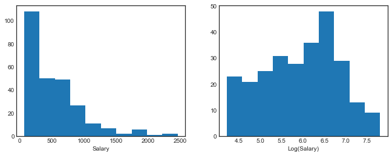
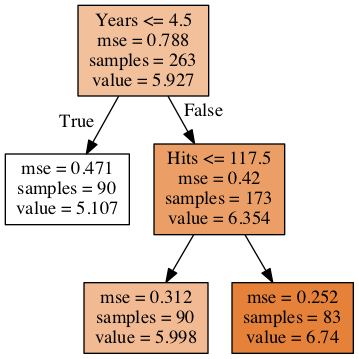
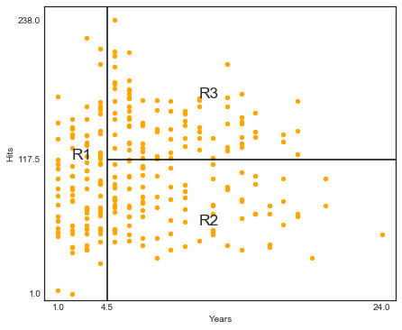
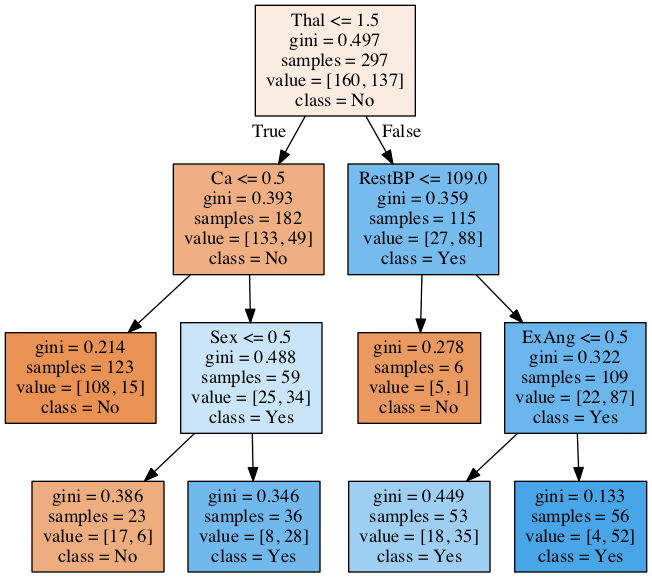
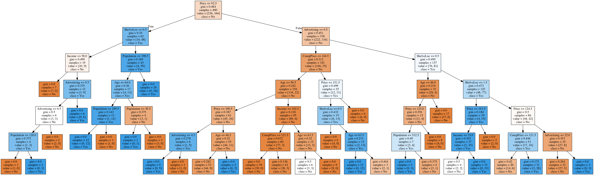
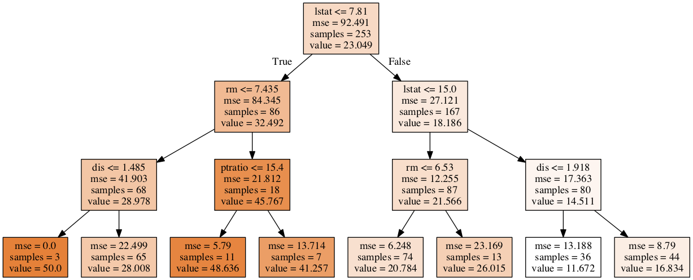
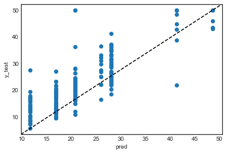
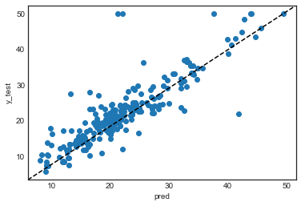
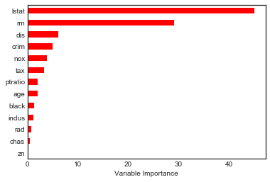
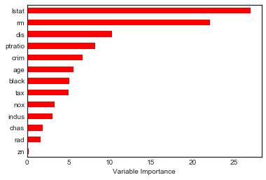

# Chapter 8 - Tree-based Methods

- [8.1.1 Regression Trees](#8.1.1-Regression-Trees)
- [8.1.2 Classification Trees](#8.1.2-Classification-Trees)
- [Lab: 8.3.1 Fitting Classification Trees](#8.3.1-Fitting-Classification-Trees)
- [Lab: 8.3.2 Fitting Regression Trees](#8.3.2-Fitting-Regression-Trees)
- [Lab: 8.3.3 Bagging and Random Forests](#8.3.3-Bagging-and-Random-Forests)
- [Lab: 8.3.4 Boosting](#8.3.4-Boosting)


```python
# %load ../standard_import.txt
import pandas as pd
import numpy as np
import matplotlib.pyplot as plt
import seaborn as sns

import pydot
from IPython.display import Image

from sklearn.model_selection import train_test_split, cross_val_score
from sklearn.externals.six import StringIO  
from sklearn.tree import DecisionTreeRegressor, DecisionTreeClassifier, export_graphviz
from sklearn.ensemble import BaggingClassifier, RandomForestClassifier, BaggingRegressor, RandomForestRegressor, GradientBoostingRegressor
from sklearn.metrics import mean_squared_error,confusion_matrix, classification_report

%matplotlib inline
plt.style.use('seaborn-white')
```


```python
# This function creates images of tree models using pydot
def print_tree(estimator, features, class_names=None, filled=True):
    tree = estimator
    names = features
    color = filled
    classn = class_names
    
    dot_data = StringIO()
    export_graphviz(estimator, out_file=dot_data, feature_names=features, class_names=classn, filled=filled)
    graph = pydot.graph_from_dot_data(dot_data.getvalue())
    return(graph)
```

### 8.1.1 Regression Trees

In R, I exported the dataset from package 'ISLR' to a csv file.


```python
df = pd.read_csv('Data/Hitters.csv').dropna()
df.info()
```

    <class 'pandas.core.frame.DataFrame'>
    Int64Index: 263 entries, 1 to 321
    Data columns (total 21 columns):
    Unnamed: 0    263 non-null object
    AtBat         263 non-null int64
    Hits          263 non-null int64
    HmRun         263 non-null int64
    Runs          263 non-null int64
    RBI           263 non-null int64
    Walks         263 non-null int64
    Years         263 non-null int64
    CAtBat        263 non-null int64
    CHits         263 non-null int64
    CHmRun        263 non-null int64
    CRuns         263 non-null int64
    CRBI          263 non-null int64
    CWalks        263 non-null int64
    League        263 non-null object
    Division      263 non-null object
    PutOuts       263 non-null int64
    Assists       263 non-null int64
    Errors        263 non-null int64
    Salary        263 non-null float64
    NewLeague     263 non-null object
    dtypes: float64(1), int64(16), object(4)
    memory usage: 45.2+ KB


```python
X = df[['Years', 'Hits']].as_matrix()
y = np.log(df.Salary.as_matrix())

fig, (ax1, ax2) = plt.subplots(1,2, figsize=(11,4))
ax1.hist(df.Salary.as_matrix())
ax1.set_xlabel('Salary')
ax2.hist(y)
ax2.set_xlabel('Log(Salary)');
```





```python
regr = DecisionTreeRegressor(max_leaf_nodes=3)
regr.fit(X, y)
```


    DecisionTreeRegressor(criterion='mse', max_depth=None, max_features=None,
               max_leaf_nodes=3, min_impurity_decrease=0.0,
               min_impurity_split=None, min_samples_leaf=1,
               min_samples_split=2, min_weight_fraction_leaf=0.0,
               presort=False, random_state=None, splitter='best')


### Figure 8.1


```python
graph, = print_tree(regr, features=['Years', 'Hits'])
Image(graph.create_png())
```





###  Figure 8.2


```python
df.plot('Years', 'Hits', kind='scatter', color='orange', figsize=(7,6))
plt.xlim(0,25)
plt.ylim(ymin=-5)
plt.xticks([1, 4.5, 24])
plt.yticks([1, 117.5, 238])
plt.vlines(4.5, ymin=-5, ymax=250)
plt.hlines(117.5, xmin=4.5, xmax=25)
plt.annotate('R1', xy=(2,117.5), fontsize='xx-large')
plt.annotate('R2', xy=(11,60), fontsize='xx-large')
plt.annotate('R3', xy=(11,170), fontsize='xx-large');
```





### Pruning
This is currently not supported in scikit-learn. See first point under 'disadvantages of decision trees in the <A href='http://scikit-learn.github.io/dev/modules/tree.html#'>documentation</A>. Implementation has been <A href='https://github.com/scikit-learn/scikit-learn/pull/941'>discussed</A> but Random Forests have better predictive qualities than a single pruned tree anyway if I understand correctly.
    

### 8.1.2 Classification Trees

Dataset available on http://www-bcf.usc.edu/~gareth/ISL/data.html


```python
df2 = pd.read_csv('Data/Heart.csv').drop('Unnamed: 0', axis=1).dropna()
df2.info()
```

    <class 'pandas.core.frame.DataFrame'>
    Int64Index: 297 entries, 0 to 301
    Data columns (total 14 columns):
    Age          297 non-null int64
    Sex          297 non-null int64
    ChestPain    297 non-null object
    RestBP       297 non-null int64
    Chol         297 non-null int64
    Fbs          297 non-null int64
    RestECG      297 non-null int64
    MaxHR        297 non-null int64
    ExAng        297 non-null int64
    Oldpeak      297 non-null float64
    Slope        297 non-null int64
    Ca           297 non-null float64
    Thal         297 non-null object
    AHD          297 non-null object
    dtypes: float64(2), int64(9), object(3)
    memory usage: 34.8+ KB


```python
df2.ChestPain = pd.factorize(df2.ChestPain)[0]
df2.Thal = pd.factorize(df2.Thal)[0]
```


```python
X2 = df2.drop('AHD', axis=1)
y2 = pd.factorize(df2.AHD)[0]
```


```python
clf = DecisionTreeClassifier(max_depth=None, max_leaf_nodes=6, max_features=3)
clf.fit(X2,y2)
```


    DecisionTreeClassifier(class_weight=None, criterion='gini', max_depth=None,
                max_features=3, max_leaf_nodes=6, min_impurity_decrease=0.0,
                min_impurity_split=None, min_samples_leaf=1,
                min_samples_split=2, min_weight_fraction_leaf=0.0,
                presort=False, random_state=None, splitter='best')


```python
clf.score(X2,y2)
```


    0.82491582491582494


```python
graph2, = print_tree(clf, features=X2.columns, class_names=['No', 'Yes'])
Image(graph2.create_png())
```





## Lab

### 8.3.1 Fitting Classification Trees

In R, I exported the dataset from package 'ISLR' to a csv file.


```python
df3 = pd.read_csv('Data/Carseats.csv').drop('Unnamed: 0', axis=1)
df3.head()
```


<div>
<style scoped>
    .dataframe tbody tr th:only-of-type {
        vertical-align: middle;
    }

    .dataframe tbody tr th {
        vertical-align: top;
    }

    .dataframe thead th {
        text-align: right;
    }
</style>
<table border="1" class="dataframe">
  <thead>
    <tr style="text-align: right;">
      <th></th>
      <th>Sales</th>
      <th>CompPrice</th>
      <th>Income</th>
      <th>Advertising</th>
      <th>Population</th>
      <th>Price</th>
      <th>ShelveLoc</th>
      <th>Age</th>
      <th>Education</th>
      <th>Urban</th>
      <th>US</th>
    </tr>
  </thead>
  <tbody>
    <tr>
      <th>0</th>
      <td>9.50</td>
      <td>138</td>
      <td>73</td>
      <td>11</td>
      <td>276</td>
      <td>120</td>
      <td>Bad</td>
      <td>42</td>
      <td>17</td>
      <td>Yes</td>
      <td>Yes</td>
    </tr>
    <tr>
      <th>1</th>
      <td>11.22</td>
      <td>111</td>
      <td>48</td>
      <td>16</td>
      <td>260</td>
      <td>83</td>
      <td>Good</td>
      <td>65</td>
      <td>10</td>
      <td>Yes</td>
      <td>Yes</td>
    </tr>
    <tr>
      <th>2</th>
      <td>10.06</td>
      <td>113</td>
      <td>35</td>
      <td>10</td>
      <td>269</td>
      <td>80</td>
      <td>Medium</td>
      <td>59</td>
      <td>12</td>
      <td>Yes</td>
      <td>Yes</td>
    </tr>
    <tr>
      <th>3</th>
      <td>7.40</td>
      <td>117</td>
      <td>100</td>
      <td>4</td>
      <td>466</td>
      <td>97</td>
      <td>Medium</td>
      <td>55</td>
      <td>14</td>
      <td>Yes</td>
      <td>Yes</td>
    </tr>
    <tr>
      <th>4</th>
      <td>4.15</td>
      <td>141</td>
      <td>64</td>
      <td>3</td>
      <td>340</td>
      <td>128</td>
      <td>Bad</td>
      <td>38</td>
      <td>13</td>
      <td>Yes</td>
      <td>No</td>
    </tr>
  </tbody>
</table>
</div>


```python
df3['High'] = df3.Sales.map(lambda x: 1 if x>8 else 0)
df3.ShelveLoc = pd.factorize(df3.ShelveLoc)[0]

df3.Urban = df3.Urban.map({'No':0, 'Yes':1})
df3.US = df3.US.map({'No':0, 'Yes':1})
df3.info()
```

    <class 'pandas.core.frame.DataFrame'>
    RangeIndex: 400 entries, 0 to 399
    Data columns (total 12 columns):
    Sales          400 non-null float64
    CompPrice      400 non-null int64
    Income         400 non-null int64
    Advertising    400 non-null int64
    Population     400 non-null int64
    Price          400 non-null int64
    ShelveLoc      400 non-null int64
    Age            400 non-null int64
    Education      400 non-null int64
    Urban          400 non-null int64
    US             400 non-null int64
    High           400 non-null int64
    dtypes: float64(1), int64(11)
    memory usage: 37.6 KB


```python
df3.head(5)
```


<div>
<style scoped>
    .dataframe tbody tr th:only-of-type {
        vertical-align: middle;
    }

    .dataframe tbody tr th {
        vertical-align: top;
    }

    .dataframe thead th {
        text-align: right;
    }
</style>
<table border="1" class="dataframe">
  <thead>
    <tr style="text-align: right;">
      <th></th>
      <th>Sales</th>
      <th>CompPrice</th>
      <th>Income</th>
      <th>Advertising</th>
      <th>Population</th>
      <th>Price</th>
      <th>ShelveLoc</th>
      <th>Age</th>
      <th>Education</th>
      <th>Urban</th>
      <th>US</th>
      <th>High</th>
    </tr>
  </thead>
  <tbody>
    <tr>
      <th>0</th>
      <td>9.50</td>
      <td>138</td>
      <td>73</td>
      <td>11</td>
      <td>276</td>
      <td>120</td>
      <td>0</td>
      <td>42</td>
      <td>17</td>
      <td>1</td>
      <td>1</td>
      <td>1</td>
    </tr>
    <tr>
      <th>1</th>
      <td>11.22</td>
      <td>111</td>
      <td>48</td>
      <td>16</td>
      <td>260</td>
      <td>83</td>
      <td>1</td>
      <td>65</td>
      <td>10</td>
      <td>1</td>
      <td>1</td>
      <td>1</td>
    </tr>
    <tr>
      <th>2</th>
      <td>10.06</td>
      <td>113</td>
      <td>35</td>
      <td>10</td>
      <td>269</td>
      <td>80</td>
      <td>2</td>
      <td>59</td>
      <td>12</td>
      <td>1</td>
      <td>1</td>
      <td>1</td>
    </tr>
    <tr>
      <th>3</th>
      <td>7.40</td>
      <td>117</td>
      <td>100</td>
      <td>4</td>
      <td>466</td>
      <td>97</td>
      <td>2</td>
      <td>55</td>
      <td>14</td>
      <td>1</td>
      <td>1</td>
      <td>0</td>
    </tr>
    <tr>
      <th>4</th>
      <td>4.15</td>
      <td>141</td>
      <td>64</td>
      <td>3</td>
      <td>340</td>
      <td>128</td>
      <td>0</td>
      <td>38</td>
      <td>13</td>
      <td>1</td>
      <td>0</td>
      <td>0</td>
    </tr>
  </tbody>
</table>
</div>


```python
X = df3.drop(['Sales', 'High'], axis=1)
y = df3.High

X_train, X_test, y_train, y_test = train_test_split(X, y, test_size=0.5, random_state=0)
```


```python
clf = DecisionTreeClassifier(max_depth=6)
clf.fit(X, y)
```


    DecisionTreeClassifier(class_weight=None, criterion='gini', max_depth=6,
                max_features=None, max_leaf_nodes=None,
                min_impurity_decrease=0.0, min_impurity_split=None,
                min_samples_leaf=1, min_samples_split=2,
                min_weight_fraction_leaf=0.0, presort=False, random_state=None,
                splitter='best')


```python
print(classification_report(y, clf.predict(X)))
```

                 precision    recall  f1-score   support
    
              0       0.89      0.99      0.93       236
              1       0.98      0.82      0.89       164
    
    avg / total       0.92      0.92      0.92       400
    


```python
graph3, = print_tree(clf, features=X.columns, class_names=['No', 'Yes'])
Image(graph3.create_png())
```





```python
clf.fit(X_train, y_train)
pred = clf.predict(X_test)
```


```python
cm = pd.DataFrame(confusion_matrix(y_test, pred).T, index=['No', 'Yes'], columns=['No', 'Yes'])
cm.index.name = 'Predicted'
cm.columns.name = 'True'
cm
```


<div>
<style scoped>
    .dataframe tbody tr th:only-of-type {
        vertical-align: middle;
    }

    .dataframe tbody tr th {
        vertical-align: top;
    }

    .dataframe thead th {
        text-align: right;
    }
</style>
<table border="1" class="dataframe">
  <thead>
    <tr style="text-align: right;">
      <th>True</th>
      <th>No</th>
      <th>Yes</th>
    </tr>
    <tr>
      <th>Predicted</th>
      <th></th>
      <th></th>
    </tr>
  </thead>
  <tbody>
    <tr>
      <th>No</th>
      <td>100</td>
      <td>31</td>
    </tr>
    <tr>
      <th>Yes</th>
      <td>18</td>
      <td>51</td>
    </tr>
  </tbody>
</table>
</div>


```python
# Precision of the model using test data is 74%
print(classification_report(y_test, pred))
```

                 precision    recall  f1-score   support
    
              0       0.76      0.85      0.80       118
              1       0.74      0.62      0.68        82
    
    avg / total       0.75      0.76      0.75       200
    


Pruning not implemented in scikit-learn.

### 8.3.2 Fitting Regression Trees

In R, I exported the dataset from package 'MASS' to a csv file.


```python
boston_df = pd.read_csv('Data/Boston.csv')
boston_df.info()
```

    <class 'pandas.core.frame.DataFrame'>
    RangeIndex: 506 entries, 0 to 505
    Data columns (total 14 columns):
    crim       506 non-null float64
    zn         506 non-null float64
    indus      506 non-null float64
    chas       506 non-null int64
    nox        506 non-null float64
    rm         506 non-null float64
    age        506 non-null float64
    dis        506 non-null float64
    rad        506 non-null int64
    tax        506 non-null int64
    ptratio    506 non-null float64
    black      506 non-null float64
    lstat      506 non-null float64
    medv       506 non-null float64
    dtypes: float64(11), int64(3)
    memory usage: 55.4 KB


```python
X = boston_df.drop('medv', axis=1)
y = boston_df.medv

X_train, X_test, y_train, y_test = train_test_split(X, y, test_size=0.5, random_state=0)
```


```python
# Pruning not supported. Choosing max depth 3)
regr2 = DecisionTreeRegressor(max_depth=3)
regr2.fit(X_train, y_train)
pred = regr2.predict(X_test)
```


```python
graph, = print_tree(regr2, features=X.columns)
Image(graph.create_png())
```





```python
plt.scatter(pred, y_test, label='medv')
plt.plot([0, 1], [0, 1], '--k', transform=plt.gca().transAxes)
plt.xlabel('pred')
plt.ylabel('y_test')
```


    Text(0,0.5,'y_test')





```python
mean_squared_error(y_test, pred)
```


    26.023230850097445


### 8.3.3 Bagging and Random Forests


```python
# There are 13 features in the dataset
X.shape
```


    (506, 13)


```python
# Bagging: using all features
regr1 = RandomForestRegressor(max_features=13, random_state=1)
regr1.fit(X_train, y_train)
```


    RandomForestRegressor(bootstrap=True, criterion='mse', max_depth=None,
               max_features=13, max_leaf_nodes=None, min_impurity_decrease=0.0,
               min_impurity_split=None, min_samples_leaf=1,
               min_samples_split=2, min_weight_fraction_leaf=0.0,
               n_estimators=10, n_jobs=1, oob_score=False, random_state=1,
               verbose=0, warm_start=False)


```python
pred = regr1.predict(X_test)

plt.scatter(pred, y_test, label='medv')
plt.plot([0, 1], [0, 1], '--k', transform=plt.gca().transAxes)
plt.xlabel('pred')
plt.ylabel('y_test')
```


    Text(0,0.5,'y_test')





```python
mean_squared_error(y_test, pred)
```


    18.301366007905138


```python
# Random forests: using 6 features
regr2 = RandomForestRegressor(max_features=6, random_state=1)
regr2.fit(X_train, y_train)
```


    RandomForestRegressor(bootstrap=True, criterion='mse', max_depth=None,
               max_features=6, max_leaf_nodes=None, min_impurity_decrease=0.0,
               min_impurity_split=None, min_samples_leaf=1,
               min_samples_split=2, min_weight_fraction_leaf=0.0,
               n_estimators=10, n_jobs=1, oob_score=False, random_state=1,
               verbose=0, warm_start=False)


```python
pred = regr2.predict(X_test)
mean_squared_error(y_test, pred)
```


    16.469374703557314


```python
Importance = pd.DataFrame({'Importance':regr2.feature_importances_*100}, index=X.columns)
Importance.sort_values('Importance', axis=0, ascending=True).plot(kind='barh', color='r', )
plt.xlabel('Variable Importance')
plt.gca().legend_ = None
```





### 8.3.4 Boosting


```python
regr = GradientBoostingRegressor(n_estimators=500, learning_rate=0.01, random_state=1)
regr.fit(X_train, y_train)
```


    GradientBoostingRegressor(alpha=0.9, criterion='friedman_mse', init=None,
                 learning_rate=0.01, loss='ls', max_depth=3, max_features=None,
                 max_leaf_nodes=None, min_impurity_decrease=0.0,
                 min_impurity_split=None, min_samples_leaf=1,
                 min_samples_split=2, min_weight_fraction_leaf=0.0,
                 n_estimators=500, presort='auto', random_state=1,
                 subsample=1.0, verbose=0, warm_start=False)


```python
feature_importance = regr.feature_importances_*100
rel_imp = pd.Series(feature_importance, index=X.columns).sort_values(inplace=False)
print(rel_imp)
rel_imp.T.plot(kind='barh', color='r', )
plt.xlabel('Variable Importance')
plt.gca().legend_ = None
```

    zn          0.170382
    rad         1.593909
    chas        1.844703
    indus       3.045285
    nox         3.284683
    tax         5.007437
    black       5.082208
    age         5.587239
    crim        6.750284
    ptratio     8.226473
    dis        10.248698
    rm         22.134290
    lstat      27.024410
    dtype: float64





```python
mean_squared_error(y_test, regr.predict(X_test))
```


    15.529710264059759


