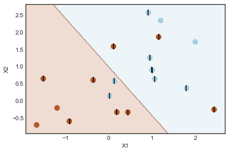

# Chapter 9 - Support Vector Machines

- [Lab: 9.6.1 Support Vector Classifier](#9.6.1-Support-Vector-Classifier)
- [Lab: 9.6.2 Support Vector Machine](#9.6.2-Support-Vector-Machine)
- [Lab: 9.6.3 ROC Curves](#9.6.3-ROC-Curves)
- [Lab: 9.6.4 SVM with Multiple Classes](#9.6.4-SVM-with-Multiple-Classes)
- [Lab: 9.6.5 Application to Gene Expression Data](#9.6.5-Application-to-Gene-Expression-Data)


```python
# %load ../standard_import.txt
import pandas as pd
import numpy as np
import matplotlib.pyplot as plt
import seaborn as sns

from sklearn.preprocessing import label_binarize
from sklearn.model_selection import train_test_split, GridSearchCV
from sklearn.svm import SVC, LinearSVC
from sklearn.discriminant_analysis import LinearDiscriminantAnalysis
from sklearn.metrics import confusion_matrix, roc_curve, auc, classification_report

%matplotlib inline
plt.style.use('seaborn-white')
```

## LAB

### 9.6.1 Support Vector Classifier

Define a function to plot a classifier with support vectors.


```python
def plot_svc(svc, X, y, h=0.02, pad=0.25):
    x_min, x_max = X[:, 0].min()-pad, X[:, 0].max()+pad
    y_min, y_max = X[:, 1].min()-pad, X[:, 1].max()+pad
    xx, yy = np.meshgrid(np.arange(x_min, x_max, h), np.arange(y_min, y_max, h))
    Z = svc.predict(np.c_[xx.ravel(), yy.ravel()])
    Z = Z.reshape(xx.shape)
    plt.contourf(xx, yy, Z, cmap=plt.cm.Paired, alpha=0.2)

    plt.scatter(X[:,0], X[:,1], s=70, c=y, cmap=plt.cm.Paired)
    # Support vectors indicated in plot by vertical lines
    sv = svc.support_vectors_
    plt.scatter(sv[:,0], sv[:,1], c='k', marker='|', s=100, linewidths='1')
    plt.xlim(x_min, x_max)
    plt.ylim(y_min, y_max)
    plt.xlabel('X1')
    plt.ylabel('X2')
    plt.show()
    print('Number of support vectors: ', svc.support_.size)
```


```python
# Generating random data: 20 observations of 2 features and divide into two classes.
np.random.seed(5)
X = np.random.randn(20,2)
y = np.repeat([1,-1], 10)

X[y == -1] = X[y == -1] +1
plt.scatter(X[:,0], X[:,1], s=70, c=y, cmap=plt.cm.Paired)
plt.xlabel('X1')
plt.ylabel('X2');
```


```python
# Support Vector Classifier with linear kernel.
svc = SVC(C= 1.0, kernel='linear')
svc.fit(X, y)

plot_svc(svc, X, y)
```


    Number of support vectors:  13


```python
# When using a smaller cost parameter (C=0.1) the margin is wider, resulting in more support vectors.
svc2 = SVC(C=0.1, kernel='linear')
svc2.fit(X, y)
plot_svc(svc2, X, y)
```





    Number of support vectors:  16


```python
# Select the optimal C parameter by cross-validation
tuned_parameters = [{'C': [0.001, 0.01, 0.1, 1, 5, 10, 100]}]
clf = GridSearchCV(SVC(kernel='linear'), tuned_parameters, cv=10, scoring='accuracy', return_train_score=True)
clf.fit(X, y)
clf.cv_results_
```


    {'mean_fit_time': array([ 0.00041504,  0.00026286,  0.00026855,  0.00027678,  0.00026004,
             0.00027893,  0.00039349]),
     'mean_score_time': array([ 0.00026352,  0.00018048,  0.0001838 ,  0.0001822 ,  0.00018001,
             0.00018055,  0.00017881]),
     'mean_test_score': array([ 0.8 ,  0.8 ,  0.8 ,  0.75,  0.75,  0.75,  0.75]),
     'mean_train_score': array([ 0.79444444,  0.79444444,  0.75      ,  0.77777778,  0.76666667,
             0.76666667,  0.76666667]),
     'param_C': masked_array(data = [0.001 0.01 0.1 1 5 10 100],
                  mask = [False False False False False False False],
            fill_value = ?),
     'params': [{'C': 0.001},
      {'C': 0.01},
      {'C': 0.1},
      {'C': 1},
      {'C': 5},
      {'C': 10},
      {'C': 100}],
     'rank_test_score': array([1, 1, 1, 4, 4, 4, 4], dtype=int32),
     'split0_test_score': array([ 0.5,  0.5,  0.5,  0.5,  0.5,  0.5,  0.5]),
     'split0_train_score': array([ 0.83333333,  0.83333333,  0.77777778,  0.77777778,  0.77777778,
             0.77777778,  0.77777778]),
     'split1_test_score': array([ 0.5,  0.5,  0.5,  0. ,  0. ,  0. ,  0. ]),
     'split1_train_score': array([ 0.83333333,  0.83333333,  0.83333333,  0.88888889,  0.88888889,
             0.88888889,  0.88888889]),
     'split2_test_score': array([ 0.5,  0.5,  0.5,  0.5,  0.5,  0.5,  0.5]),
     'split2_train_score': array([ 0.83333333,  0.83333333,  0.77777778,  0.83333333,  0.83333333,
             0.83333333,  0.83333333]),
     'split3_test_score': array([ 1.,  1.,  1.,  1.,  1.,  1.,  1.]),
     'split3_train_score': array([ 0.77777778,  0.77777778,  0.72222222,  0.72222222,  0.72222222,
             0.72222222,  0.72222222]),
     'split4_test_score': array([ 1.,  1.,  1.,  1.,  1.,  1.,  1.]),
     'split4_train_score': array([ 0.77777778,  0.77777778,  0.72222222,  0.77777778,  0.77777778,
             0.77777778,  0.77777778]),
     'split5_test_score': array([ 1.,  1.,  1.,  1.,  1.,  1.,  1.]),
     'split5_train_score': array([ 0.77777778,  0.77777778,  0.72222222,  0.72222222,  0.72222222,
             0.72222222,  0.72222222]),
     'split6_test_score': array([ 1.,  1.,  1.,  1.,  1.,  1.,  1.]),
     'split6_train_score': array([ 0.77777778,  0.77777778,  0.72222222,  0.77777778,  0.72222222,
             0.72222222,  0.72222222]),
     'split7_test_score': array([ 1.,  1.,  1.,  1.,  1.,  1.,  1.]),
     'split7_train_score': array([ 0.72222222,  0.72222222,  0.72222222,  0.77777778,  0.72222222,
             0.72222222,  0.72222222]),
     'split8_test_score': array([ 0.5,  0.5,  0.5,  0.5,  0.5,  0.5,  0.5]),
     'split8_train_score': array([ 0.83333333,  0.83333333,  0.77777778,  0.77777778,  0.77777778,
             0.77777778,  0.77777778]),
     'split9_test_score': array([ 1.,  1.,  1.,  1.,  1.,  1.,  1.]),
     'split9_train_score': array([ 0.77777778,  0.77777778,  0.72222222,  0.72222222,  0.72222222,
             0.72222222,  0.72222222]),
     'std_fit_time': array([  1.29045113e-04,   2.34619509e-05,   4.18230226e-05,
              3.99072322e-05,   4.80760882e-06,   2.40586557e-05,
              4.76230235e-05]),
     'std_score_time': array([  1.05007676e-04,   1.09293532e-05,   1.94490093e-05,
              1.08948682e-05,   1.90122934e-05,   1.49680733e-05,
              2.26685797e-06]),
     'std_test_score': array([ 0.24494897,  0.24494897,  0.24494897,  0.3354102 ,  0.3354102 ,
             0.3354102 ,  0.3354102 ]),
     'std_train_score': array([ 0.03557291,  0.03557291,  0.0372678 ,  0.0496904 ,  0.05443311,
             0.05443311,  0.05443311])}


```python
# 0.001 is best according to GridSearchCV. 
clf.best_params_
```


    {'C': 0.001}


```python
# Generating test data
np.random.seed(1)
X_test = np.random.randn(20,2)
y_test = np.random.choice([-1,1], 20)
X_test[y_test == 1] = X_test[y_test == 1] -1

plt.scatter(X_test[:,0], X_test[:,1], s=70, c=y_test, cmap=plt.cm.Paired)
plt.xlabel('X1')
plt.ylabel('X2');
```


```python
# svc2 : C = 0.1
y_pred = svc2.predict(X_test)
pd.DataFrame(confusion_matrix(y_test, y_pred),index=svc.classes_, columns=svc.classes_)
```


<div>
<style scoped>
    .dataframe tbody tr th:only-of-type {
        vertical-align: middle;
    }

    .dataframe tbody tr th {
        vertical-align: top;
    }

    .dataframe thead th {
        text-align: right;
    }
</style>
<table border="1" class="dataframe">
  <thead>
    <tr style="text-align: right;">
      <th></th>
      <th>-1</th>
      <th>1</th>
    </tr>
  </thead>
  <tbody>
    <tr>
      <th>-1</th>
      <td>2</td>
      <td>6</td>
    </tr>
    <tr>
      <th>1</th>
      <td>0</td>
      <td>12</td>
    </tr>
  </tbody>
</table>
</div>


```python
svc3 = SVC(C=0.001, kernel='linear')
svc3.fit(X, y)

# svc3 : C = 0.001
y_pred = svc3.predict(X_test)
pd.DataFrame(confusion_matrix(y_test, y_pred), index=svc3.classes_, columns=svc3.classes_)
# The misclassification is the same
```


<div>
<style scoped>
    .dataframe tbody tr th:only-of-type {
        vertical-align: middle;
    }

    .dataframe tbody tr th {
        vertical-align: top;
    }

    .dataframe thead th {
        text-align: right;
    }
</style>
<table border="1" class="dataframe">
  <thead>
    <tr style="text-align: right;">
      <th></th>
      <th>-1</th>
      <th>1</th>
    </tr>
  </thead>
  <tbody>
    <tr>
      <th>-1</th>
      <td>2</td>
      <td>6</td>
    </tr>
    <tr>
      <th>1</th>
      <td>0</td>
      <td>12</td>
    </tr>
  </tbody>
</table>
</div>


```python
# Changing the test data so that the classes are really seperable with a hyperplane.
X_test[y_test == 1] = X_test[y_test == 1] -1
plt.scatter(X_test[:,0], X_test[:,1], s=70, c=y_test, cmap=plt.cm.Paired)
plt.xlabel('X1')
plt.ylabel('X2');
```


```python
svc4 = SVC(C=10.0, kernel='linear')
svc4.fit(X_test, y_test)
```


    SVC(C=10.0, cache_size=200, class_weight=None, coef0=0.0,
      decision_function_shape='ovr', degree=3, gamma='auto', kernel='linear',
      max_iter=-1, probability=False, random_state=None, shrinking=True,
      tol=0.001, verbose=False)


```python
plot_svc(svc4, X_test, y_test)
```


    Number of support vectors:  4


```python
# Increase the margin. Now there is one misclassification: increased bias, lower variance.
svc5 = SVC(C=1, kernel='linear')
svc5.fit(X_test, y_test)
```


    SVC(C=1, cache_size=200, class_weight=None, coef0=0.0,
      decision_function_shape='ovr', degree=3, gamma='auto', kernel='linear',
      max_iter=-1, probability=False, random_state=None, shrinking=True,
      tol=0.001, verbose=False)


```python
plot_svc(svc5, X_test, y_test)
```


    Number of support vectors:  5


### 9.6.2 Support Vector Machine 


```python
# Generating test data
np.random.seed(8)
X = np.random.randn(200,2)
X[:100] = X[:100] +2
X[101:150] = X[101:150] -2
y = np.concatenate([np.repeat(-1, 150), np.repeat(1,50)])

X_train, X_test, y_train, y_test = train_test_split(X, y, test_size=0.5, random_state=2)

plt.scatter(X[:,0], X[:,1], s=70, c=y, cmap=plt.cm.Paired)
plt.xlabel('X1')
plt.ylabel('X2');
```


```python
svm = SVC(C=1.0, kernel='rbf', gamma=1)
svm.fit(X_train, y_train)
```


    SVC(C=1.0, cache_size=200, class_weight=None, coef0=0.0,
      decision_function_shape='ovr', degree=3, gamma=1, kernel='rbf',
      max_iter=-1, probability=False, random_state=None, shrinking=True,
      tol=0.001, verbose=False)


```python
plot_svc(svm, X_train, y_train)
```


    Number of support vectors:  51


```python
# Increasing C parameter, allowing more flexibility
svm2 = SVC(C=100, kernel='rbf', gamma=1.0)
svm2.fit(X_train, y_train)
```


    SVC(C=100, cache_size=200, class_weight=None, coef0=0.0,
      decision_function_shape='ovr', degree=3, gamma=1.0, kernel='rbf',
      max_iter=-1, probability=False, random_state=None, shrinking=True,
      tol=0.001, verbose=False)


```python
plot_svc(svm2, X_train, y_train)
```


    Number of support vectors:  36


```python
# Set the parameters by cross-validation
tuned_parameters = [{'C': [0.01, 0.1, 1, 10, 100],
                     'gamma': [0.5, 1,2,3,4]}]
clf = GridSearchCV(SVC(kernel='rbf'), tuned_parameters, cv=10, scoring='accuracy', return_train_score=True)
clf.fit(X_train, y_train)
clf.cv_results_
```


    {'mean_fit_time': array([ 0.00057094,  0.00040917,  0.00044692,  0.00046566,  0.0004539 ,
             0.00037632,  0.00042117,  0.00052576,  0.00053477,  0.00054688,
             0.00039585,  0.00043306,  0.00058219,  0.00061436,  0.00059385,
             0.00039713,  0.00043871,  0.00058134,  0.0006536 ,  0.00065069,
             0.00043354,  0.00047519,  0.0005713 ,  0.00062847,  0.00062041]),
     'mean_score_time': array([ 0.00028653,  0.00020535,  0.00020931,  0.00020568,  0.00019453,
             0.00019224,  0.00019584,  0.0002043 ,  0.00020387,  0.00020037,
             0.0001987 ,  0.00019855,  0.00020149,  0.00020573,  0.00021515,
             0.0001905 ,  0.00019574,  0.00020428,  0.00020165,  0.00020831,
             0.00020461,  0.00019076,  0.0001929 ,  0.00019503,  0.00019488]),
     'mean_test_score': array([ 0.77,  0.77,  0.77,  0.77,  0.77,  0.77,  0.77,  0.77,  0.77,
             0.77,  0.92,  0.92,  0.9 ,  0.88,  0.85,  0.92,  0.89,  0.86,
             0.86,  0.87,  0.84,  0.83,  0.86,  0.87,  0.87]),
     'mean_train_score': array([ 0.77002017,  0.77002017,  0.77002017,  0.77002017,  0.77002017,
             0.77002017,  0.77002017,  0.77002017,  0.77002017,  0.77002017,
             0.93557504,  0.94777366,  0.95998477,  0.96333059,  0.98112195,
             0.95113224,  0.9666642 ,  0.99112277,  0.99112277,  0.99112277,
             0.9688989 ,  0.99112277,  0.99112277,  0.99112277,  0.99112277]),
     'param_C': masked_array(data = [0.01 0.01 0.01 0.01 0.01 0.1 0.1 0.1 0.1 0.1 1 1 1 1 1 10 10 10 10 10 100
      100 100 100 100],
                  mask = [False False False False False False False False False False False False
      False False False False False False False False False False False False
      False],
            fill_value = ?),
     'param_gamma': masked_array(data = [0.5 1 2 3 4 0.5 1 2 3 4 0.5 1 2 3 4 0.5 1 2 3 4 0.5 1 2 3 4],
                  mask = [False False False False False False False False False False False False
      False False False False False False False False False False False False
      False],
            fill_value = ?),
     'params': [{'C': 0.01, 'gamma': 0.5},
      {'C': 0.01, 'gamma': 1},
      {'C': 0.01, 'gamma': 2},
      {'C': 0.01, 'gamma': 3},
      {'C': 0.01, 'gamma': 4},
      {'C': 0.1, 'gamma': 0.5},
      {'C': 0.1, 'gamma': 1},
      {'C': 0.1, 'gamma': 2},
      {'C': 0.1, 'gamma': 3},
      {'C': 0.1, 'gamma': 4},
      {'C': 1, 'gamma': 0.5},
      {'C': 1, 'gamma': 1},
      {'C': 1, 'gamma': 2},
      {'C': 1, 'gamma': 3},
      {'C': 1, 'gamma': 4},
      {'C': 10, 'gamma': 0.5},
      {'C': 10, 'gamma': 1},
      {'C': 10, 'gamma': 2},
      {'C': 10, 'gamma': 3},
      {'C': 10, 'gamma': 4},
      {'C': 100, 'gamma': 0.5},
      {'C': 100, 'gamma': 1},
      {'C': 100, 'gamma': 2},
      {'C': 100, 'gamma': 3},
      {'C': 100, 'gamma': 4}],
     'rank_test_score': array([16, 16, 16, 16, 16, 16, 16, 16, 16, 16,  1,  1,  4,  6, 13,  1,  5,
            10, 10,  7, 14, 15, 10,  7,  7], dtype=int32),
     'split0_test_score': array([ 0.72727273,  0.72727273,  0.72727273,  0.72727273,  0.72727273,
             0.72727273,  0.72727273,  0.72727273,  0.72727273,  0.72727273,
             0.90909091,  0.90909091,  0.81818182,  0.81818182,  0.81818182,
             0.90909091,  0.81818182,  0.72727273,  0.72727273,  0.72727273,
             0.81818182,  0.81818182,  0.72727273,  0.72727273,  0.72727273]),
     'split0_train_score': array([ 0.7752809 ,  0.7752809 ,  0.7752809 ,  0.7752809 ,  0.7752809 ,
             0.7752809 ,  0.7752809 ,  0.7752809 ,  0.7752809 ,  0.7752809 ,
             0.94382022,  0.95505618,  0.96629213,  0.96629213,  0.98876404,
             0.95505618,  0.97752809,  1.        ,  1.        ,  1.        ,
             0.97752809,  1.        ,  1.        ,  1.        ,  1.        ]),
     'split1_test_score': array([ 0.72727273,  0.72727273,  0.72727273,  0.72727273,  0.72727273,
             0.72727273,  0.72727273,  0.72727273,  0.72727273,  0.72727273,
             1.        ,  0.90909091,  0.90909091,  0.90909091,  0.81818182,
             0.90909091,  0.81818182,  0.90909091,  0.90909091,  0.90909091,
             0.81818182,  0.81818182,  0.90909091,  1.        ,  1.        ]),
     'split1_train_score': array([ 0.7752809 ,  0.7752809 ,  0.7752809 ,  0.7752809 ,  0.7752809 ,
             0.7752809 ,  0.7752809 ,  0.7752809 ,  0.7752809 ,  0.7752809 ,
             0.92134831,  0.93258427,  0.95505618,  0.96629213,  0.97752809,
             0.96629213,  0.96629213,  0.98876404,  0.98876404,  0.98876404,
             0.97752809,  0.98876404,  0.98876404,  0.98876404,  0.98876404]),
     'split2_test_score': array([ 0.72727273,  0.72727273,  0.72727273,  0.72727273,  0.72727273,
             0.72727273,  0.72727273,  0.72727273,  0.72727273,  0.72727273,
             1.        ,  1.        ,  1.        ,  0.90909091,  0.81818182,
             1.        ,  1.        ,  1.        ,  0.90909091,  0.90909091,
             1.        ,  1.        ,  1.        ,  0.90909091,  0.90909091]),
     'split2_train_score': array([ 0.7752809 ,  0.7752809 ,  0.7752809 ,  0.7752809 ,  0.7752809 ,
             0.7752809 ,  0.7752809 ,  0.7752809 ,  0.7752809 ,  0.7752809 ,
             0.93258427,  0.94382022,  0.95505618,  0.95505618,  0.97752809,
             0.94382022,  0.95505618,  0.98876404,  0.98876404,  0.98876404,
             0.95505618,  0.98876404,  0.98876404,  0.98876404,  0.98876404]),
     'split3_test_score': array([ 0.8,  0.8,  0.8,  0.8,  0.8,  0.8,  0.8,  0.8,  0.8,  0.8,  1. ,
             1. ,  1. ,  1. ,  1. ,  0.9,  0.9,  1. ,  1. ,  1. ,  0.9,  0.9,
             1. ,  1. ,  1. ]),
     'split3_train_score': array([ 0.76666667,  0.76666667,  0.76666667,  0.76666667,  0.76666667,
             0.76666667,  0.76666667,  0.76666667,  0.76666667,  0.76666667,
             0.94444444,  0.95555556,  0.95555556,  0.95555556,  0.97777778,
             0.94444444,  0.95555556,  0.98888889,  0.98888889,  0.98888889,
             0.95555556,  0.98888889,  0.98888889,  0.98888889,  0.98888889]),
     'split4_test_score': array([ 0.8,  0.8,  0.8,  0.8,  0.8,  0.8,  0.8,  0.8,  0.8,  0.8,  0.8,
             0.8,  0.8,  0.8,  0.8,  0.9,  0.7,  0.7,  0.7,  0.8,  0.7,  0.7,
             0.7,  0.7,  0.7]),
     'split4_train_score': array([ 0.76666667,  0.76666667,  0.76666667,  0.76666667,  0.76666667,
             0.76666667,  0.76666667,  0.76666667,  0.76666667,  0.76666667,
             0.93333333,  0.94444444,  0.95555556,  0.97777778,  0.98888889,
             0.95555556,  0.97777778,  0.98888889,  0.98888889,  0.98888889,
             0.98888889,  0.98888889,  0.98888889,  0.98888889,  0.98888889]),
     'split5_test_score': array([ 0.8,  0.8,  0.8,  0.8,  0.8,  0.8,  0.8,  0.8,  0.8,  0.8,  1. ,
             1. ,  1. ,  1. ,  0.9,  1. ,  1. ,  1. ,  1. ,  1. ,  0.9,  1. ,
             1. ,  1. ,  1. ]),
     'split5_train_score': array([ 0.76666667,  0.76666667,  0.76666667,  0.76666667,  0.76666667,
             0.76666667,  0.76666667,  0.76666667,  0.76666667,  0.76666667,
             0.94444444,  0.94444444,  0.95555556,  0.95555556,  0.97777778,
             0.94444444,  0.96666667,  0.98888889,  0.98888889,  0.98888889,
             0.96666667,  0.98888889,  0.98888889,  0.98888889,  0.98888889]),
     'split6_test_score': array([ 0.8,  0.8,  0.8,  0.8,  0.8,  0.8,  0.8,  0.8,  0.8,  0.8,  0.7,
             0.8,  0.8,  0.8,  0.8,  0.8,  0.8,  0.7,  0.7,  0.7,  0.7,  0.6,
             0.7,  0.7,  0.7]),
     'split6_train_score': array([ 0.76666667,  0.76666667,  0.76666667,  0.76666667,  0.76666667,
             0.76666667,  0.76666667,  0.76666667,  0.76666667,  0.76666667,
             0.95555556,  0.96666667,  0.96666667,  0.96666667,  0.98888889,
             0.95555556,  0.96666667,  1.        ,  1.        ,  1.        ,
             0.96666667,  1.        ,  1.        ,  1.        ,  1.        ]),
     'split7_test_score': array([ 0.77777778,  0.77777778,  0.77777778,  0.77777778,  0.77777778,
             0.77777778,  0.77777778,  0.77777778,  0.77777778,  0.77777778,
             0.77777778,  0.77777778,  0.77777778,  0.77777778,  0.77777778,
             0.77777778,  0.88888889,  0.77777778,  0.88888889,  0.88888889,
             0.77777778,  0.77777778,  0.77777778,  0.88888889,  0.88888889]),
     'split7_train_score': array([ 0.76923077,  0.76923077,  0.76923077,  0.76923077,  0.76923077,
             0.76923077,  0.76923077,  0.76923077,  0.76923077,  0.76923077,
             0.94505495,  0.95604396,  0.96703297,  0.96703297,  0.97802198,
             0.95604396,  0.95604396,  0.98901099,  0.98901099,  0.98901099,
             0.95604396,  0.98901099,  0.98901099,  0.98901099,  0.98901099]),
     'split8_test_score': array([ 0.77777778,  0.77777778,  0.77777778,  0.77777778,  0.77777778,
             0.77777778,  0.77777778,  0.77777778,  0.77777778,  0.77777778,
             1.        ,  1.        ,  0.88888889,  0.88888889,  0.88888889,
             1.        ,  1.        ,  0.88888889,  0.88888889,  0.88888889,
             0.88888889,  0.88888889,  0.88888889,  0.88888889,  0.88888889]),
     'split8_train_score': array([ 0.76923077,  0.76923077,  0.76923077,  0.76923077,  0.76923077,
             0.76923077,  0.76923077,  0.76923077,  0.76923077,  0.76923077,
             0.91208791,  0.93406593,  0.96703297,  0.96703297,  0.97802198,
             0.94505495,  0.96703297,  0.98901099,  0.98901099,  0.98901099,
             0.96703297,  0.98901099,  0.98901099,  0.98901099,  0.98901099]),
     'split9_test_score': array([ 0.77777778,  0.77777778,  0.77777778,  0.77777778,  0.77777778,
             0.77777778,  0.77777778,  0.77777778,  0.77777778,  0.77777778,
             1.        ,  1.        ,  1.        ,  0.88888889,  0.88888889,
             1.        ,  1.        ,  0.88888889,  0.88888889,  0.88888889,
             0.88888889,  0.77777778,  0.88888889,  0.88888889,  0.88888889]),
     'split9_train_score': array([ 0.76923077,  0.76923077,  0.76923077,  0.76923077,  0.76923077,
             0.76923077,  0.76923077,  0.76923077,  0.76923077,  0.76923077,
             0.92307692,  0.94505495,  0.95604396,  0.95604396,  0.97802198,
             0.94505495,  0.97802198,  0.98901099,  0.98901099,  0.98901099,
             0.97802198,  0.98901099,  0.98901099,  0.98901099,  0.98901099]),
     'std_fit_time': array([  1.29946046e-04,   2.37428996e-05,   3.44466995e-05,
              4.06270366e-05,   1.08891275e-05,   9.16545024e-06,
              3.26168903e-05,   4.05703804e-05,   3.52196780e-05,
              5.12081594e-05,   4.58430076e-05,   5.77187892e-05,
              6.30817400e-05,   5.33768882e-05,   3.02056298e-05,
              1.66381495e-05,   2.50651415e-05,   3.66048308e-05,
              4.32769062e-05,   1.73285536e-05,   2.26485603e-05,
              3.73201545e-05,   1.64487395e-05,   2.56888689e-05,
              2.57250885e-05]),
     'std_score_time': array([  5.44625275e-05,   1.39864760e-05,   2.87118636e-05,
              1.88631289e-05,   2.26798611e-06,   3.38697068e-06,
              9.65003433e-06,   1.13169492e-05,   1.33860726e-05,
              8.99264819e-06,   1.90952892e-05,   1.06008097e-05,
              9.35649405e-06,   1.96293797e-05,   3.91622674e-05,
              4.30343884e-06,   8.26594154e-06,   2.02857086e-05,
              1.05884695e-05,   2.38947401e-05,   4.54962125e-05,
              2.53767431e-06,   1.47145025e-06,   2.89460186e-06,
              1.58220864e-06]),
     'std_test_score': array([ 0.03128559,  0.03128559,  0.03128559,  0.03128559,  0.03128559,
             0.03128559,  0.03128559,  0.03128559,  0.03128559,  0.03128559,
             0.10933222,  0.08867145,  0.09000561,  0.07563869,  0.06384166,
             0.07656779,  0.10140926,  0.11898561,  0.10832051,  0.09712535,
             0.09132028,  0.11988631,  0.11898561,  0.11629378,  0.11629378]),
     'std_train_score': array([ 0.00360388,  0.00360388,  0.00360388,  0.00360388,  0.00360388,
             0.00360388,  0.00360388,  0.00360388,  0.00360388,  0.00360388,
             0.01280087,  0.01001371,  0.00553851,  0.00712229,  0.00506044,
             0.0072475 ,  0.00861247,  0.00443945,  0.00443945,  0.00443945,
             0.01086333,  0.00443945,  0.00443945,  0.00443945,  0.00443945])}


```python
clf.best_params_
```


    {'C': 1, 'gamma': 0.5}


```python
confusion_matrix(y_test, clf.best_estimator_.predict(X_test))
```


    array([[67,  6],
           [ 9, 18]])


```python
# 15% of test observations misclassified
clf.best_estimator_.score(X_test, y_test)
```


    0.84999999999999998


### 9.6.3 ROC Curves

Comparing the ROC curves of two models on train/test data. One model is more flexible than the other.


```python
svm3 = SVC(C=1, kernel='rbf', gamma=2)
svm3.fit(X_train, y_train)
```


    SVC(C=1, cache_size=200, class_weight=None, coef0=0.0,
      decision_function_shape='ovr', degree=3, gamma=2, kernel='rbf',
      max_iter=-1, probability=False, random_state=None, shrinking=True,
      tol=0.001, verbose=False)


```python
# More flexible model
svm4 = SVC(C=1, kernel='rbf', gamma=50)
svm4.fit(X_train, y_train)
```


    SVC(C=1, cache_size=200, class_weight=None, coef0=0.0,
      decision_function_shape='ovr', degree=3, gamma=50, kernel='rbf',
      max_iter=-1, probability=False, random_state=None, shrinking=True,
      tol=0.001, verbose=False)


```python
y_train_score3 = svm3.decision_function(X_train)
y_train_score4 = svm4.decision_function(X_train)

false_pos_rate3, true_pos_rate3, _ = roc_curve(y_train, y_train_score3)
roc_auc3 = auc(false_pos_rate3, true_pos_rate3)

false_pos_rate4, true_pos_rate4, _ = roc_curve(y_train, y_train_score4)
roc_auc4 = auc(false_pos_rate4, true_pos_rate4)

fig, (ax1,ax2) = plt.subplots(1, 2, figsize=(14,6))
ax1.plot(false_pos_rate3, true_pos_rate3, label='SVM $\gamma = 1$ ROC curve (area = %0.2f)' % roc_auc3, color='b')
ax1.plot(false_pos_rate4, true_pos_rate4, label='SVM $\gamma = 50$ ROC curve (area = %0.2f)' % roc_auc4, color='r')
ax1.set_title('Training Data')

y_test_score3 = svm3.decision_function(X_test)
y_test_score4 = svm4.decision_function(X_test)

false_pos_rate3, true_pos_rate3, _ = roc_curve(y_test, y_test_score3)
roc_auc3 = auc(false_pos_rate3, true_pos_rate3)

false_pos_rate4, true_pos_rate4, _ = roc_curve(y_test, y_test_score4)
roc_auc4 = auc(false_pos_rate4, true_pos_rate4)

ax2.plot(false_pos_rate3, true_pos_rate3, label='SVM $\gamma = 1$ ROC curve (area = %0.2f)' % roc_auc3, color='b')
ax2.plot(false_pos_rate4, true_pos_rate4, label='SVM $\gamma = 50$ ROC curve (area = %0.2f)' % roc_auc4, color='r')
ax2.set_title('Test Data')

for ax in fig.axes:
    ax.plot([0, 1], [0, 1], 'k--')
    ax.set_xlim([-0.05, 1.0])
    ax.set_ylim([0.0, 1.05])
    ax.set_xlabel('False Positive Rate')
    ax.set_ylabel('True Positive Rate')
    ax.legend(loc="lower right")
```


As expected, the more flexible model scores better on training data but worse on the test data.

### 9.6.4 SVM with Multiple Classes


```python
# Adding a third class of observations
np.random.seed(8)
XX = np.vstack([X, np.random.randn(50,2)])
yy = np.hstack([y, np.repeat(0,50)])
XX[yy ==0] = XX[yy == 0] +4

plt.scatter(XX[:,0], XX[:,1], s=70, c=yy, cmap=plt.cm.prism)
plt.xlabel('XX1')
plt.ylabel('XX2');
```


```python
svm5 = SVC(C=1, kernel='rbf')
svm5.fit(XX, yy)
```


    SVC(C=1, cache_size=200, class_weight=None, coef0=0.0,
      decision_function_shape='ovr', degree=3, gamma='auto', kernel='rbf',
      max_iter=-1, probability=False, random_state=None, shrinking=True,
      tol=0.001, verbose=False)


```python
plot_svc(svm5, XX, yy)
```


    Number of support vectors:  133


### 9.6.5 Application to Gene Expression Data

In R, I exported the dataset from package 'ISLR' to csv files.


```python
X_train = pd.read_csv('Data/Khan_xtrain.csv').drop('Unnamed: 0', axis=1)
y_train = pd.read_csv('Data/Khan_ytrain.csv').drop('Unnamed: 0', axis=1).as_matrix().ravel()
X_test = pd.read_csv('Data/Khan_xtest.csv').drop('Unnamed: 0', axis=1)
y_test = pd.read_csv('Data/Khan_ytest.csv').drop('Unnamed: 0', axis=1).as_matrix().ravel()
```


```python
# y_train counts
pd.Series(y_train).value_counts(sort=False)
```


    1     8
    2    23
    3    12
    4    20
    dtype: int64


```python
# y_test counts
pd.Series(y_test).value_counts(sort=False)
```


    1    3
    2    6
    3    6
    4    5
    dtype: int64


```python
# This model gives identical results to the svm() of the R package e1071, also based on libsvm library.
svc = SVC(kernel='linear')

# This model is based on liblinear library and gives 100 score on the test data. 
#svc = LinearSVC()

svc.fit(X_train, y_train)
```


    SVC(C=1.0, cache_size=200, class_weight=None, coef0=0.0,
      decision_function_shape='ovr', degree=3, gamma='auto', kernel='linear',
      max_iter=-1, probability=False, random_state=None, shrinking=True,
      tol=0.001, verbose=False)


```python
cm = confusion_matrix(y_train, svc.predict(X_train))
cm_df = pd.DataFrame(cm.T, index=svc.classes_, columns=svc.classes_)
cm_df.index.name = 'Predicted'
cm_df.columns.name = 'True'
print(cm_df)
```

    True       1   2   3   4
    Predicted               
    1          8   0   0   0
    2          0  23   0   0
    3          0   0  12   0
    4          0   0   0  20


```python
cm = confusion_matrix(y_test, svc.predict(X_test))
cm_df = pd.DataFrame(cm.T, index=svc.classes_, columns=svc.classes_)
cm_df.index.name = 'Predicted'
cm_df.columns.name = 'True'
print(cm_df)
```

    True       1  2  3  4
    Predicted            
    1          3  0  0  0
    2          0  6  2  0
    3          0  0  4  0
    4          0  0  0  5

