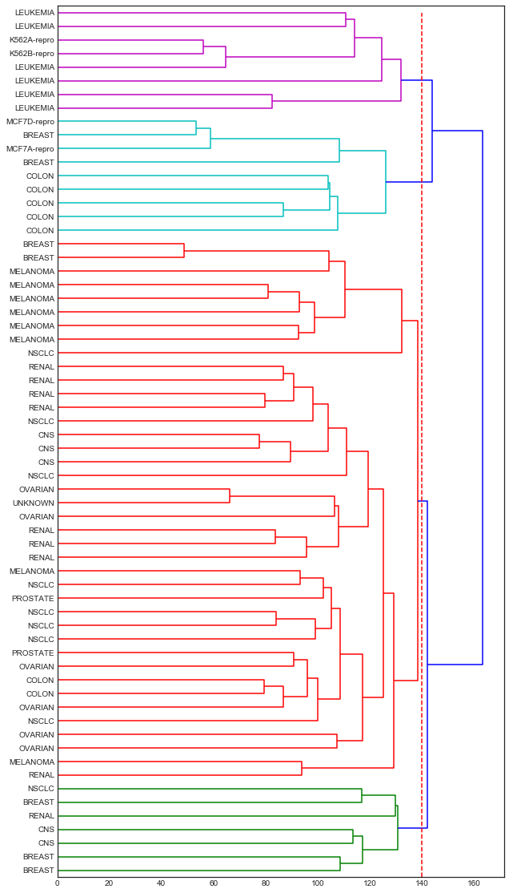

# Unsupervised Learning: Practice

- [Lab 1: Principal Component Analysis](#Lab-1:-Principal-Component-Analysis)
- [Lab 2: K-Means Clustering](#Lab-2:-Clustering)
- [Lab 2: Hierarchical Clustering](#10.5.3-Hierarchical-Clustering)
- [Lab 3: NCI60 Data Example](#Lab-3:-NCI60-Data-Example)


```python
import pandas as pd
import numpy as np
import matplotlib as mpl
import matplotlib.pyplot as plt
import seaborn as sns

from sklearn.preprocessing import scale
from sklearn.decomposition import PCA
from sklearn.cluster import KMeans

from scipy.cluster import hierarchy

%matplotlib inline
plt.style.use('seaborn-white')
```

## Lab 1: Principal Component Analysis


```python
# In R, I exported the dataset to a csv file. It is part of the base R distribution.
df = pd.read_csv('Data/USArrests.csv', index_col=0)
df.info()
```

    <class 'pandas.core.frame.DataFrame'>
    Index: 50 entries, Alabama to Wyoming
    Data columns (total 4 columns):
    Murder      50 non-null float64
    Assault     50 non-null int64
    UrbanPop    50 non-null int64
    Rape        50 non-null float64
    dtypes: float64(2), int64(2)
    memory usage: 2.0+ KB


```python
df.mean()
```


    Murder        7.788
    Assault     170.760
    UrbanPop     65.540
    Rape         21.232
    dtype: float64


```python
df.var()
```


    Murder        18.970465
    Assault     6945.165714
    UrbanPop     209.518776
    Rape          87.729159
    dtype: float64


```python
X = pd.DataFrame(scale(df), index=df.index, columns=df.columns)
```


```python
# The loading vectors
pca_loadings = pd.DataFrame(PCA().fit(X).components_.T, index=df.columns, columns=['V1', 'V2', 'V3', 'V4'])
pca_loadings
```


<div>
<style scoped>
    .dataframe tbody tr th:only-of-type {
        vertical-align: middle;
    }

    .dataframe tbody tr th {
        vertical-align: top;
    }

    .dataframe thead th {
        text-align: right;
    }
</style>
<table border="1" class="dataframe">
  <thead>
    <tr style="text-align: right;">
      <th></th>
      <th>V1</th>
      <th>V2</th>
      <th>V3</th>
      <th>V4</th>
    </tr>
  </thead>
  <tbody>
    <tr>
      <th>Murder</th>
      <td>0.535899</td>
      <td>0.418181</td>
      <td>-0.341233</td>
      <td>0.649228</td>
    </tr>
    <tr>
      <th>Assault</th>
      <td>0.583184</td>
      <td>0.187986</td>
      <td>-0.268148</td>
      <td>-0.743407</td>
    </tr>
    <tr>
      <th>UrbanPop</th>
      <td>0.278191</td>
      <td>-0.872806</td>
      <td>-0.378016</td>
      <td>0.133878</td>
    </tr>
    <tr>
      <th>Rape</th>
      <td>0.543432</td>
      <td>-0.167319</td>
      <td>0.817778</td>
      <td>0.089024</td>
    </tr>
  </tbody>
</table>
</div>


```python
# Fit the PCA model and transform X to get the principal components
pca = PCA()
df_plot = pd.DataFrame(pca.fit_transform(X), columns=['PC1', 'PC2', 'PC3', 'PC4'], index=X.index)
df_plot
```


<div>
<style scoped>
    .dataframe tbody tr th:only-of-type {
        vertical-align: middle;
    }

    .dataframe tbody tr th {
        vertical-align: top;
    }

    .dataframe thead th {
        text-align: right;
    }
</style>
<table border="1" class="dataframe">
  <thead>
    <tr style="text-align: right;">
      <th></th>
      <th>PC1</th>
      <th>PC2</th>
      <th>PC3</th>
      <th>PC4</th>
    </tr>
  </thead>
  <tbody>
    <tr>
      <th>Alabama</th>
      <td>0.985566</td>
      <td>1.133392</td>
      <td>-0.444269</td>
      <td>0.156267</td>
    </tr>
    <tr>
      <th>Alaska</th>
      <td>1.950138</td>
      <td>1.073213</td>
      <td>2.040003</td>
      <td>-0.438583</td>
    </tr>
    <tr>
      <th>Arizona</th>
      <td>1.763164</td>
      <td>-0.745957</td>
      <td>0.054781</td>
      <td>-0.834653</td>
    </tr>
    <tr>
      <th>Arkansas</th>
      <td>-0.141420</td>
      <td>1.119797</td>
      <td>0.114574</td>
      <td>-0.182811</td>
    </tr>
    <tr>
      <th>California</th>
      <td>2.523980</td>
      <td>-1.542934</td>
      <td>0.598557</td>
      <td>-0.341996</td>
    </tr>
    <tr>
      <th>Colorado</th>
      <td>1.514563</td>
      <td>-0.987555</td>
      <td>1.095007</td>
      <td>0.001465</td>
    </tr>
    <tr>
      <th>Connecticut</th>
      <td>-1.358647</td>
      <td>-1.088928</td>
      <td>-0.643258</td>
      <td>-0.118469</td>
    </tr>
    <tr>
      <th>Delaware</th>
      <td>0.047709</td>
      <td>-0.325359</td>
      <td>-0.718633</td>
      <td>-0.881978</td>
    </tr>
    <tr>
      <th>Florida</th>
      <td>3.013042</td>
      <td>0.039229</td>
      <td>-0.576829</td>
      <td>-0.096285</td>
    </tr>
    <tr>
      <th>Georgia</th>
      <td>1.639283</td>
      <td>1.278942</td>
      <td>-0.342460</td>
      <td>1.076797</td>
    </tr>
    <tr>
      <th>Hawaii</th>
      <td>-0.912657</td>
      <td>-1.570460</td>
      <td>0.050782</td>
      <td>0.902807</td>
    </tr>
    <tr>
      <th>Idaho</th>
      <td>-1.639800</td>
      <td>0.210973</td>
      <td>0.259801</td>
      <td>-0.499104</td>
    </tr>
    <tr>
      <th>Illinois</th>
      <td>1.378911</td>
      <td>-0.681841</td>
      <td>-0.677496</td>
      <td>-0.122021</td>
    </tr>
    <tr>
      <th>Indiana</th>
      <td>-0.505461</td>
      <td>-0.151563</td>
      <td>0.228055</td>
      <td>0.424666</td>
    </tr>
    <tr>
      <th>Iowa</th>
      <td>-2.253646</td>
      <td>-0.104054</td>
      <td>0.164564</td>
      <td>0.017556</td>
    </tr>
    <tr>
      <th>Kansas</th>
      <td>-0.796881</td>
      <td>-0.270165</td>
      <td>0.025553</td>
      <td>0.206496</td>
    </tr>
    <tr>
      <th>Kentucky</th>
      <td>-0.750859</td>
      <td>0.958440</td>
      <td>-0.028369</td>
      <td>0.670557</td>
    </tr>
    <tr>
      <th>Louisiana</th>
      <td>1.564818</td>
      <td>0.871055</td>
      <td>-0.783480</td>
      <td>0.454728</td>
    </tr>
    <tr>
      <th>Maine</th>
      <td>-2.396829</td>
      <td>0.376392</td>
      <td>-0.065682</td>
      <td>-0.330460</td>
    </tr>
    <tr>
      <th>Maryland</th>
      <td>1.763369</td>
      <td>0.427655</td>
      <td>-0.157250</td>
      <td>-0.559070</td>
    </tr>
    <tr>
      <th>Massachusetts</th>
      <td>-0.486166</td>
      <td>-1.474496</td>
      <td>-0.609497</td>
      <td>-0.179599</td>
    </tr>
    <tr>
      <th>Michigan</th>
      <td>2.108441</td>
      <td>-0.155397</td>
      <td>0.384869</td>
      <td>0.102372</td>
    </tr>
    <tr>
      <th>Minnesota</th>
      <td>-1.692682</td>
      <td>-0.632261</td>
      <td>0.153070</td>
      <td>0.067317</td>
    </tr>
    <tr>
      <th>Mississippi</th>
      <td>0.996494</td>
      <td>2.393796</td>
      <td>-0.740808</td>
      <td>0.215508</td>
    </tr>
    <tr>
      <th>Missouri</th>
      <td>0.696787</td>
      <td>-0.263355</td>
      <td>0.377444</td>
      <td>0.225824</td>
    </tr>
    <tr>
      <th>Montana</th>
      <td>-1.185452</td>
      <td>0.536874</td>
      <td>0.246889</td>
      <td>0.123742</td>
    </tr>
    <tr>
      <th>Nebraska</th>
      <td>-1.265637</td>
      <td>-0.193954</td>
      <td>0.175574</td>
      <td>0.015893</td>
    </tr>
    <tr>
      <th>Nevada</th>
      <td>2.874395</td>
      <td>-0.775600</td>
      <td>1.163380</td>
      <td>0.314515</td>
    </tr>
    <tr>
      <th>New Hampshire</th>
      <td>-2.383915</td>
      <td>-0.018082</td>
      <td>0.036855</td>
      <td>-0.033137</td>
    </tr>
    <tr>
      <th>New Jersey</th>
      <td>0.181566</td>
      <td>-1.449506</td>
      <td>-0.764454</td>
      <td>0.243383</td>
    </tr>
    <tr>
      <th>New Mexico</th>
      <td>1.980024</td>
      <td>0.142849</td>
      <td>0.183692</td>
      <td>-0.339534</td>
    </tr>
    <tr>
      <th>New York</th>
      <td>1.682577</td>
      <td>-0.823184</td>
      <td>-0.643075</td>
      <td>-0.013484</td>
    </tr>
    <tr>
      <th>North Carolina</th>
      <td>1.123379</td>
      <td>2.228003</td>
      <td>-0.863572</td>
      <td>-0.954382</td>
    </tr>
    <tr>
      <th>North Dakota</th>
      <td>-2.992226</td>
      <td>0.599119</td>
      <td>0.301277</td>
      <td>-0.253987</td>
    </tr>
    <tr>
      <th>Ohio</th>
      <td>-0.225965</td>
      <td>-0.742238</td>
      <td>-0.031139</td>
      <td>0.473916</td>
    </tr>
    <tr>
      <th>Oklahoma</th>
      <td>-0.311783</td>
      <td>-0.287854</td>
      <td>-0.015310</td>
      <td>0.010332</td>
    </tr>
    <tr>
      <th>Oregon</th>
      <td>0.059122</td>
      <td>-0.541411</td>
      <td>0.939833</td>
      <td>-0.237781</td>
    </tr>
    <tr>
      <th>Pennsylvania</th>
      <td>-0.888416</td>
      <td>-0.571100</td>
      <td>-0.400629</td>
      <td>0.359061</td>
    </tr>
    <tr>
      <th>Rhode Island</th>
      <td>-0.863772</td>
      <td>-1.491978</td>
      <td>-1.369946</td>
      <td>-0.613569</td>
    </tr>
    <tr>
      <th>South Carolina</th>
      <td>1.320724</td>
      <td>1.933405</td>
      <td>-0.300538</td>
      <td>-0.131467</td>
    </tr>
    <tr>
      <th>South Dakota</th>
      <td>-1.987775</td>
      <td>0.823343</td>
      <td>0.389293</td>
      <td>-0.109572</td>
    </tr>
    <tr>
      <th>Tennessee</th>
      <td>0.999742</td>
      <td>0.860251</td>
      <td>0.188083</td>
      <td>0.652864</td>
    </tr>
    <tr>
      <th>Texas</th>
      <td>1.355138</td>
      <td>-0.412481</td>
      <td>-0.492069</td>
      <td>0.643195</td>
    </tr>
    <tr>
      <th>Utah</th>
      <td>-0.550565</td>
      <td>-1.471505</td>
      <td>0.293728</td>
      <td>-0.082314</td>
    </tr>
    <tr>
      <th>Vermont</th>
      <td>-2.801412</td>
      <td>1.402288</td>
      <td>0.841263</td>
      <td>-0.144890</td>
    </tr>
    <tr>
      <th>Virginia</th>
      <td>-0.096335</td>
      <td>0.199735</td>
      <td>0.011713</td>
      <td>0.211371</td>
    </tr>
    <tr>
      <th>Washington</th>
      <td>-0.216903</td>
      <td>-0.970124</td>
      <td>0.624871</td>
      <td>-0.220848</td>
    </tr>
    <tr>
      <th>West Virginia</th>
      <td>-2.108585</td>
      <td>1.424847</td>
      <td>0.104775</td>
      <td>0.131909</td>
    </tr>
    <tr>
      <th>Wisconsin</th>
      <td>-2.079714</td>
      <td>-0.611269</td>
      <td>-0.138865</td>
      <td>0.184104</td>
    </tr>
    <tr>
      <th>Wyoming</th>
      <td>-0.629427</td>
      <td>0.321013</td>
      <td>-0.240659</td>
      <td>-0.166652</td>
    </tr>
  </tbody>
</table>
</div>


```python
fig , ax1 = plt.subplots(figsize=(9,7))

ax1.set_xlim(-3.5,3.5)
ax1.set_ylim(-3.5,3.5)

# Plot Principal Components 1 and 2
for i in df_plot.index:
    ax1.annotate(i, (df_plot.PC1.loc[i], -df_plot.PC2.loc[i]), ha='center')

# Plot reference lines
ax1.hlines(0,-3.5,3.5, linestyles='dotted', colors='grey')
ax1.vlines(0,-3.5,3.5, linestyles='dotted', colors='grey')

ax1.set_xlabel('First Principal Component')
ax1.set_ylabel('Second Principal Component')
    
# Plot Principal Component loading vectors, using a second y-axis.
ax2 = ax1.twinx().twiny() 

ax2.set_ylim(-1,1)
ax2.set_xlim(-1,1)
ax2.tick_params(axis='y', colors='orange')
ax2.set_xlabel('Principal Component loading vectors', color='orange')

# Plot labels for vectors. Variable 'a' is a small offset parameter to separate arrow tip and text.
a = 1.07  
for i in pca_loadings[['V1', 'V2']].index:
    ax2.annotate(i, (pca_loadings.V1.loc[i]*a, -pca_loadings.V2.loc[i]*a), color='orange')

# Plot vectors
ax2.arrow(0,0,pca_loadings.V1[0], -pca_loadings.V2[0])
ax2.arrow(0,0,pca_loadings.V1[1], -pca_loadings.V2[1])
ax2.arrow(0,0,pca_loadings.V1[2], -pca_loadings.V2[2])
ax2.arrow(0,0,pca_loadings.V1[3], -pca_loadings.V2[3]);
```


```python
# Standard deviation of the four principal components
np.sqrt(pca.explained_variance_)
```


    array([ 1.5908673 ,  1.00496987,  0.6031915 ,  0.4206774 ])


```python
pca.explained_variance_
```


    array([ 2.53085875,  1.00996444,  0.36383998,  0.17696948])


```python
pca.explained_variance_ratio_
```


    array([ 0.62006039,  0.24744129,  0.0891408 ,  0.04335752])


```python
plt.figure(figsize=(7,5))

plt.plot([1,2,3,4], pca.explained_variance_ratio_, '-o', label='Individual component')
plt.plot([1,2,3,4], np.cumsum(pca.explained_variance_ratio_), '-s', label='Cumulative')

plt.ylabel('Proportion of Variance Explained')
plt.xlabel('Principal Component')
plt.xlim(0.75,4.25)
plt.ylim(0,1.05)
plt.xticks([1,2,3,4])
plt.legend(loc=2);
```


## Lab 2: Clustering

### 10.5.1 K-Means Clustering


```python
# Generate data
np.random.seed(2)
X = np.random.standard_normal((50,2))
X[:25,0] = X[:25,0]+3
X[:25,1] = X[:25,1]-4
```

#### K = 2


```python
km1 = KMeans(n_clusters=2, n_init=20)
km1.fit(X)
```


    KMeans(algorithm='auto', copy_x=True, init='k-means++', max_iter=300,
        n_clusters=2, n_init=20, n_jobs=1, precompute_distances='auto',
        random_state=None, tol=0.0001, verbose=0)


```python
km1.labels_
```


    array([1, 1, 1, 1, 1, 1, 1, 1, 1, 1, 1, 1, 1, 1, 1, 1, 1, 1, 1, 1, 1, 1, 1,
           1, 1, 0, 0, 0, 0, 0, 0, 0, 0, 0, 0, 0, 0, 0, 0, 0, 0, 0, 0, 0, 0, 0,
           0, 0, 0, 1], dtype=int32)


See plot for K=2 below.

####  K = 3


```python
np.random.seed(4)
km2 = KMeans(n_clusters=3, n_init=20)
km2.fit(X)
```


    KMeans(algorithm='auto', copy_x=True, init='k-means++', max_iter=300,
        n_clusters=3, n_init=20, n_jobs=1, precompute_distances='auto',
        random_state=None, tol=0.0001, verbose=0)


```python
pd.Series(km2.labels_).value_counts()
```


    1    21
    0    20
    2     9
    dtype: int64


```python
km2.cluster_centers_
```


    array([[-0.27876523,  0.51224152],
           [ 2.82805911, -4.11351797],
           [ 0.69945422, -2.14934345]])


```python
km2.labels_
```


    array([1, 2, 1, 1, 1, 1, 1, 1, 1, 1, 1, 1, 1, 1, 1, 2, 2, 1, 1, 1, 1, 2, 1,
           1, 1, 0, 0, 0, 0, 2, 0, 0, 0, 2, 0, 0, 0, 0, 0, 2, 0, 0, 2, 0, 0, 0,
           0, 0, 0, 2], dtype=int32)


```python
# Sum of distances of samples to their closest cluster center.
km2.inertia_
```


    68.973792009397258


```python
fig, (ax1, ax2) = plt.subplots(1,2, figsize=(14,5))

ax1.scatter(X[:,0], X[:,1], s=40, c=km1.labels_, cmap=plt.cm.prism) 
ax1.set_title('K-Means Clustering Results with K=2')
ax1.scatter(km1.cluster_centers_[:,0], km1.cluster_centers_[:,1], marker='+', s=100, c='k', linewidth=2)

ax2.scatter(X[:,0], X[:,1], s=40, c=km2.labels_, cmap=plt.cm.prism) 
ax2.set_title('K-Means Clustering Results with K=3')
ax2.scatter(km2.cluster_centers_[:,0], km2.cluster_centers_[:,1], marker='+', s=100, c='k', linewidth=2);
```


### 10.5.3 Hierarchical Clustering

#### scipy


```python
fig, (ax1,ax2,ax3) = plt.subplots(3,1, figsize=(15,18))

for linkage, cluster, ax in zip([hierarchy.complete(X), hierarchy.average(X), hierarchy.single(X)], ['c1','c2','c3'],
                                [ax1,ax2,ax3]):
    cluster = hierarchy.dendrogram(linkage, ax=ax, color_threshold=0)

ax1.set_title('Complete Linkage')
ax2.set_title('Average Linkage')
ax3.set_title('Single Linkage');
```


## Lab 3: NCI60 Data Example

### § 10.6.1 PCA


```python
# In R, I exported the two elements of this ISLR dataset to csv files.
# There is one file for the features and another file for the classes/types.
df2 = pd.read_csv('Data/NCI60_X.csv').drop('Unnamed: 0', axis=1)
df2.columns = np.arange(df2.columns.size)
df2.info()
```

    <class 'pandas.core.frame.DataFrame'>
    RangeIndex: 64 entries, 0 to 63
    Columns: 6830 entries, 0 to 6829
    dtypes: float64(6830)
    memory usage: 3.3 MB


```python
X = pd.DataFrame(scale(df2))
X.shape
```


    (64, 6830)


```python
y = pd.read_csv('Data/NCI60_y.csv', usecols=[1], skiprows=1, names=['type'])
y.shape
```


    (64, 1)


```python
y.type.value_counts()
```


    RENAL          9
    NSCLC          9
    MELANOMA       8
    BREAST         7
    COLON          7
    OVARIAN        6
    LEUKEMIA       6
    CNS            5
    PROSTATE       2
    MCF7D-repro    1
    K562B-repro    1
    K562A-repro    1
    MCF7A-repro    1
    UNKNOWN        1
    Name: type, dtype: int64


```python
# Fit the PCA model and transform X to get the principal components
pca2 = PCA()
df2_plot = pd.DataFrame(pca2.fit_transform(X))
```


```python
fig, (ax1, ax2) = plt.subplots(1,2, figsize=(15,6))

color_idx = pd.factorize(y.type)[0]
cmap = plt.cm.hsv

# Left plot
ax1.scatter(df2_plot.iloc[:,0], -df2_plot.iloc[:,1], c=color_idx, cmap=cmap, alpha=0.5, s=50)
ax1.set_ylabel('Principal Component 2')

# Right plot
ax2.scatter(df2_plot.iloc[:,0], df2_plot.iloc[:,2], c=color_idx, cmap=cmap, alpha=0.5, s=50)
ax2.set_ylabel('Principal Component 3')

# Custom legend for the classes (y) since we do not create scatter plots per class (which could have their own labels).
handles = []
labels = pd.factorize(y.type.unique())
norm = mpl.colors.Normalize(vmin=0.0, vmax=14.0)

for i, v in zip(labels[0], labels[1]):
    handles.append(mpl.patches.Patch(color=cmap(norm(i)), label=v, alpha=0.5))

ax2.legend(handles=handles, bbox_to_anchor=(1.05, 1), loc=2, borderaxespad=0.)

# xlabel for both plots
for ax in fig.axes:
    ax.set_xlabel('Principal Component 1')    
```


```python
pd.DataFrame([df2_plot.iloc[:,:5].std(axis=0, ddof=0).as_matrix(),
              pca2.explained_variance_ratio_[:5],
              np.cumsum(pca2.explained_variance_ratio_[:5])],
             index=['Standard Deviation', 'Proportion of Variance', 'Cumulative Proportion'],
             columns=['PC1', 'PC2', 'PC3', 'PC4', 'PC5'])
```


<div>
<style scoped>
    .dataframe tbody tr th:only-of-type {
        vertical-align: middle;
    }

    .dataframe tbody tr th {
        vertical-align: top;
    }

    .dataframe thead th {
        text-align: right;
    }
</style>
<table border="1" class="dataframe">
  <thead>
    <tr style="text-align: right;">
      <th></th>
      <th>PC1</th>
      <th>PC2</th>
      <th>PC3</th>
      <th>PC4</th>
      <th>PC5</th>
    </tr>
  </thead>
  <tbody>
    <tr>
      <th>Standard Deviation</th>
      <td>27.853469</td>
      <td>21.481355</td>
      <td>19.820465</td>
      <td>17.032556</td>
      <td>15.971807</td>
    </tr>
    <tr>
      <th>Proportion of Variance</th>
      <td>0.113589</td>
      <td>0.067562</td>
      <td>0.057518</td>
      <td>0.042476</td>
      <td>0.037350</td>
    </tr>
    <tr>
      <th>Cumulative Proportion</th>
      <td>0.113589</td>
      <td>0.181151</td>
      <td>0.238670</td>
      <td>0.281145</td>
      <td>0.318495</td>
    </tr>
  </tbody>
</table>
</div>


```python
df2_plot.iloc[:,:10].var(axis=0, ddof=0).plot(kind='bar', rot=0)
plt.ylabel('Variances');
```


```python
fig , (ax1,ax2) = plt.subplots(1,2, figsize=(15,5))

# Left plot
ax1.plot(pca2.explained_variance_ratio_, '-o')
ax1.set_ylabel('Proportion of Variance Explained')
ax1.set_ylim(ymin=-0.01)

# Right plot
ax2.plot(np.cumsum(pca2.explained_variance_ratio_), '-ro')
ax2.set_ylabel('Cumulative Proportion of Variance Explained')
ax2.set_ylim(ymax=1.05)

for ax in fig.axes:
    ax.set_xlabel('Principal Component')
    ax.set_xlim(-1,65)    
```


### § 10.6.2 Clustering


```python
X= pd.DataFrame(scale(df2), index=y.type, columns=df2.columns)
```


```python
fig, (ax1,ax2,ax3) = plt.subplots(1,3, figsize=(20,20))

for linkage, cluster, ax in zip([hierarchy.complete(X), hierarchy.average(X), hierarchy.single(X)],
                                ['c1','c2','c3'],
                                [ax1,ax2,ax3]):
    cluster = hierarchy.dendrogram(linkage, labels=X.index, orientation='right', color_threshold=0, leaf_font_size=10, ax=ax)

ax1.set_title('Complete Linkage')
ax2.set_title('Average Linkage')
ax3.set_title('Single Linkage');
```


```python
plt.figure(figsize=(10,20))
cut4 = hierarchy.dendrogram(hierarchy.complete(X),
                            labels=X.index, orientation='right', color_threshold=140, leaf_font_size=10)
plt.vlines(140,0,plt.gca().yaxis.get_data_interval()[1], colors='r', linestyles='dashed');
```





##### KMeans


```python
np.random.seed(2)
km4 = KMeans(n_clusters=4, n_init=50)
km4.fit(X)
```


    KMeans(algorithm='auto', copy_x=True, init='k-means++', max_iter=300,
        n_clusters=4, n_init=50, n_jobs=1, precompute_distances='auto',
        random_state=None, tol=0.0001, verbose=0)


```python
km4.labels_
```


    array([1, 1, 1, 1, 1, 1, 1, 1, 1, 1, 1, 1, 1, 1, 1, 1, 1, 1, 1, 1, 1, 1, 1,
           2, 2, 2, 2, 2, 2, 2, 2, 2, 2, 0, 0, 0, 0, 0, 0, 0, 0, 2, 2, 2, 2, 2,
           2, 2, 2, 2, 2, 2, 2, 2, 2, 3, 3, 3, 3, 3, 3, 3, 3, 3], dtype=int32)


```python
# Observations per KMeans cluster
pd.Series(km4.labels_).value_counts().sort_index()
```


    0     8
    1    23
    2    24
    3     9
    dtype: int64


##### Hierarchical


```python
# Observations per Hierarchical cluster
cut4b = hierarchy.dendrogram(hierarchy.complete(X), truncate_mode='lastp', p=4, show_leaf_counts=True)
```


```python
# Hierarchy based on Principal Components 1 to 5
plt.figure(figsize=(10,20))
pca_cluster = hierarchy.dendrogram(hierarchy.complete(df2_plot.iloc[:,:5]), labels=y.type.values, orientation='right', color_threshold=100, leaf_font_size=10)
```


```python
cut4c = hierarchy.dendrogram(hierarchy.complete(df2_plot), truncate_mode='lastp', p=4,
                             show_leaf_counts=True)
# See also color coding in plot above.
```


